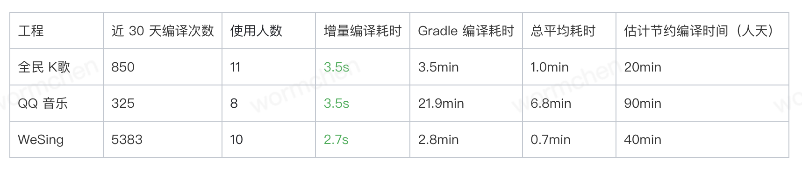
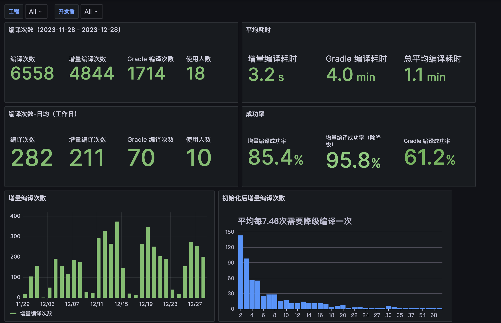
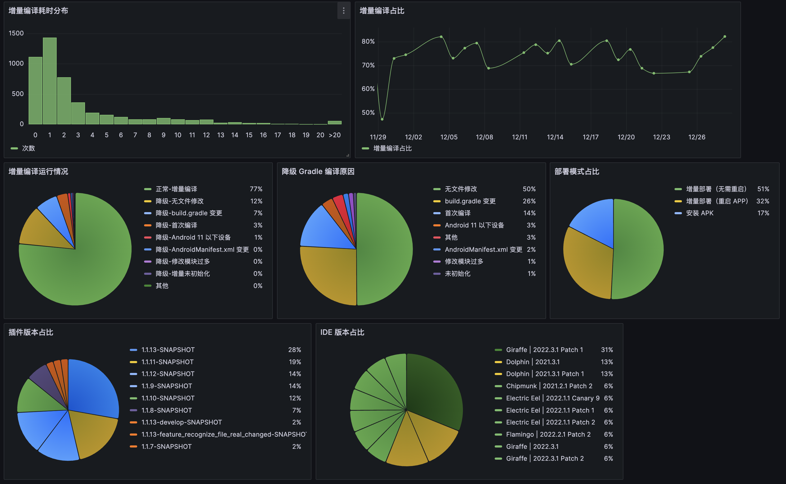
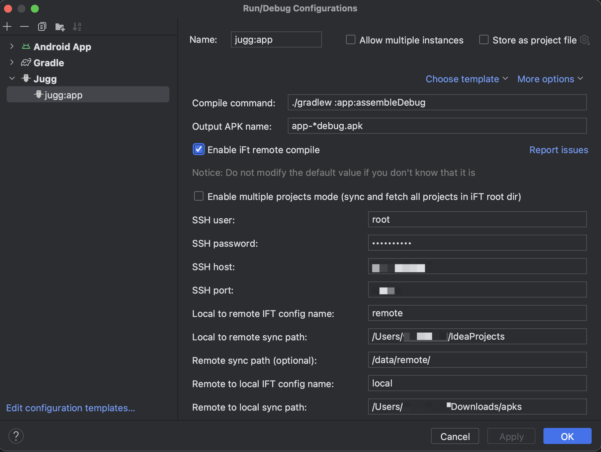
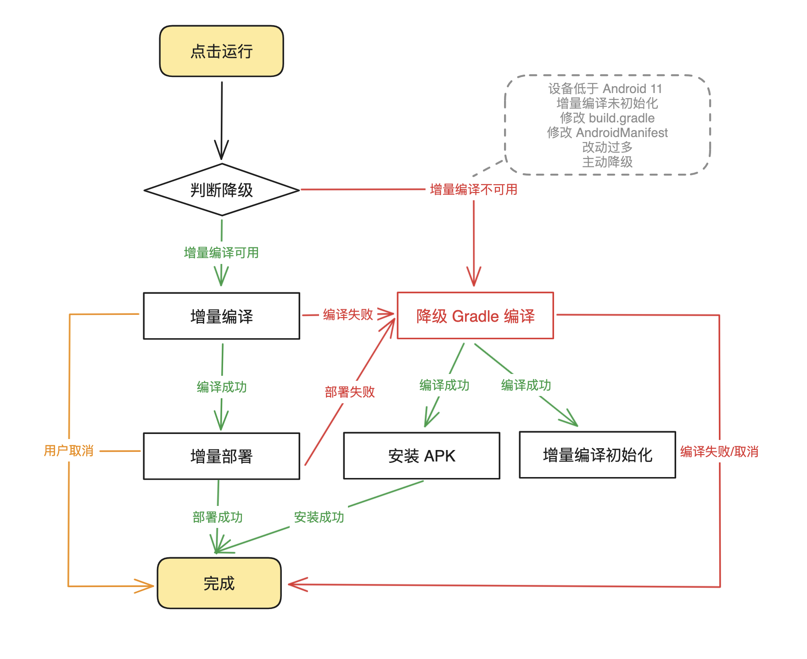
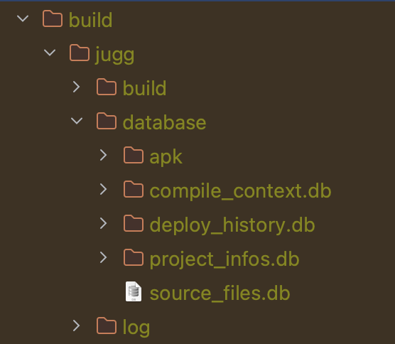
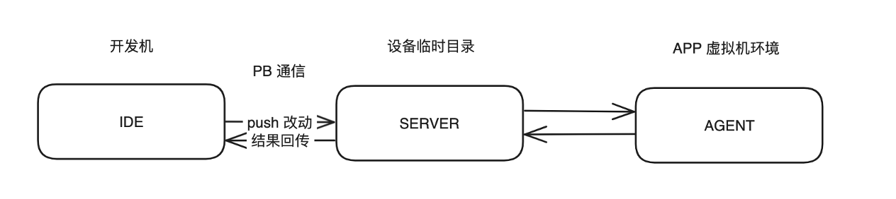

> [!NOTE]
> 本文为历史技术分享，正文保持原文内容。文中的数据、界面、链接和能力状态反映发布时情况；最新产品行为以 Wiki 其他页面为准。

<!-- original-article-start -->

> 本文主要内容：
> 1. 介绍增量编译插件 Jugg 的使用方式和使用数据
> 2. 介绍 Jugg 的大体方案
> 

# 1. 增量编译插件 Jugg 介绍

## 1.1 什么是 Android 增量编译？

Android 增量编译通常指的是**绕过了常规的 gradle 编译流程**，寻求更快编译速度的编译方案。

增量编译领域大家可能没有关注太多，但其实 Android 增量编译已经存在不少方案了。从 Android 官方的 [Instant Run](https://medium.com/google-developers/instant-run-how-does-it-work-294a1633367f)，[Apply Changes](https://medium.com/androiddevelopers/android-studio-project-marble-apply-changes-e3048662e8cd)（准确来讲它属于增量部署），到民间自研的腾讯内部方案，阿里的 [Freeline](https://github.com/alibaba/freeline)，有赞的 [Savitar](https://tech.youzan.com/you-zan-android-bian-yi-jin-jie-zhi-lu-zeng-liang-bian-yi-ti-xiao-fang-an-savitar/)。不少人在这条道路上已经探索了很久。

## 1.2 为什么要做一个新的 Android 增量编译插件？

各个增量编译的方案都有所不同。有时代的特点，有自己的思考和权衡，也有功能发展和进步。对于我来说，做这个的起因源于一个简单的“执念”：**如果我修改的够少，那我就可以编译的足够快。** 十几秒半分钟的那种不算，要 JavaScript，Flutter 的那种一两秒的快。

而且还要足够通用，不含定制，绝大部分工程理论上都能兼容。能满足这两样要求的方案目前还没有。

因这样一个简单的念头开始，一做就是两年多（2021 年 3 月开始）。从最开始花了 5 个月肝出来一个可行的 demo，到 2 年后才真正能运行在同事们的电脑上，初心早就已经磨没了，剩下的只有痛苦，让我坚持下去的更多的是不愿意把这么长的投入变成沉没成本。

目前插件正在互动视频中心内部进行推广，**最近 30 天插件累计编译次数已达 6558 次**。在大家的热情帮助下，插件的发展可以算是 “未来可期” 的。在速度和工程兼容性上，Jugg 的确体现了它独有的亮点。但接入的规模还不够大，而插件的价值不由做出来的人决定，而是由使用插件的人所产生的价值决定。

目前增量编译插件 Jugg 已具备区别于其他方案的独特性：

1. 它是一个**纯 IDE 插件**，并且做了非常深度的 IDE 集成，但保持了使用的简单性；
2. **增量编译平均耗时做到了 3.2s，中位数 1.4s**（数据为近一个月 4800 次增量编译的平均值）；
3. 实现了不需要重启的热重载（约 2/3 的增量部署不需要重启）；
4. 实现了 aapt2 的定制，资源编译耗时从 15s 降至 < 1s；
5. 支持云编译；
6. 已在数个大工程完成适配并投入日常开发，包括 WeSing，全民 K 歌，QQ 音乐。其他中小工程基本能做到一键接入。

但增量编译方案的通病 Jugg 也有：

1. 存在不支持的场景，如 build.gradle 文件变更，注解处理器等（约占整体编译 8%）；
2. 大工程还做不到一键接入，总有考虑不到的场景，需要一定的适配工作量。

## 1.3 为什么叫 Jugg？

因为希望插件可以像 dota2 的剑圣（Juggernaut，国内一般简称 Jugg）一样砍的那么快：


> 你甚至可以在技术文章里见到刀斯林

## 1.4 演示视频

[演示视频](https://www.bilibili.com/video/BV1W3411C7PU)

视频展示了无需重启 App 的修改场景：修改代码实现和 res 资源。除此之外还存在以下场景：
1. 因 ARTTI 的特性，存在需要重启 App 的情况。
2. 当修改 build.gradle 会自动降级一次 Gradle 编译；
3. 遇到注解等目前暂不支持的场景，需要主动降级一次 Gradle 编译；
4. 调试设备要求 Android 11 以上。

## 1.5 Jugg 目前的接入使用情况

目前已有累计 18 名同学使用过 Jugg 插件。近 30 天统计数据如下（一个人可能开发多个工程）：


> 
> 估计每日节约编译时间估算规则：**每日节约时间=工作日每日编译次数 \*（Gradle 编译耗时*0.7 - 总平均耗时）**
> 
> 0.7 系数：因为插件会承接大量小改动，所以降级为 Gradle 编译后，耗时会比不使用插件高。根据 WeSing 实践经验，使用插件后 Gradle 编译耗时增长约 30%，所以取 0.7。

数据解释：

* 增量编译耗时与工程大小没有强关联，工程越大收益越大；
* 估计节约编译时间受平均编译次数（人天）影响。WeSing 的同学接入较早，数据已经稳定；开发全民 K 歌和 QQ 音乐工程的同学正在逐步接入，数据还在爬坡；


看板可以以项目维度和个人维度查看数据：






# 2. Jugg 的使用介绍

## 2.1 运行流程

我在插件的使用优化投入了非常多的工作，其工作量甚至多于编译方案的研发。因为我希望它不仅是一个技术方案，而更加是一个能用且好用的**产品**。

和普通 app 编译一样， Jugg 默认提供一个运行配置。首次使用需要先按照接入文档配置编译命令，云编译参数（可选）：




配置完成后，点击运行开始，整个运行流程如下：



流程设计保证了功能的可用性。

## 2.2 日常开发场景列举

Jugg 的使用体验如何，我准备通过分成不同场景的方式来分别介绍。这些场景可以让大家能提前了解 Jugg 让人感到便利的时候，和体验稍差的时候。

### 2.2.1 场景：初次编译

增量编译的运行依赖 Gradle 编译的产物，目前依赖的有：APK，class 文件，注解器生成的源码。所以首次运行需要先进行一次 gradle 编译。

编译完成后，插件会在后台收集所需的构建产物，收集并初始化完成后才会启用增量编译。

首次初始化时间：大工程本地编译约 30s，需要分析工程结构和函数引用关系；云开发机编译需要额外拉取产物到本地，时间 1-3min。

再次降级后初始化时间：解析和产物拉取都实现了增量操作，本地约 15s，云编译约 25s。

### 2.2.2 场景：日常开发

正常情况下，Jugg 已经可以正确的处理非常多的边界场景：
* 识别工程关闭期间变更的文件；
* 多种不同类型文件混编，模块混编；
* 使用过程切换设备；
* 卸载 App 后恢复增量部署现场；
* 多工程开发，多设备调试。

### 2.2.3 场景：快乐的调试场景

以下场景是 Jugg 的高光时刻：

* 写完一段代码，需要验证边界场景时。只需要魔改一下参数，几秒内完成编译和部署，验证完后然后回退改动即可；
* 调试代码和布局参数时，Jugg 可以让你快速的调整参数，增加测试逻辑，增加日志，不会被一次次的耗时不短的编译打断心流。

因为改动成本足够低，Jugg 已经改变了我自己的开发习惯。现在的我会快速地修改参数，增加日志打点来验证逻辑，不再需要因编译耗时的问题，先长时间阅读代码思考，再编译验证猜想。

### 2.2.4 降级场景：自动降级（占比 8%）

以下场景 Jugg 会执行自动降级：

* 改动了 build.gradle，重新编译后恢复；（占比 7%）；
* 使用的是 Android 11 以下设备（占比 1%）；
* 一次性修改了非常多的文件，如 Merge 后产生很多文件变更，Jugg 会根据影响模块数来决定是否要降级，以防止极端情况导致耗时反而更高。（占比 < 1%）。

### 2.2.5 降级场景：主动降级（占比 8%）

以下场景可能需要你主动执行降级：

* 遇到新增注解和插桩，viewbinding 等暂不支持的场景时；
* 认为插件没有正确编译时（编译报错，运行时崩溃）；
* 感觉已经改动了很多，恰好这段时间不需要频繁调试，想要顺便重置一下心里安稳时；

主动降级的方式：在不修改文件的情况下，再次点击运行；Jugg 会弹窗确认是否降级（也支持默认直接降级）。

目前的统计方式包含了误操作的主动降级（此时开发一般会取消编译，下次会继续走增量编译），所以实际主动降级比例会更低。


# 3. 如何接入 Jugg

目前 Jugg 经过热心同学的测试使用后，编译部分已经比较稳定。但对于不同设备和工程的环境差异兼容性，仍未到非常完善的程度，所以接入大工程时还是会有一些工作量。

## 3.1 接入流程

如果你也对 Jugg 感兴趣，可参考该文档进行接入：Jugg 接入手册。我会及时提供接入和使用的技术支持。

因为插件的开发从来都不在我的工作排期之内，所以自然也不会成为我的束缚🫡。

整个接入过程大概会是这样的：

1. 根据接入文档对工程进行配置，我协助处理遇到的问题，完成工程接入验证。接入过程约耗时 5 - 15 分钟，解决遇到的问题可能需要 1 小时到 1 天；
2. 接入并使用几天后，如果稳定性和效果都不错，可以邀请组内的其他同学接入，我会继续提供协助。

## 3.2 写在接入的最后

编译工具是很难获取信任的工具类型。就算是官方的 Instant Run 和 Apply changes，由于各种原因，最终也并未得到大规模普及。很多时候一个小小的问题或几次不愉快的体验，就足以让人将其束之高阁，**毕竟它只是一个可选项**。我非常珍惜每一个愿意尝试 Jugg 的同学，所以会尽可能解决所有遇到的问题，同时也算是对自己投入的 2 年半的时间负责。

> 截至 2023.12.28，Jugg 共提交 commit 1137 个，代码 2.4W 行，测试用例 107 个。
>
> 其中部门推广期间提交 commit 276 个，包括 bugfix 91 个，优化 89 个，功能 31 个。


# 4. Jugg 编译方案简述

从实现上 Jugg 可分为 5 部分，文件改动检测模块，编译上下文管理模块，Gradle 编译模块，增量编译模块，部署模块。

## 4.1 文件改动检测模块

### 功能

监听文件改动，将改动的文件传给编译模块编译。

### 实现

该部分实现比较简单：

* 工程打开期间，通过 ```VirtualFileManager``` 监听文件改动；
* 工程关闭期间无法通过 IDE 监听，则在工程重新打开时，通过 Git 查询文件改动。

### 实现细节

1. 需要通过 ```ModuleManager``` 读取所有源码目录，过滤非源码的改动和非本工程的改动；
2. 如果工程没有初始化 Git，则工程重新打开，需要重新初始化才能使用；
3. 多工程联调场景，需要兼容多 Git 仓库场景。
4. IDE 只会告诉你文件修改了，但也可能是修改回退了。在分支来回切换和文件回退的场景，还需要通过历史部署记录和 git diff 功能协同确认文件是否真正改变。


## 4.2 编译上下文管理模块

### 功能

1. 收集编译所需要的所有环境参数。参数主要包括：
   * Android SDK 路径
   * 工程的所有模块
   * 模块的路径，源码目录列表，AndroidManifest 路径，Build Variant，模块依赖，库依赖，Java 版本，Kotlin 版本等。

这些目前都是通过 IDE 的各种各样的接口获取的，如 ```ModuleManager```，```ProjectBuildModel```，```PsProjectImpl```。部分是 Intellij Idea 的标准接口，部分是 Android 插件包里的接口（虽然不多，但变更频繁，基本每个新版本都有适配工作）。

1. 数据持久化。包括：
   * Gradle 产物记录；
   * 部署记录，和所有已部署的增量文件
   * APK 解析数据库
   * 文件索引数据库

### 实现

环境变量部分涉及很多细节，但不做插件的人并不关心这些，所以就不啰嗦了，实现原则就是尽可能不要写死参数。重点讲一下数据持久化部分。

Jugg 的所有数据都存放在工程根目录的 ```build/jugg``` 目录中，其中 ```build/jugg/database``` 为编译上下文管理模块存放的目录：



* apk：存放 APK 的解析数据库；用于生成部署数据，和寻找方法调用关系。用途涉及模块《部署模块》，《扩散编译》；
* compile_context.db：存放历史部署文件，用于恢复工程现场（重新打开工程场景），和设备现场（重装 APK 场景）；
* deploy_hisotry.db：记录历史部署情况，用于记录部署和识别设备切换。
* project_infos.db：存储所有的环境参数，优化读取耗时（一个模块大约需要 50ms， 如果有 150 个模块需要约 8s）
* source_files.db：存储文件名到文件路径的映射，通过全盘扫描源代码文件实现。用于根据 dex 中 sourcefile 字段，来找到对应的源文件。用途涉及模块《扩散编译》

### 实现细节

#### APK 解析数据库

Jugg Gradle 编译之后需要进行一次 APK 解析。[dex2jar](https://github.com/pxb1988/dex2jar) 提供了类似 ASM 的 API 来解析 Dex 文件。Jugg 还使用了 SQLite 对整个解析结果进行存储，并增加索引来提高查询速度。

而且 Jugg 会比对 Dex 的 checksum。在一些小改动中，大部分 Dex 都没有变更，则只会解析变化的 Dex 来提高解析速度。


## 4.3 Gradle 编译模块

### 功能

执行 gradle 命令，生成构建产物。

### 实现

因为 Jugg 支持了云开发机编译，所以会通过接口 ```IGradleCompileClient``` 统一两者实现：

* 本地编译直接通过 ```Runtime.getRuntime().exec()``` 调用命令行来执行编译；
* 云开发机编译通过 [Jsch](http://www.jcraft.com/jsch/) 来实现 SSH 登录，然后执行编译。同时流程中插入 iFT 同步指令完成源码和产物同步。

### 实现细节

* 本地编译可能和 IDE 编译的环境不一样：如 JDK 版本不一致，ANDROID_HOME 目录未指定等。Jugg 会优先读取 IDE 的环境变量，抹平两者差异；
* 云开发机编译会有额外的交互场景；选择用户和设备，输入 PIN+TOKEN 等。Jugg 支持自动选择 + 弹窗的方式让用户完成交互；
* Windows / Mac / Linux，支持的命令和换行符有差异，需要额外兼容。


## 4.4 增量编译模块

### 功能

编译改动的文件，生成待增量部署的文件。

增量部署的文件和热修复文件接近：

* 代码变更 -> DEX 文件；
* asset 变更 -> 原文件拷贝；
* res 变更 -> resource.arsc 和 res 资源。

但也有特别之处：

1. ARTTI(JVMTI) 要求一个 DEX 文件只能有一个类，需要拆分；
2. 首次 res 变更时，需要全量推送一次 res 资源。

### 4.4.1 Java 编译

Java 编译实质等同于调用 ```javac``` 命令，可通过 JDK 提供的 ```javax.tools.JavaCompiler``` 实现。

调用一个命令是流程性，原子性的，只需要提供正确的参数，即可正确实现编译。参数来源由编译上下文管理模块提供。

### 4.4.2 Kotlin 编译

同样的，Kotlin 编译实质等同于调用 ```kotlinc``` 命令，可通过 maven 包 ```org.jetbrains.kotlin:kotlin-compiler-embeddable``` 提供的 ```K2JVMCompiler``` 实现。

因为 Kotlin 和 Intellij Idea 都是 JetBrains 搞的，所以编译器实现和 IDE 还存在一些名字一样但实现不完全一致的类。而 IDE 的类先加载，编译器后加载，出现类实现不匹配，导致运行编译失败。

解决办法是，将编译器实现和它的所有依赖，构造一个单独的 ClassLoader 加载，以达到隔离的目的：

```
URLClassLoader(libraryClasspath.values.toTypedArray(), null)
```

### 4.4.4 Dex 编译

从 ```javac``` 和 ```kotlinc``` 编译出来的是 class 文件，还需要使用 ```d8``` 将 class 转换为 dex。通过 ```D8Command``` 可以调用 d8。

### 4.4.5 Res 编译

#### 常规的 Res 编译

常规的 Res 编译使用的是 ```aapt2``` 命令行编译。有 2 就有 1，```aapt2``` 相比 ```aapt``` 实现了增量编译，和 gcc 那样的 compile + link 两步走：

* compile 命令将 xml 编译为 xml.flat；
* link 命令将所有 flat 文件读取，分配 Res ID，输出最终 res 资源，resource.arsc 和 AndroidManifest.xml；

拆分后，compile 耗时大大下降了，只需要几十毫秒就能完成。但 link 耗时还是比较可观，大的工程接近 1w 个 res 文件，仍需要 15s 以上的 link 耗时。

#### aapt2 增量链接版 —— 啪的一下就编好了，很快啊

Jugg 定制了 aapt2，增加了 ```inclink``` 命令，将 ```link``` 再次拆分为两步：

1. inclink --load，加载 APK 中的 resource.arsc 和 AndroidManifest.xml（加载 APK 比加载所有 flat 要快 500% 左右），并缓存在内存中。然后通过 ```aapt2 daemon``` 模式保持 ```appt2``` 不退出；
2. inclink，接收编译的增量 flat 文件，增量处理并增量输出编译产物；
3. 甚至，如果 inclink 检测到没有 ID 新增，则连 R.java 都不会生成。可以省下 R.java 2-3 秒的编译耗时。

改造后 inclink 命令耗时只有几百毫秒，速度贼快。


## 4.5 部署模块

### 功能

将 DEX，res，assets 等文件到当前设备上，使改动生效。

### 目前已有方案

实现增量部署的方式之一就是大家比较熟悉的热修复方案，即：

1. 代码增量加载：启动时通过反射将新的 DEX 文件插入到 ClassLoader 的 ```pathList.dexElements``` 中。因为 ClassLoader 会按顺序搜索类来加载，所以只要插入到头部就可以了。
2. so 替换加载：和代码增量加载类似，只不过反射插入的变量变成 ```pathList.nativeLibraryPathElements```；
3. 资源增量加载：启动时反射构建一个新的 ```AssetManager```，将新的 res 目录通过 ```addAssetPath``` 方法设置进去；然后遍历 ```ResourcesManager``` 的 ```mActiveResources``` 或 ```mResourceReferences```，将新的 AssetManager 设置进去。
4. 特别地，如果希望实现无代码侵入的初始化方案，可以参考 Lightning 在构建 APK 的过程中将 AndroidManifest 的 Application 替换为自己的实现，替换的实现会执行初始化并代理原来的 Application 实现。


实现增量部署的方式之二，是 Apply Changes 基于 ARTTI（JVMTI）实现的方案。简单来说，Apply Changes 能力是热修复能力基础上，额外多了一个运行时替换类实现的能力。其整体运行框架如下：



Jugg 复用了 Apply Changes 通道进行增量部署，所以支持无需重启的热重载部署。

## 4.6 额外的：Android Studio 版本兼容

Jugg 依赖了 Intellij Idea 的标准接口，和 Android IDE 插件的部分部署相关的类。

Intellij Idea 的标准接口比较稳定且变化不大，发现新版本问题的时候，更新版本简单适配即可。

Android IDE 插件的类变化较多，因为部分接口也没有标明是外部可以随意使用的（也没有说不能用）。目前基本每个版本 Jugg 都需要进行兼容性适配，目前已支持从 Chipmunk 到 Iguana 的版本。

针对版本兼容性的兼容方案，Jugg 使用的是用一层隔离层对不同版本的不同实现进行隔离，外部统一通过接口调用。用哪个实现则在启动时通过 IDE 版本进行判断。

但需要考虑的是，Android Studio 的一个大版本也会有多个小版本，仅对大版本的最终版本进行适配，依然会有中间小版本不兼容的风险。

所以在发生不兼容调用时，Jugg 还有会对其他版本的兼容实现进行遍历，直到找到兼容的实现。


# 5. 写在最后

本文为系列文章第一篇，后续会继续分享各模块的实现细节，包括编译实现，部署实现，appt2 的改造，IDE 能力调用。

非常感谢你阅读到这里。如果你愿意尝试使用 Jugg 那就更好了！


<!-- original-article-end -->
