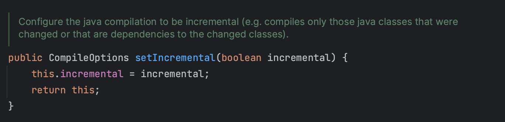
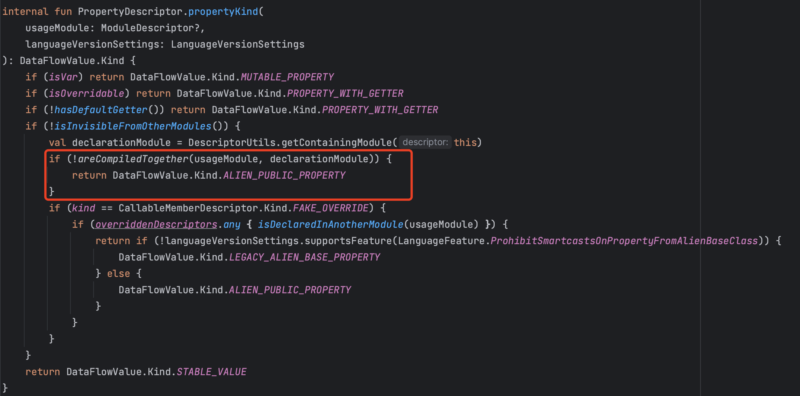
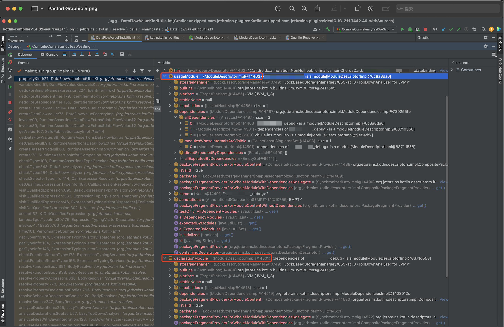
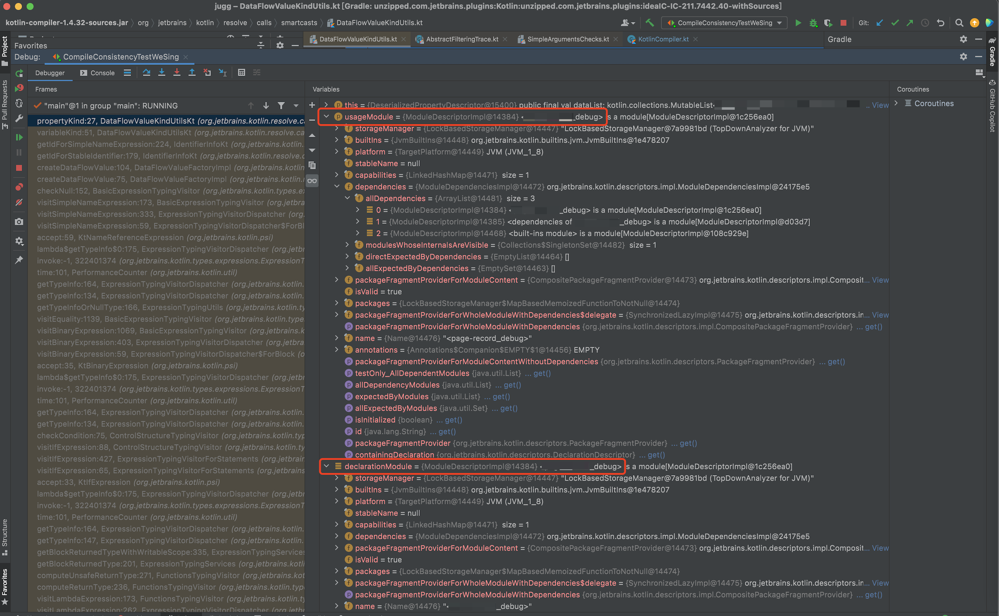
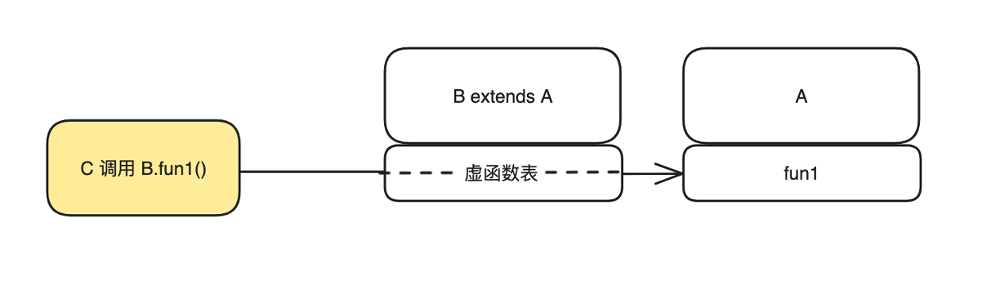
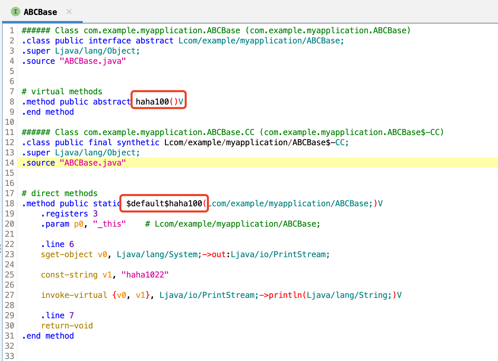
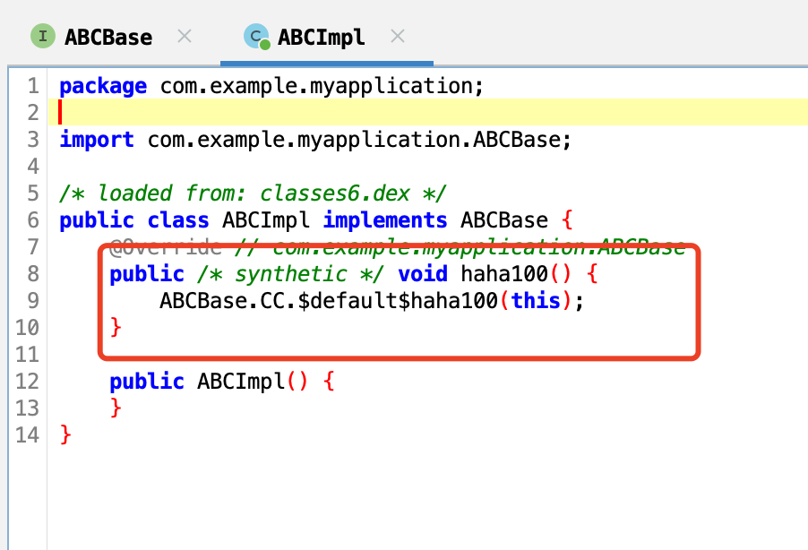

> [!NOTE]
> 本文为历史技术分享，正文保持原文内容。文中的数据、界面、链接和能力状态反映发布时情况；最新产品行为以 Wiki 其他页面为准。

<!-- original-article-start -->

> 本文主要内容：介绍增量编译插件 Jugg 源码编译方案。

本篇为增量编译源码的方案介绍。插件的介绍和接入情况见第一篇文章：[Android增量编译插件Jugg(1) - 平均耗时3.2秒，邀请大家使用](TODO)

# 1. Java 编译

在 Gradle 编译中，我们使用的是 ```compileDebugJavaWithJavac``` 完成 Java 源码编译（对应实现是 ```org.gradle.api.tasks.compile.JavaCompile```）。这个 task 会接收模块所有的 Java 文件，并将所有 Java 文件编译为 class 文件。

因为需要处理所有的 Java 文件，即使 task 实现有增量编译逻辑，耗时依然较为可观。


> compileDebugJavaWithJavac 的增量编译逻辑

在 Jugg 的增量编译中，为了获得更快的编译速度，我们可以利用全量编译生成的的 class 文件作为 classpath 依赖，仅对改动的文件进行编译。

Java 编译实质等同于调用 ```javac``` 命令，可通过 JDK 提供的 ```javax.tools.JavaCompiler``` 实现。

调用一个命令是流程性，原子性的，只需要提供正确的参数，即可正确实现编译。

参数来源由编译上下文管理模块提供，而 Jugg 目前用到的编译参数有：

* -cp：依赖的 classpath，支持目录和 jar 包，通过```File.pathSeparator```分割。对应 ```build.gradle``` 里的 ```implementation``` 和 ```api```；
* -g：保留调试符号，否则 debug 调试时会无法显示变量名；
* -source：源码最高支持版本，对应 ```build.gradle``` 里的 ```sourceCompatibility```；
* -target：生成的 class 文件的版本，对应 ```build.gradle``` 里的 ```targetCompatibility```；
* -d：指定输出目录。

javac 更多可用参数：[javac](https://docs.oracle.com/javase/8/docs/technotes/tools/windows/javac.html)。

这一点也不难嘛！确实，获取这些参数值可能麻烦，但调用 javac 还是挺简单的。

## 一点小意外 - 获取 JavaCompiler 失败

适配 Android Studio Giraffe 时，```ToolProvider.getSystemJavaCompiler()``` 返回了空，拿不到 JavaCompiler 了。

然后通过 StackOverflow 发现了另一种获取方式：```Class.forName("com.sun.tools.javac.api.JavacTool").newInstance() as JavaCompiler```。

如果这是在答辩，我会说“虽然问题已经解决，但为了知其所以然，也为了防止后续有新的意外发生，我对这个问题进行了原理的了解和问题的深入分析”。


但现实是开发时间很宝贵，我会把时间投入到更高优先级的功能中去。

# 2. Kotlin 编译

在 Gradle 编译中，我们使用的是 ```compileDebugKotlin``` 完成 Kotlin 源码编译（对应实现是 ```org.jetbrains.kotlin.gradle.tasks.KotlinCompile```）。这个 task 会接收模块所有的 Kotlin 文件，并将所有 Kotlin 文件编译为 class 文件。

同样的，Kotlin 编译实质等同于调用 ```kotlinc``` 命令，可通过 maven 包 ```org.jetbrains.kotlin:kotlin-compiler-embeddable``` 提供的 ```K2JVMCompiler``` 实现来完成。

虽说依然是“只需要提供正确的参数，即可正确实现编译”，但 kotlinc 显然要难搞得多。

首先是环境问题。因为 Kotlin 和 Intellij Idea 都是 JetBrains 搞的，所以编译器实现和 IDE 还存在一些**包名一样但实现不完全一致的类**。而 IDE 的类先加载，编译器后加载，从而在编译器运行时出现类实现不匹配，导致运行编译失败。

解决办法是，将编译器实现和它的所有依赖，用一个新的独立的 ClassLoader 加载，以达到隔离的目的：

```
URLClassLoader(libraryClasspath.values.toTypedArray(), null) // null 表示它没有爸爸
```

然后是用到的 kotlinc 参数：

* -verbose：打印更多的日志；
* -jvm-target：目标 JVM 版本，对应 ```build.gradle``` 里的 ```jvmTarget```；
* -language-version：指定 Kotlin 语言版本，如 1.6，1.7。由于部分语法差异，同一段代码 A 版本可以编译成功，但 B 版本可能编译失败；
* -no-warn: 不打印 warning；
* -no-stdlib：不要默认把 ```kotlin-stdlib.jar``` 加入 classpath；
* -no-reflect：不要默认把 ```kotlin-reflect.jar``` 加入 classpath；
* -module-name：编译文件所在的模块名称。这个参数会影响 internal 方法的命名和 .kotlin_module 生成。
* -Xfriend-paths：指定同模块的 classpath 目录。internal 方法会通过该目录识别，不指定会报错：“error: cannot access 'XXX': it is internal in 'YYYYY'”
* -Xreport-output-files：编译时打印输出文件，方便解析输出列表；
* -Xjava-source-roots：用于指定同模块的 Java 源码路径。用于 Java / Kotlin 相互引用场景。
* -Xplugin：用于支持 KotlinAndroidExtendsion（就是那个被 viewbinding 废掉的那个 View id 引用插件）等能力。
* -P：设置参数给 KotlinCompiler，此处主要用来设置 KotlinAndroidExtendsion 需要的参数。
* -d：指定输出目录。需要指定为 classpath 目录，否则会认为和其他 class 不是同一个 module 导致 smart cast 失败：```smart cast is imposible```。

kotlinc 的更多可用参数（但不全）：[kotlinc](https://kotlinlang.org/docs/compiler-reference.html)

参数很多，资料不多。下面分享一下我开发 Jugg 过程中遇到的几个有趣的编译问题。

## Java / Kotlin 混编 —— 鸡生蛋？蛋生鸡？

这个场景是一个“哲学”场景：一个互相引用的 Java 和 Kotlin 同时被修改，应该先编译哪个？答案是**先编译 Kotlin**，因为 Kotlin 可以通过 ```-Xjava-source-roots``` 同时读取 Java 源文件联合编译。

如果没有正确设置该参数，会出现：```class is not abstract and does not implement abstract member```， ```reference not found```，```type mismatch```, ```cannot access class``` 等各种因为没有引入 Java 新源码，而是使用老的 classpath 导致的错误。

## internal 方法支持

Kotlin 的 internal 特性是标记为 internal 的方法和变量只可以被本模块访问。kotlinc 识别本模块的方式是通过 ```friend-paths``` 参数来标识同模块 classpath，否则同模块无法访问 internal 方法。

此外编译器对 internal 方法的**字节码**处理方式是，**将标记为 internal 方法和变量的末尾加上 module_name**。而 Gradle 编译中 module_name 的命名规则是：```${moduleName}_{buildVariant}```。所以 app 的 debug 包的 ```func1``` 方法，编译后 class 字节码中的方法名为：```func1$app_debug```。

> \$ 通常代表这是一个编译器生成的类/方法/变量，通常建议避免在类和方法命名中过度使用特殊字符，以保持代码的可读性。

所以让 internal 方法正确运行的办法是：设置正确的 -module-name 参数，如果没有正确设置，则调用的地方会因为名字对不上发生运行时报错 ```NoSuchMethodError```。

## .kotlin_module 的作用与增量处理

.kotlin_module 是一个 Kotlin 模块（粒度与 Gradle 模块一致）的描述文件。kotlin_module 文件记录了 JVM 字节码不支持的顶级声明信息，如扩展方法，全局变量。因为这些信息无法在 class 文件中体现，所以需要额外的信息来帮助 Kotlin 编译器编译。

在全量编译中，Kotlin 编译器总是接收所有的 Kotlin 文件，生成完整的 kotlin_module 文件，没有问题。

而单文件编译中，如果文件新增了顶层声明或扩展函数，会新生成一个 .kotlin_module。新的声明也需要加入到原来的 kotlin_module 声明中，否则会发生编译报错，如 ```extension unresolved reference```。

所以我们需要实现 kotlin_module 文件的合并，将新增的声明和已有的声明合并起来。Kotlin 提供了 ```kotlinx-metadata-jvm``` 库来解析 kotlin_module 文件。kotlin_module 文件内容会被解析为 KmModule 对象，里面维护了一些 List 和 Map 属性，直接合并即可。

## 智能强转失效 - smart cast to 'MutableList<BillboardData>' is impossible, because 'dataList' is a public API property declared in different module

这个错误我们在正常开发期间也会遇到，它表述的意思是：你这个属性（```dataList```）是来自其他模块的，我不知道你是直接返回一个变量，还是一个自定义 get 函数。如果是一个自定义 get 函数，那就算你判断了非空，我也不能帮你自动转成非空，因为它可能每次返回都是不同的值。

我举一个简单的例子，下面代码主要关注 ```main``` 函数即可：

```kotlin
import kotlin.random.Random

fun main() {
    val cast = TestSmartCast()
    if (cast.var1 != null) {
        // 正常: Smart cast success
        cast.var1.inc()
    }

    val cast2 = TestSmartCast2()
    if (cast2.var1 != null) {
        // 报错: Smart cast to 'Int' is impossible, because 'cast2.var1' is a property that has open or custom getter
        cast2.var1.inc()
    }

    val cast3 = TestSmartCast3() // TestSmartCast3 声明在其他模块
    if (cast3.var1 != null) {
        // 报错: Smart cast to 'Int' is impossible, because 'cast3.var1' is a public API property declared in different module
        cast3.var1.inc()
    }
}

class TestSmartCast {

    val var1: Int? = null
}

class TestSmartCast2 {

    val var1: Int? get() {
        val randomInt = Random(0).nextInt(10)
        return if (randomInt > 5) {
            randomInt
        } else {
            null
        }
    }
}
```

* TestSmartCast 的 var1 实际上是一个变量，可以智能强转为非空；
* TastSmartCast2 的 var1 实际上是一个 get 函数，不可以智能强转为非空；
* TastSmartCast3 在另一个模块，和 TestSmartCast 实现一样，是一个变量，但是不可以智能强转。**因为依赖的类存在于另一个模块，不同模块是单独编译的，另一个模块随时有可能在未来任意时候变换为 get 函数实现。如果没有这个报错，此时智能强转将背刺你。**

以下是[官方回复](https://discuss.kotlinlang.org/t/what-is-the-reason-behind-smart-cast-being-impossible-to-perform-when-referenced-class-is-in-another-module/2201/10)：


智能强转的背景知识介绍完毕。在 Jugg 的这个 case 中，Gradle 是可以编译成功的，说明调用的类是在同一个模块中，只是增量编译没有正确配置导致报这个错。

我以为设置正确的 module-name 就可以认为文件是在同一个模块，但实际看来并非如此。于是我开始对 KotlinCompiler 进行漫长的调试（没错，KotlinCompiler 也是 Kotlin 写的，可以直接调试）。

最后发现是否是同模块编译是 ```DataFlowValueKindUtils.areCompiledTogether``` 这个函数决定的。



调试查看 ```usageModule``` 和 ```declarationModule```，确实不一样：



这里的意思是：依赖的类在依赖模块里，而使用的类在自己模块里。按照分类确实也合理，我确实把依赖的类放在 classpath 里了。

那怎么才能让依赖的类识别为同一个模块呢？除了把所有源文件放一起编译之外，**把 output 目录设置为模块的 classpath 目录也可以达到同样的效果**。设置后果然一样了。



问题解决了。至于我是怎么发现这个条件的，办法是和 Gradle ```compileDebugKotlin``` 使用的参数逐一比对排除。

非常朴素一点儿都不酷。

# 3. 编译检查（扩散编译）

之前提到 Java / Kotlin 增量编译都仅只对改动的文件进行编译以提高编译速度。那么现在考虑这个场景：我们删除了某个接口，而依赖的文件没有改动没有重新编译，这个时候会出现运行时 crash ```NoSuchMethodError```，因为方法被我们删除了。

Gradle 编译会将全量的源码加入到编译列表中，所以在编译期间就可以帮我们检查出没有适配改动的文件。增量编译的原始方案无法帮我们做**编译检查**，会对开发体验带来一定的折损。

所幸的是**编译检查**解决方案也是有的，有这么一个概念：扩散编译。扩散编译是几个方案都提到的一个概念。

简单来说就是你只改了 A 文件，但影响了 B 文件对 A 文件的调用（如接口变更，变量删除）。此时需要把 B 文件也编译了，保证不会因为 B 文件的调用问题导致运行时 crash。

目前 Jugg 处理了以下场景：

1. 方法签名变化/删除时——编译所有引用类源码；
2. 变量签名变化/删除时——编译所有引用类源码；
3. 抽象类父类新增抽象接口时——编译所有子类源码。

## 扩散编译实现

为了实现扩散编译，我们需要拿到类之间的调用关系。通过前篇提到的 APK 解析数据库，Jugg 可以完成类引用的查询。但需要注意：

1. ```A``` 的方法 ```fun1``` 发生变化时，由于 ```invoke-virtual``` 虚函数调用的特性，引用类并不一定是通过调用 ```A.func1()``` 来实现调用的，也可能通过 A 的子类进行调用。所以在搜索是时，需要把 ```A``` 的子类引用也加入搜索。


2. 增量部署过的类，需要使用部署后的类结构分析。


## 遗留问题

由于实现方案是根据 APK 结构实现的，Kotlin 的常量和内联方法的改动不会触发扩散编译，也无法追踪（不排除 Kotlin 可能留了一些产物来进行标识）。正常来讲，实现内联方法的引用检索需要引入源码语法树分析能力。


# 4. Dex 编译

从 ```javac``` 和 ```kotlinc``` 编译出来的是 class 文件，还需要使用 ```d8``` 将 class 转换为 dex。通过 ```D8Command``` 可以调用 d8，涉及的参数如下：

* --output：指定输出路径；
* --file-per-class：每个 class 单独一个 DEX，需要用到，是 JVMTI（ARTTI）的要求；
* --lib：传入 ```android.jar```，用于 Java 8 语法脱糖；
* --classpath，传入的是 class 文件的 classpath 依赖，也是用于脱糖。
* --min-api：对应 ```build.gradle``` 的 ```minSdkVersion```。会影响脱糖行为，如 min-api 26 以上则不会对 Java 8 进行脱糖，因为虚拟机已经完全支持 Java 8；
* --no-desugaring：关闭脱糖。因为 Jugg 需要 Andorid 11 以上设备，所以关闭是 OK 的，但会引入一个新问题（见下）。

D8 的 更多可用参数：[d8](https://developer.android.com/tools/d8)

## D8 脱糖介绍

D8 除了将 class 转换为 dex，还有一个重要的功能是脱糖（desugar）。脱糖指的是将 Java 8 的 class 文件修改为等效的 Java 7 class 文件，让 Java 8 的语法也可以运行在低版本设备上。

Android api 26 之后的版本完全支持 Java 8 特性，如果我们工程的 minApi >= 26，则不再需要脱糖。

D8 支持脱糖的特性包含：
* Lambda 转内部匿名类
* 使用 JDK8 才有的方法
* 方法引用（setOnClickListener(::onClick)）
* 重复注解
* 接口默认方法

## 脱糖 vs 不脱糖？

思考这个问题的起因是我发现当 D8 传入 classpath 进行脱糖耗时非常久，大文件长达 30s，原因未知。那么既然 Jugg 要求 Android 11 设备才可以使用，要不直接关闭脱糖得了。


我研究后发现，大部分脱糖都可以通过直接不脱糖解决，但 Java 的 default method 语法脱糖不可以。因为 default method 的脱糖方式是生成一个 ```$-CC``` 结尾的类，和一个 static 函数来代替默认实现，见下图：

一个含有 default 方法的接口类脱糖，生成 ```$-CC``` 结尾的新类来存放 default 实现：


实现了这个接口的类脱糖，会实现这个方法，并调用替代的 static 方法：


**默认方法的脱糖的特殊点在于：它不仅影响自己，也影响它的子类和调用类**。那么，如果我把脱糖关闭了，重新编译的子类就不再会实现此方法，运行时调用这个子类的 default 方法就会报错 ```AbstractMethodError```。因为子类没有实现这个方法，接口类因为脱糖了也没有提供这个方法的默认实现。

如果要修复这个错误，需要把实现了 default method 的接口 redex，来恢复不脱糖的 Java 8 默认方法。

或者，本地开发时直接把工程的 min api 设置为 26。但这样就要侵入工程，对于一个 IDE 插件来说是不应该出现的。

总结：脱糖和不脱糖都有棘手的问题需要解决：**走脱糖路线，需要解决 d8 耗时问题，走不脱糖的路线，需要解决 default method 的问题。**

最后 Jugg 选择的是 redex 方法，原因是 Jugg 已经搭建起了 APK 解析数据库，通过引用关系可以找到所有调用 default method 的 class，进行不脱糖的 DEX 重新部署。相比 d8 耗时问题，这是一条明确可行且工作量可控的方案。

Jugg 使用了多条规则来找到所有可能受 default method 影响的类：

1. 向上查找含有默认方法的接口并 redex；
2. 如果自身为实现了默认方法的接口，意味着默认方法可能有改动，需要 redex 所有子类；
3. 查找所有 invoke-static 中调用的是 static 方法的接口，并 redex；
4. 查找所有被删除的方法是否覆盖了接口的默认方法，如有则需要 redex 接口。
5. 类 A 的改动触发了类 B 的脱糖，类 B 需要继续查找规则 3，找到其他需要脱糖的类；

> 判断一个接口是否含有默认方法，是通过是否有同前缀且以 "-$CC" 结尾的类来判断的。

虽然规则虽多，但建立好数据库 index 后，平均查询耗时一般不超过 50ms。批量 redex 耗时基本也在 1s 以内，且同一个文件只会 redex 一次，性能是可接受的。

一开始这里的场景不齐全，而且运行时问题不太容易通过编译测试发现。这些场景也是通过大伙的反馈，调整了几次方案才补齐的。

# 5. 正在开发中的更多功能

## 5.1 注解器支持

```javac``` 使用 ```-processorpath``` 参数可以指定注解器，从而支持 ARouter 等通过 ```annotationProcessor``` 声明的注解器。

但 IDE 本身无法直接读取 annotationProcessor 相关配置，导致解析上有一定的困难，且难以保证准确性。

目前正在开发的方案是这样的：

1. 通过 ```ProjectBuildModel``` 拿到 ```annotationProcessor``` 声明，然后前往 ```GRADLE_HOME``` 根据路径特征搜索找到对应的包路径；
2. 解析路径里的 POM 文件，同样的方法在 ```GRADLE_HOME``` 找到注解器的依赖，一并加入到 ```-processorpath```；
3. 特别地，如果依赖包用了 support-v4 库（如 ARouter），可能还需要手动对其进行 jetified，因为 ```GRADLE_HOME``` 里 jetified 过的库路径第一层是一个 hash 值，遍历可能耗时较大。

失去了 Gradle 环境，这个功能流程存在很多不确定性，开发起来需要更慎重一些。

## 5.2 支持 viewbinding，compose

viewbinding，compose 都可以通过调用对应的 Java 包来实现，目前正在开发中，功能也会根据接入同学的需求优先支持。


# 6. 写在最后

非常感谢你阅读到这里。如果你愿意尝试使用 Jugg 请随时联系我～我用爱发电，无需排期。


<!-- original-article-end -->
