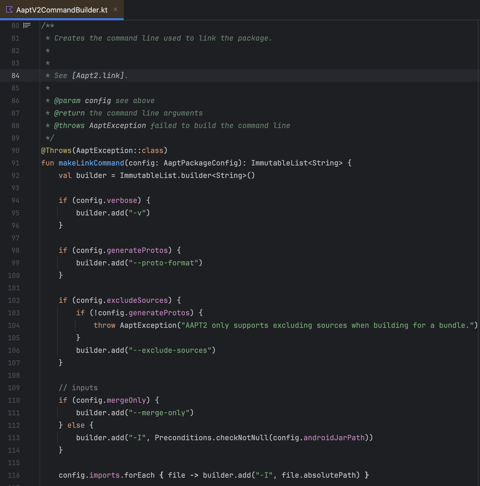
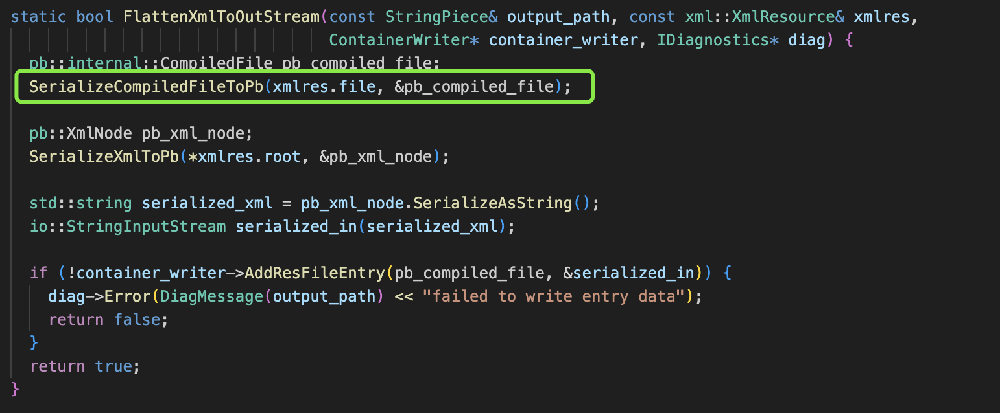
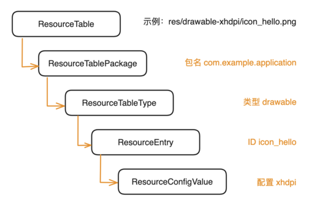
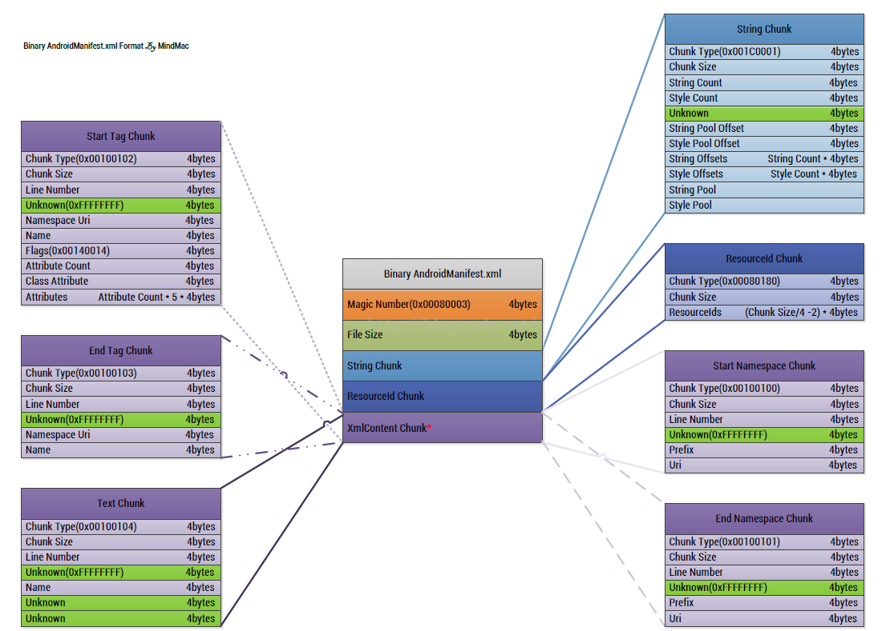
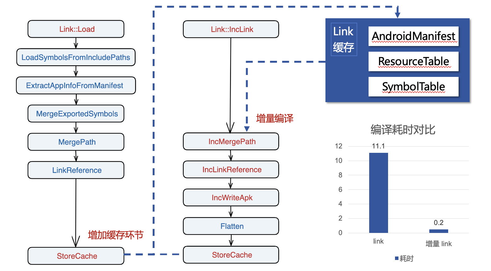
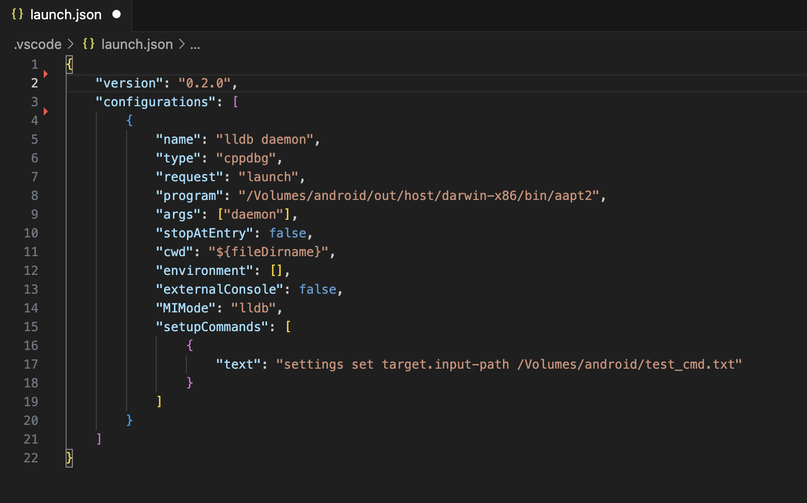
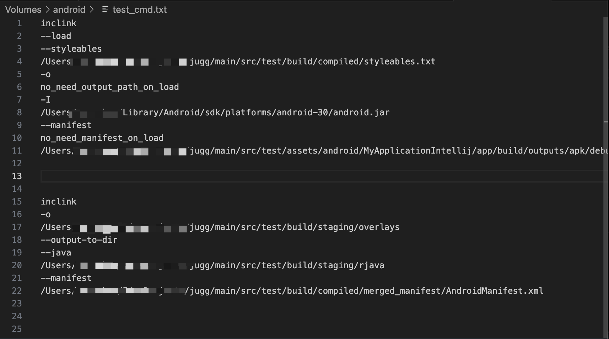
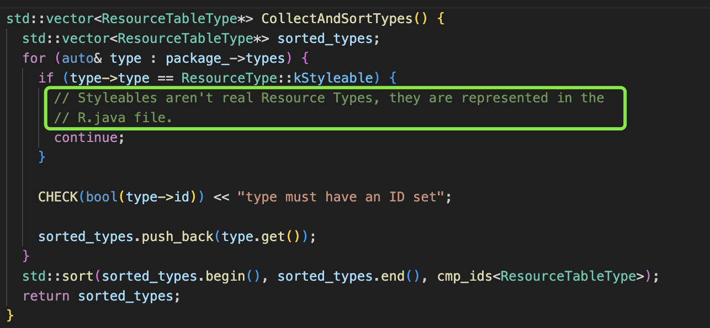
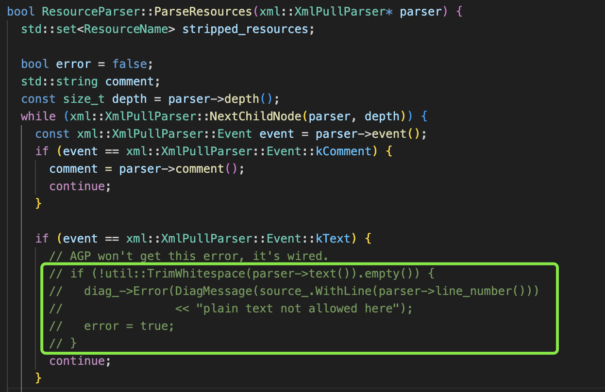

> [!NOTE]
> 本文为历史技术分享，正文保持原文内容。文中的数据、界面、链接和能力状态反映发布时情况；最新产品行为以 Wiki 其他页面为准。

<!-- original-article-start -->

> Jugg 提速编译的其中一个黑科技是使用了定制版 aapt2，将单文件资源编译耗时从 10-15 秒降低到 0.2 秒。
> 本篇文章将介绍 Android 的资源编译方式，以及 Jugg 是如何针对增量的场景改造 aapt2 的。


# 0. 写在最前

目前 Jugg 依然在稳定迭代维护中。我建了用户群，各位可以先进群，有空随时接入：TODO

同时也附上接入手册：Jugg 使用手册。使用非常简单，只需安装到 Android Studio 即可使用。遇到任何问题随时联系我，包解决。

本篇为系列文章第三篇，整体方案见：TODO


# 1. Android 是如何编译资源的？

**编译本质上是一个将源文件转换为目标文件的过程。** 在 Android 中，资源源文件就是存放在 res 目录中的各种文件。比如 drawable 目录里的 png，webp 图片，通过 xml 定义的 shape，selector，gradient 等；layout 目录的 xml 布局文件；values 目录里定义的 styles，color，strings 等。

> 截止至 aapt2 2.19 版本，aapt2 支持 anim，animator，array，attr，attrPrivate，bool，color，dimen，drawable，font，fraction，id，integer，interceptor，layout，menu，mipmap，navigation，plurals，raw，string，style，styleable，transition，xml 共 25 种类型资源。资源类型会以枚举的形式定义在 aapt2 的 ```ResourceType``` 中。

~~众所周知，~~ 这些存放在 res 目录的资源文件，是无法被 Android APK 直接使用的。出于效率上的考虑，这些文件还需要完成两步处理才能被正常读取：

1. **引用内联**，把 ```@drawable/jugg_niubi``` ```@string/jugg_no1``` 等引用替换为最终的一个整数 ID，这一步和和编程的内联有点像，可以提高解析速度；
2. **序列化**，把 xml 文件转换为专用文件格式。这一步和 protobuf 也有点像，可以压缩体积，并提高读取速度；
3. 特别地（你不是说两步吗？），color，string，id 等值类型的资源，会直接被写进 ```resources.arsc``` 这个索引表中，不需要用额外的文件承载了；
4. 更特别地（？），对于 png 和 .9.png 类型的图片，编译器会尝试清理无用的 chunk 块，来尝试减小图片体积；
5. 最特别地，AndroidManifest.xml 也是一个的资源文件（它可以引用 res 里的资源），所以也是通过 aapt2 处理后输出二进制格式的。

编译后的资源产物即为 APK 中 res 目录的所有文件，以及 resources.arsc 和 AndroidManifest.xml。除此之外还会输出 R.java，供代码引用。

那么谁来完成这些事情呢？是它，```aapt2```。


# 2. aapt2 是如何编译资源的？

aapt2 同志，是一位由 C++ 编写的二进制可执行文件，支持 Windows，Mac，Linux 三个平台。aapt2 是 AOSP 的一部分，路径为 ```frameworks/base/tools/aapt2```，源码见：[aapt2](https://android.googlesource.com/platform/frameworks/base.git/+/master/tools/aapt2)。在 Gradle 编译中，编译资源的 Task 也是通过调用 aapt2 可执行文件来完成资源编译的。


> ```LinkApplicationAndroidResourcesTask``` 最终会构造 aapt2 命令并调用


有 2 就有 1，[aapt](https://android.googlesource.com/platform/frameworks/base.git/+/master/tools/aapt) 是第一代资源编译实现，方案是一步走完成整个资源编译流程。这个方案文件少的时候还好，现在工程动不动上万个资源文件，如果每次都全量编译一次，这谁顶得住啊。


所以 aapt2 它来了，aapt2 实现了增量编译，参考 gcc 的方式做成了编译 + 链接两步走：

1. **aapt2 compile** 命令将 xml 编译为 xml.flat。这个 flat 文件就是 aapt2 编译的中间产物，由 protobuf 序列化。此时文件引用的 ID 还未确定，还不是最终编译产物；
   

2. **aapt2 link** 命令读取所有 flat 文件和 AndroidManifest.xml 并输出最终产物。link 会为所有资源分配一个唯一的 ID，然后将 ID 回填到 flat 文件并输出为最终的格式（不是 protobuf 了）。并同时输出 resource.arsc，AndroidManifest.xml 和 R.java；

这里面提到的 ```resource.arsc``` 是 APK 的资源索引表，存储了所有的资源的 ID/配置/值，在 aapt2 源码中的结构为 ```ResourceTable```。它的结构可以简单表示为如下：



而最终编译完成的资源文件，是一个特殊的数据格式：


> 图是偷来的，就不展开说了。见：[Egos Blog](https://coolegos.github.io/2018/01/21/xml%E6%A0%BC%E5%BC%8F%E4%BB%8B%E7%BB%8D%E3%80%81resoures.arsc%E7%BB%93%E6%9E%84%E4%BB%8B%E7%BB%8D%E4%BB%A5%E5%8F%8AAndroid%20%E8%B5%84%E6%BA%90%E7%9B%B8%E5%85%B3%E9%9C%80%E6%B1%82/) （他的图也是偷的）

这样一来，资源文件编译变成了一个解耦的操作，不需要其他文件参与。XML 文件变了，就编译更新对应的 flat 文件，而没变的 XML 就不需要再编译了。而查找改动的文件是由 Gradle task 来完成的。

aapt2 使得 compile 耗时大大下降了，不用每次都全量编了，编译一个文件一般只需要 100-200ms。但 link 耗时还是比较可观，大的工程 1W+ 的 res 文件，仍需要 10s 以上的 link 耗时。**增量了，但没完全增。** 

但这其实并不是 aapt2 不想，而是其作为一个无状态的命令行工具，他的输入就是由外部完整提供，和输出一一对应。当然，也可以复杂地做，增加一些构建中间产物缓存来提速编译也是编译器常见的做法。只是对 aapt2 来说十几秒的耗时，相比源码编译的几分钟耗时，倒也没太大必要。

**而 Jugg 的改造方案，是特定场景的非标准解法。** 该方案可以得到极快的编译速度（10-15s 降低到 0.2s），但代价是无法删除资源 ID，删除资源后对应的 ID 会一直保留在 resource.arsc，直到下一次降级构建。这在 debug 开发环境是可以接受的（也没什么副作用），但并不能用在生产构建环境。

# 3. Jugg 黑科技，aapt2 增量链接命令 —— 啪的一下就编好了，很快啊

上一回我们讲到，aapt2 实现了增量编译功能，但链接还是需要从磁盘读取所有的中间文件，给每一个资源分配 ID，耗时较高，不符合 Jugg 对极速的追求。


先说结果，Jugg 定制了 aapt2，增加了 ```inclink``` 命令，将 ```link``` 再拆分一次，拆成加载和增量链接：

1. 加载通过 inclink --load 命令，加载 APK 中的 res 和 resource.arsc；
2. 增量链接通过 inclink 命令，接收改动的 flat 文件，增量处理并增量输出编译产物；
3. 甚至，如果 inclink 检测到没有 ID 新增，则连 R.java 都不会生成。可以省下 R.java 2-3 秒的编译耗时。

改造后使用 inclink 编译一般只需要 100ms，速度贼快。

## 3.1 方案实现

现在我们来看看如何把增量链接这个能力加入到 aapt2 中。

### 3.1.1 编译 aapt2

aapt2 是 AOSP 的一个 C++ 子项目，路径是 ```frameworks/base/tools/aapt2```。改造 aapt2 首先需要下载 [AOSP 源代码](https://source.android.com/setup/build/downloading)。AOSP 需要下载到一个大小写敏感的分区，在 MAC 上需要[这么做](https://blog.csdn.net/sinat_14899485/article/details/52333561)，Linux 可以直接下载，Windows 不支持编译，Windows 的 aapt2.exe 是通过 Linux 交叉编译生成的。

AOSP 下载完成后，在其根目录执行 ```source build/envsetup.sh``` 初始化，然后执行 ```make aapt2 -j8``` 编译，即可得到对应平台的 aapt2。Mac 会编译出 Mac 的 aapt2，Linux 平台会编译出 Linux 和 Windows 的 aapt2。Linux 编译出来的大小为 90+MB，需要用 ```objcopy --strip-debug``` 来移除 debug 信息。移除后大小约 6MB。


### 3.1.1 定制 aapt2

定制不是胡制，改造不是乱造。先定目标：

1. 不要影响 aapt2 的其他功能，仅新增一个增量链接命令；
2. 把 aapt2 改造成可以常驻内存的服务，内部维护缓存上下文，避免 IO 操作。**这有违 aapt2 作为命令行工具无状态的特点，但这是提高编译速度的关键** ；
3. 改了什么就编什么，多余的事情不要做，以得到极致的速度。

（此处省略 1 万字源码阅读过程）最终整体改造流程如下：


> 改造方案。蓝色为已有流程，红色为新增流程。右下角的耗时包含 compile 耗时。

1. 调用时使用 aapt2 daemon 模式，命令执行完后不会退出，这样 context 就可以一直缓存不需要重复初始化了；
2. 新增 ```IncLinkCommand``` 命令实现，继承于 ```LinkCommand```；
3. 实现 inclink --load 命令。先读取 APK 文件，加载 ID 表（也就是 resources.arsc），Android SDK 里的 android.jar（里面声明了属性和资源，编译需要依赖）。

   > 这里使用 APK 而不是读取所有 flat 文件来加载的原因是：1. APK 读取快差不多 4-5 倍；2. 直接读取 resource.arsc 就是最终的 ResourceTable，也就不需要通过 --emit-ids / --stable-ids 来固化 ID 了。
4. 因为读取的是 APK 而不是 flat 文件，而 resource.arsc 是不含 styleable 类型的，所以还需要额外的从 APK DEX 中导出 R.styleables 声明，再通过命令额外导入 styleables。
5. 加载完成后，将 LinkContext 持有起来，执行完命令后不要释放；
6. 实现 inclink 命令。和 link 命令流程相似，不过需要把 link 的加载流程剔除，且部分步骤从全量处理改为增量处理；
7. 实现按需生成 R.java，如果 ID 没有新增则跳过生成步骤。

## 3.2 aapt2 定制过程遇到的一些问题

当然事情不会那么的顺利，由于对 C++ 的不熟悉，在定制过程中也算是经历了九九八十一难。


### 3.2.1 断点调试

因为不知道怎么调试 AOSP 的 native 代码，第一版改造是通过日志打点完成的，花了 1 个多月。

第一版做出来后我发现一个 bug：xml 中新增 ID 最终不会更新到 resource.arsc，此时编译失败。因为排查效率低一度想要用 Kotlin 重写一份 aapt2。最后老老实实研究了一下如何调试，并对比 link 原流程，发现其实是一些步骤没有执行。问题快速解决。

下面讲一下断点调试 aapt2 的方法。想要调试 aapt2 首先需要打包出带 debug 信息的 so。先在 ```aapt2/Android.bp``` 增加调试标记：

```
cflags: [
   "-O0", // 禁用代码优化
   "-gdwarf-4", // -g -gdb都不行，VS Code 没办法关联源码和行号，搞了一天发现 -gdwarf-4 可以
]
```

编译出来后：

1. VS Code 安装 C/C++，CodeLLDB，GDB Debug 插件；
2. 用 VS Code 打开 ```frameworks/base/tools/aapt2``` 源码目录；
3. 新建运行和调试配置，见下图。这里配置的意思是运行命令 ${program} ${args}，并将 test_cmd.txt 输入给程序，方便快速调试
  
   > 运行配置截图。

   
   > test_cmd 内容。就是启动程序之后帮你自动输入的输入流。

4. 点击运行，断点成功。

### 3.2.2 新增 styleable 运行时 Crash

前面提到，我选择从 APK 读取已有资源，而不是所有的 flat 文件，这样可以提速，且省去固化 ID 的麻烦。但我很快发现 resources.arsc 中并没有 styleable 信息，导致新增 styleable 场景会出现 ID 冲突等问题。

为什么 resource.arsc 不含 styleable 呢？源码里也有答案：



原因就是 styleables 其实只是一个方便代码引用的定义，在资源搜索场景是没有用处的，所以最终不会存储到 resources.arsc。

遇到这个问题的时候，我陷入了深深的自我怀疑：使用 APK 作为数据源是否是对的？后续会不会有更多的问题？要不要重新选择正统的全量 flat 文件读取逻辑作为方案？

最终在经过数天洗澡冥思之后，我还是选择打一个补丁来修复：**从 APK 的 DEX 中导出 R.styleable 声明，在 aapt2 inclink --load 命令中额外导入 styleable。** 原因首先是我始终对速度有执念，不希望妥协；其次是固化 ID 需要侵入到 APK 构建过程，不是很友好。

### 3.2.3 使用了高版本属性导致 xml 修改不生效

这个问题的背景是，在 xml 中我们可能会使用一些高版本才有的属性，比如 ```android:paddingHorizontal```（API 26）。在 Android 5.1 之前，声明不支持的属性会的导致运行时 crash。5.1 对此做了优化，系统读取到不支持的属性时会自动忽略，不再崩溃。

在 aapt2 这个层面，aapt2 希望能兜住 5.1 以下也不要崩溃。而 aapt2 的做法是，当它发现 xml 存在不支持的属性的时候（即属性 API > min API），会生成一份 v22 配置（如 layout-v22）。这份 v22 配置保留所有属性。同时，原来的 XML 不支持属性会被移除掉，这样就不会 crash 了。

Jugg 的增量链接这个逻辑没有生效。表现就是修改某个含高 API 的 layout 不会生效，因为系统优先读取了已存在的 layout-v22 xml。

知道原因后通过一些 trick 使其生效即可。

### 3.2.4 xml 格式校验导致编译失败

某个接入的工程中 xml 文件里面写了一些纯文本，编译报错，但 gradle 却能编译通过。

猜测可能是高版本 appt2 增加了兼容性。解决方案：忽略 plain text，不再报错；




# 4. 顺带一提：assets 如何增量编译？

存放在 assets 中的文件不需要二次处理，直接部署到设备即可。增量部署实现请见下一篇文章～

# 5. 写在最后（复读机）

目前 Jugg 依然在稳定迭代维护中。我建了用户群，各位可以先进群，有空随时接入：TODO

同时也附上接入手册：Jugg 使用手册。使用非常简单，只需安装到 Android Studio 即可使用。遇到任何问题随时联系我，包解决。


<!-- original-article-end -->
