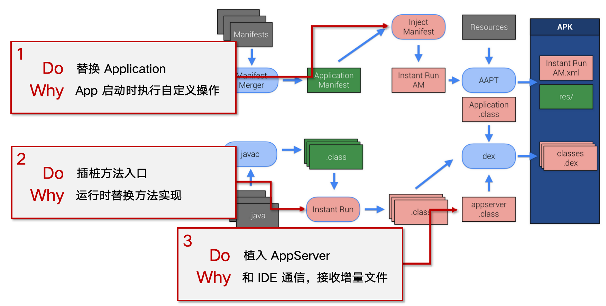
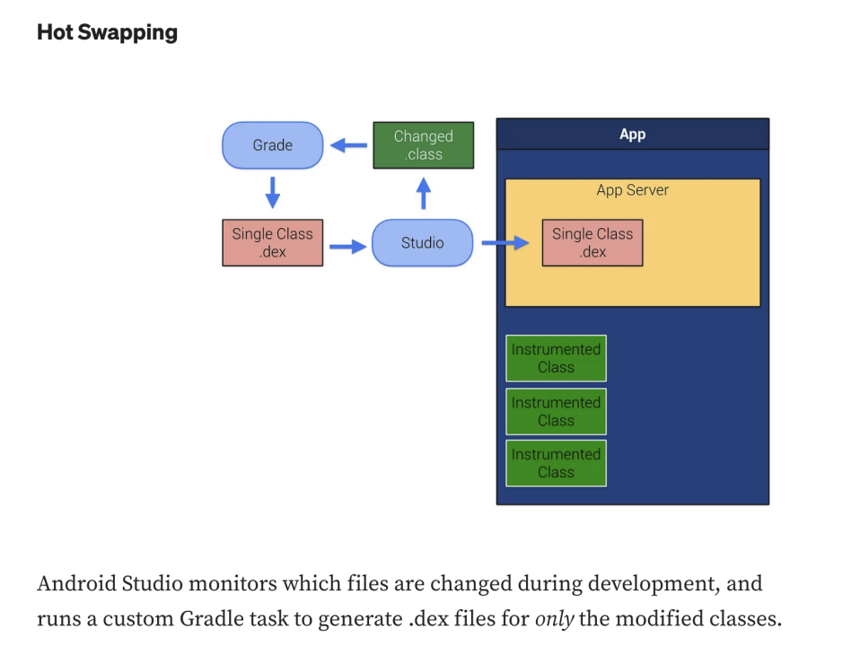
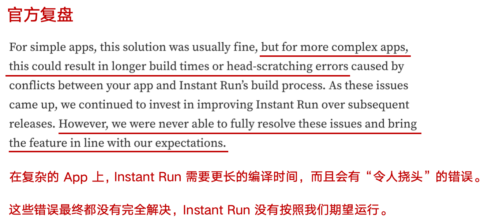
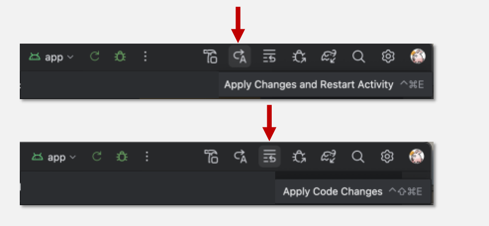
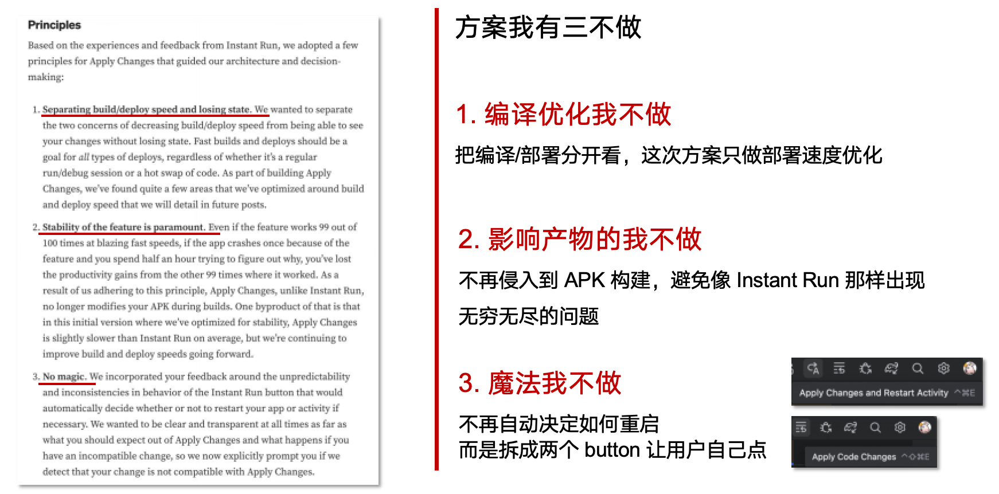
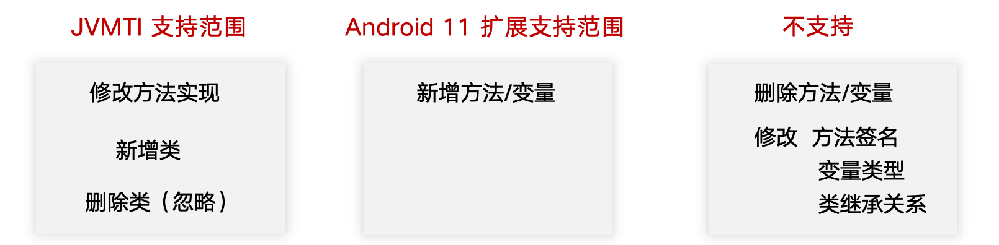
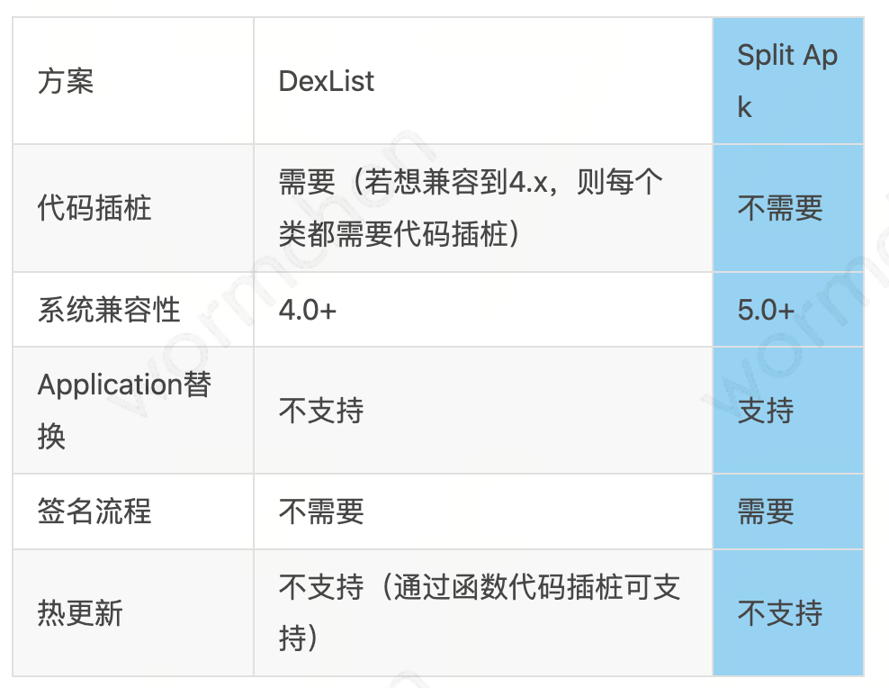
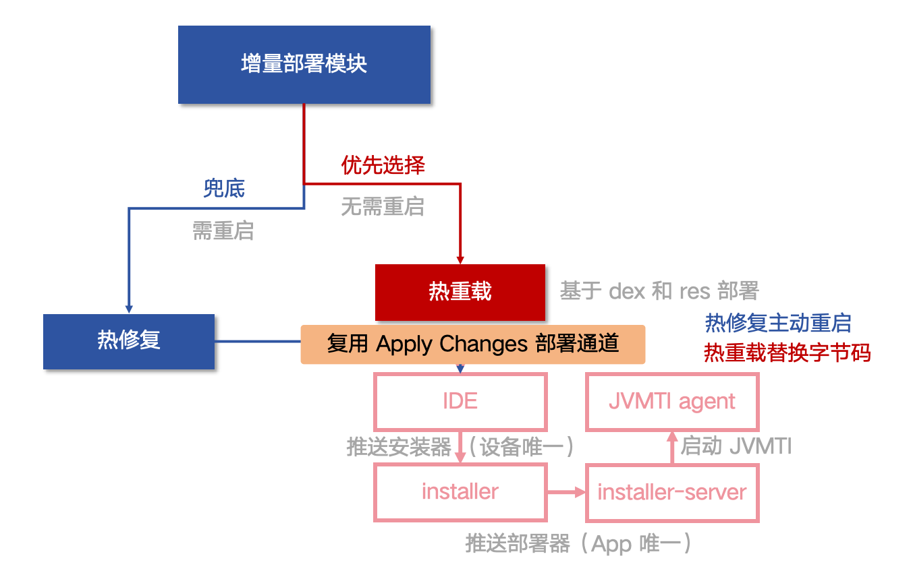

> [!NOTE]
> 本文为历史技术分享，正文保持原文内容。文中的数据、界面、链接和能力状态反映发布时情况；最新产品行为以 Wiki 其他页面为准。

<!-- original-article-start -->

> 本篇文章将介绍增量编译方案中增量部署的多种方式，以及 Jugg 是如何实现热修复+热重载混合部署的。

# 0. 写在最前

目前 Jugg 依然在稳定迭代维护中。我建了用户群，各位可以先进群，有空随时接入：TODO

同时也附上接入手册：Jugg 使用手册。使用非常简单，只需安装到 Android Studio 即可使用。遇到任何问题随时联系我，包解决。

本篇为系列文章第四篇，整体方案见：TODO


# 1. 增量部署是什么？

增量部署是增量编译方案中，**仅把部分的编译产物推送到 App 并使其生效的能力**。与其相对的全量部署就是安装完整的 APK 了。

> 背景同步：这里的增量编译方案指的不是 Gradle 编译中的增量编译，而是像 Jugg 这样不再进行完整构建，仅进行改动部分构建的方案。

为什么需要增量部署呢？因为在增量编译方案中，一般不会完整地构建出一个新的 APK，而是仅编译出部分增量的 DEX / 资源 / Assets。因此如何把这些增量的产物生效也是增量编译方案需要思考的重点。

各种增量编译方案可谓是八仙过海，各显神通，落地了非常多~~骚~~有趣的实现方式，我们接着往下看。


# 2. 目前都有哪些增量部署方案？

讲到如何把增量的产物生效，大家第一反应估计会想到热修复。热修复是一个用在线上的动态加载新代码/资源的方案，主要用来做一些 bug 修复和小功能更新。

实际上在多个增量编译方案中，就是参考热修复来实现增量部署的，比如 QQ 音乐的 [Lightning](https://cloud.tencent.com/developer/article/1744859) 和 有赞的 [Savitar](https://tech.youzan.com/you-zan-android-bian-yi-jin-jie-zhi-lu-zeng-liang-bian-yi-ti-xiao-fang-an-savitar/) 。 事已至此，我们不妨就先看看如何用热修复来实现增量部署。


## 2.1 热修复方案 -- 经过时间考验的经典

用一句话解释热修复的原理：**热修复是在 App 启动时，通过反射插入新的 Dex 和 资源路径到指定的类，同时使其优先生效，来实现代码/资源增量部署的能力。**

热修复的部署方式，具体来说会有以下几个步骤：

1. 代码增量加载：在 Application.attachBaseContext 阶段，通过 Context 获取 BaseDexClassLoader，然后通过反射将新的 DEX 文件插入到 ```pathList.dexElements``` 字段中。因为 ClassLoader 会按顺序搜索类来加载，所以只要插入到头部就可以了。
2. so 替换加载：和代码增量加载类似，只不过反射插入的变量变成 ```pathList.nativeLibraryPathElements```；
3. 资源增量加载：在 Application.attachBaseContext 阶段，通过反射构建一个新的 ```AssetManager```，然后通过反射将新的资源包通过 ```addAssetPath``` 方法设置进去；然后遍历 ```ResourcesManager``` 的 ```mActiveResources``` 或 ```mResourceReferences```，将新的 AssetManager 设置进去。

> 值得一提的是，这里的资源包设置的是一个不含 dex 的 res.apk 包，所以 assets 和 res 的增量部署都支持。

这里同学们可能会有疑问，所有热修复框架都是用的这个方案吗？

不是的，除了这个反射插入路径的方案，代码替换还有还有 native hook 方案，插桩方案等。native hook 方案如 [Andfix](https://cloud.tencent.com/developer/article/1633531) 兼容性难度较大，用的人不多。插桩方案如 [Robust](https://tech.meituan.com/2016/09/14/android-robust.html) 有一定性能和包体积的副作用，但优点是可以实时生效。


> 更多信息参考见：  
> Tinker 热修复解析 [http://w4lle.com/2016/12/16/tinker/index.html](http://w4lle.com/2016/12/16/tinker/index.html)  
> 热修复方案汇总 [https://zhuanlan.zhihu.com/p/75465215](https://zhuanlan.zhihu.com/p/75465215)  

了解了热修复原理之后，再实现增量部署思路就很清晰了。把 dex/res.apk 文件推送到手机指定目录上，App 重启时用热修复的方式加载这些增量产物即可。


## 2.2 Instant Run 方案 -- 增量编译的始祖

讲到热修复，就不得不提增量编译始祖 Instant Run，因为经典热修复的思路就是来源于它。Instant Run 是 Android 官方 2016 年推出的增量编译方案，目的是大幅提高日常开发的编译速度。可惜革命失败，功能已经永久下线了。兜兜转转回到本源，让我们一起看看它是怎么实现增量部署的。

在**首次编译**时，Instant Run 做了三件事：



1. 把 Application 换成自己的 Application。这一步的目的是启动的时候可以做一些初始化，比如把热修复里 Application.attachBaseContext 这个阶段的事情自动化完成了，不再需要开发自己加代码。当然完成自己的事情后，会把原来的 application 调用起来，做到透明无感知。

2. 给方法入口插桩。这一步是用来在后续增量编译时动态替换方法实现用的，下文会再次提到。

3. 植入了一个 AppServer，这个 server 是用来和 IDE 通信的，接收 IDE 发送过来的增量文件并生效。

在后续**增量编译阶段**：



在命中 **Hot Swapping** 模式（如仅修改了某个方法的实现）下，Instant Run 会执行一个自定义 task，**仅编译变化的文件**。

编译出来的增量 dex，会通过 IDE 发送给 AppServer。AppServer 会把变化的类标记为需要替换，并把补丁 dex 插入到 dex 列表前排。等下次执行这个类的方法时，依靠上面第二步的插桩，就可以把实现给重定向到新的实现。

在命中 Hot Swapping 模式时，App 是无需重启，立即可以生效的。除了 Hot Swapping 模式，还有 Warm Swapping，Cold Swapping。

**Warm Swapping** 适用于修改了资源的情况，因为资源不会自动生效，所以需要重启 Activity。

**Cold Swapping** 是前两个模式不适用的情况下的兜底，需要重启 App。这一步会比较特别，增量 dex 不再通过 AppServer 发送，而是打包成 APK 重新安装。

但是这个 APK 也不是全量的。在首次构建环节，APK 实际上会被 Instant Run 拆分为 10 个 split APK，此时 Instant Run 会通过提前记录的一个 mapping，找到受影响的 split APK 更新并安装。

这就是整个 Instant Run 的方案了。细心的同学可能发现，热修复好像也没怎么发挥作用啊？其实 Hot Swapping 和 Warm Swapping 模式就需要用到热修复的原理来插入代码和资源，且重启 App 后，也需要热修复的原理来恢复之前运行时部署的变更。

Instant Run 整个方案算是很野的，又换 Application 又插桩又热修复，这在 2016 年大家都在 LinearLayout RelativeLayout 的阶段，真是非常具有前瞻性的。只可惜方案太激进了，在面对复杂的大工程时没办法完美兼容，导致最终废弃的下场。




> 更多信息参考：  
> Instant Run 官方介绍：[https://medium.com/google-developers/instant-run-how-does-it-work-294a1633367f](https://medium.com/google-developers/instant-run-how-does-it-work-294a1633367f)  
> Inatant Run 代码解析：[http://dogee.tech/2016-07-28_InstantRun.html](http://dogee.tech/2016-07-28_InstantRun.html)  
> 官方复盘：[https://medium.com/androiddevelopers/android-studio-project-marble-apply-changes-e3048662e8cd](https://medium.com/androiddevelopers/android-studio-project-marble-apply-changes-e3048662e8cd)


## 2.3 Apply Changes 方案 -- 属于安卓自己的热重载

Apply Changes 也是安卓官方的方案。安卓团队不怕失败，不怕困难，痛定思痛，重新出发，定要给大家带来编译优化的革命。这个功能在 2018 年推出，目前依然在 Android Studio 中，也就是这两个按钮：



这次的 Apply Changes 方案做了什么呢？经过 Instant Run 的教训，Apply Changes 团队定了三个原则：



编译我不优化了，产物我也不改你的了，容易翻车；按钮我也都拆分开了（之前 Hot/Warm/Cold Swapping 都在一个按钮，策略自动选择，黑盒存在一定困惑），做到“所点即所得”。**这次只做部署优化。**


> 编译，我不优化了；产物，我也不改了；今日你那破 magic 按钮，我也拆定了。少魔改，保稳定，只有这条路才是留给我们走的，长兄还不明白么 ——《黑神话编译》（[->原版](https://www.bilibili.com/video/BV1gSsweyE4g/?vd_source=d2060254f0d1ac8e37f80d5e18bcf281)）

**部署，指的是安装 APK -> 重启 App -> 回到原来的状态这个过程。** 平时我们习惯了可能感受不深，其实安装+重启+恢复状态这个过程，细算了往往也需要 20s 以上。

那 Apply Changes 打算用什么技术来优化部署呢？答案就是：JVMTI（Java Virtual Machine Tools Interface）Java 虚拟机工具接口。

JVMTI 是 JVM 主动暴露出来的调试接口，支持类初始化监控，对象创建监控，类重载（class redefinition）等功能。像是 Android Studio 的 profiler 功能也是利用 JVMTI 接口实现的。

JVMTI 在 Android 8.0 以上才支持，并且有了自己的专属名字：**ARTTI**，但功能基本是一样的的，图方便下文还是继续用 JVMTI 这个名字。JVMTI 在 Debug 包是满血版，Release 会关闭大部分功能（毕竟还支持修改类实现这样危险的能力）。但网上也有通过 native hook 强制在 release 包上打开 JVMTI 接口的功能，比如 [这篇文章](https://developer.aliyun.com/article/1177923)。

Apply Changes 正是利用了类重载这个能力，**实现了安卓版本的热重载**。类重载可以实现运行时动态修改类的字节码，而不需要重启 App。

代码增量部署有解决方案了，那资源增量部署以及重启后恢复这两个场景怎么办呢？这就不得不说 JVMTI 的霸道之处了：**它连安卓源码的实现都可以改！**。只要是 JVM 加载的类都可以改，所以 Apply Changes 在加载代码增量部署的同时，还会修改 ```DexPathList``` 和 ```ResourceManager``` 的实现。

整个 Apply Changes 的流程是这样的：


> Apply Changes 架构图。

1. 执行编译，生成新的 APK。然后 **IDE 会把该 APK 和设备上的 APK 进行 Diff，找到变化的类和资源**，确定需要部署哪些文件。
2. IDE 将 ```agent.so``` push 到 app 的 ```code_cache/startup_agents``` 目录中； 
3. IDE 将增量部署文件 push 到 app 的 ```code_cache/.overlay``` 目录中；
4. IDE 将 ```agent.so``` attach 到 App 的虚拟机上。除此之外 ```ActivityThread.java``` 也会在 App 启动时遍历 ```code_cache/startup_agents``` 目录的 so 并 attach 到虚拟机，以此实现部署恢复；
5. so 会把增量部署的 DEX 文件通过 ```jvmti->RedefineClasses``` 方法，运行时替换类实现；
6. so 会把一个叫 ```instruments.jar``` 的包通过 ```jvmti->AddToBootstrapClassLoaderSearch``` 接口动态插入到 Dex 加载列表，该包用于实现类似热修复的能力，下面步骤会用到；
7. so 会调用 ```jvmti->RetransformClasses``` 方法进行插桩，完成类似方案一的能力：
   1. 修改 ```dalvik/system/DexPathList.split_dex_paths``` 方法，在原实现末尾处插入实现 ```InstrumentationHooks.handleSplitDexPathExit```。该方法会将 ```.overlay``` 的 DEX 文件插入到队列前面，实现增量类加载。
   2. 修改 ```dalvik/system/DexPathList.splitPaths``` 方法，在原实现末尾处插入实现 ```InstrumentationHooks.handleSplitPathsExit```。该方法会将 ```.overlay``` 的  apk 文件中 lib 路径插入到队列前面，实现 so 替换；
   3. 修改 ```android/app/LoadedApk.getResources``` 方法，在原实现末尾处插入实现 ```InstrumentationHooks.addResourceOverlays```。该方法会为 ```resources``` 增加 ```ResourcesLoader```，实现 res 替换。
   4. 修改 ```android/app/ResourcesManager.applyNewResourceDirsLocked``` 方法，在原实现开头处插入实现 ```InstrumentationHooks.addResourceOverlays```。该方法会为对 ```ResourcesManager.mResourceReferences```遍历增加 ```ResourcesLoader```，实现 res 替换。

Apply Changes 的另一个霸道之处，就是能让安卓源码给他打个洞，实现自己的启动加载逻辑（第 4 点）。纯纯亲儿子待遇。


但是，要说但是了，JVMTI 类重载功能是有条件限制的，**它不支持类结构的变化**，包括增删接口，方法，变量。Apply Changes 团队感觉这也不是个事啊，于是在 Android 11 拓展了增加变量和方法这两个场景：



那不支持的场景咋办呢？Apply Changes 会直接报错，并且提供一个按钮，点击后降级为 APK 安装流程。因为编译部分是没改的，所以直接装生成的 APK 就可以了。流程在此刻实现了闭环。

以上就是 Apply Changes 的整体方案。从个人的使用体验来看，确实很稳定，不用担心什么。但是，没有优化编译速度，导致优化效果不明显；容易触发不支持场景，报错还需要再点一次安装；拆分成三个按钮，每次都要想一下，增加了我使用的心智负担。**这估计也是 Apply Changes 没有真正流行起来的原因吧。**

PS：虽然正常没啥 bug，但架不住手机厂商硬造啊。目前已经发现鸿蒙 4.2 重启后必现代码部署不生效，以及小米澎湃 OS 偶现指定 App 无法部署 Apply Changes 的问题了。这些是后话了，Jugg 也兼容了，下一篇 Jugg 2.0 再说。

> 更多信息参考：  
> Apply Changes 官方介绍：[https://medium.com/androiddevelopers/android-studio-project-marble-apply-changes-e3048662e8cd](https://medium.com/androiddevelopers/android-studio-project-marble-apply-changes-e3048662e8cd)  
> 热重载优化，支持增加变量和方法：[https://medium.com/androiddevelopers/structural-class-redefinition-6fc0cbab9161](https://medium.com/androiddevelopers/structural-class-redefinition-6fc0cbab9161)


### 2.3.1 额外的：如何编写自己的 JVMTI 功能？

大家可能好奇 JVMTI 自己也想用要怎么做？这里也拓展一下。

编译 agent.so 很简单。引用 ```jvmti.h```（这个到处都能找到，黏进去就行），声明入口 jint JNICALL Agent_OnLoad() ，像正常写 android native 代码那样编译出 so 库。

编译出来后，加载有三种方式：

1. 放置在 App 目录 ```code_caches/startup_agents```，APP 启动时会自动调用（感谢 Apply Changes）
2. adb 命令 ```am attach-agent  ${包名} ${so 路径}```
3. 程序调用：```android.os.Debug.attachJvmtiAgent(so 路径)```

这里也可以用这个[开源 demo](https://github.com/AndroidAdvanceWithGeektime/JVMTI_Sample) 调试，有些手机有兼容性问题，但整个流程是通的。


## 2.4 split APK 方案

早在 Instant Run 的方案，就率先使用了 split APK 的特点实现增量部署。在一个内部方案中，也使用了 split APK 的特点实现了增量部署。




关于优缺点，**这边直接引用原文描述**：


> * 优点：无需插桩，可替换任意的代码（包括Application）
> * 缺点：
>   * 需要侵入并改变打包流程，生成的插件包需要使用签名工具签名，从而拖慢增量编译速度
>   * 只能支持到Android5.0以上版本，且部分厂商定制ROM并不支持此种方案
> 由于dexList方案需要侵入工程代码，而且要支持到4.x还需要处理每个class文件进行代码插桩，造成接入成本较高，我们的1.0版本选用了dexList方案.（wormchen 注：参考 Instant Run 的方式做到不侵入工程代码）


以及实现方式：

> 但为了方便三方工程接入，不影响原代码逻辑，我们又实现了分包APK方案。  
> 
> * base.apk：包含全部的资源文件，一个空Dex  
> * patch.apk：包含代码补丁的apk，初始时是一个空Dex，其中split="split0"，以保证其处于第一个被加载。  
> * orgSrc.apk：包含App原有所有class的Dex，其中split="split1"  
> 当生成新的补丁包时，若有资源修改，重做base.apk并安装，若有代码修改，重制patch.apk并安装。

总体来说是一个很好的思路，而且 DexList 方案 dex 多了本身也会有一点性能问题，但是要构建 APK 要签名会慢一点。


# 3. Jugg 的增量部署方案 —— 热修复热重载我全部要！


珠玉在前，Jugg 会选择什么样的增量部署方案呢？首先热重载的优势我想要，但降级场景我不想要，而且 Jugg 只做增量编译，也没有一个完整的 APK 给他降级。

那要不就降级为热修复？听起来很不错，不过有几个问题需要解决：

1. 如何判断用热修复还是热重载？
2. 如何实现热重载，自己单独搞一份还是借用 Apply Changes 的通道？
3. Jugg 是 IDE 插件，不是 Gradle 插件，如何在不需要用户修改工程的前提下实现热修复？

第一点，判断热修复还是热重载。已知 JVMTI（ARTTI） 的适用范围，我们可以通过比较要部署的类，已部署的字节码和将要部署的字节码的差异，找到是否有删除/修改方法/变量类型等情况，判断走热重载还是热修复。（但判断错也不用怕，JVMTI 会报错，再兜底即可）

第二点，如何实现热重载。我最初的想法是参考着 Apply Changes 实现一套自己的部署流程。但在 [细读源码](https://sickworm.com/2021/06/16/android-studio-deployer/) 后发现，只需要提供上次部署的 id，新类字节码，热重载类字节码，部署的资源字节流等数据，即可调用 Apply Changes 的接口来实现热重载。

```
// pb 结构示例
{
   // 上一次的部署 ID，确保中间没有发生清理或并发部署
   "overlayId": "3abc23d49448d56dea1f39df",
   // 新类字节码，保存并插入到 dex 列表
   "new_classes": [{ByteBuffer...}, {ByteBuffer...}, {ByteBuffer...}...],
   // 热重载类字节码，保存并调用 JVMTI 替换类实现
   "modified_classes": [{ByteBuffer...}, {ByteBuffer...}, {ByteBuffer...}...],
   // 资源/assets 文件字节流，保存并替换资源
   "overlays": [{ByteBuffer...}, {ByteBuffer...}, {ByteBuffer...}...],
   ...
}
```
> 见 [deploy.proto#OverlaySwapRequest](https://android.googlesource.com/platform/tools/base/+/studio-2024.2.1/deploy/proto/deploy.proto?autodive=0%2F%2F%2F%2F)

第三点，IDE 插件实现无侵入热修复。我一开始感觉这回偷不了懒了，要不把 Apply Changes 源码自己编译一份，实现兼容热修复的 Apply Changes 吧。上面提到，Apply Changes 的启动恢复部署和热修复本质是做一样的事，所以我只需要将其改造成不支持的类不报错然后重启就可以了。

但又在细读源码之后（这次是 [agent 代码](https://android.googlesource.com/platform/tools/base/+/studio-2024.2.1/deploy/agent/native?autodive=0%2F/)）发现，如果你把**不支持的类当做新类丢给 Apply Changes**，Apply Changes 会跳过检查，直接存储并塞进 dex 列表中。这里的原因是，新类不需要热重载，塞进 dex 列表，等触发初始化的时候自动就会加载了。

但是我丢进去的不是真的新的类，如果类已经加载过就不会再次触发类加载。但此时只要我主动重启一下，触发 Apply Changes 的恢复部署（上一步已经存储好），即可完成热修复的功能。

使用先进的 Apply Changes 部署通道非常快（socket + protobuf 通信），平均耗时仅 0.9s。最终整体方案如下：




> 最近我发现 Apply Changes 还有仅推送产物的通道，这下连装（新类）都不用装了，推送后重启即可，流程更短更快。


# 4. 写在最后（复读机）

目前 Jugg 依然在稳定迭代维护中。我建了用户群，各位可以先进群，有空随时接入：TODO

同时也附上接入手册：Jugg 使用手册。使用非常简单，只需安装到 Android Studio 即可使用。遇到任何问题随时联系我，包解决。


<!-- original-article-end -->
