> [!NOTE]
> 本文为历史技术分享，正文保持原文内容。文中的数据、界面、链接和能力状态反映发布时情况；最新产品行为以 Wiki 其他页面为准。

<!-- original-article-start -->

> 本篇文章介绍 Jugg 在 2.0 版本改善的功能稳定性，以及新的能力，包括依赖库增量编译，AndroidManifest 增量编译和 so 增量编译

# 0. Android 极速编译插件 Jugg 是什么？

**Android 极速编译插件 Jugg 是一款通用，安装即用，无侵入的 Android 增量编译 IDE 插件，于 2023 年 10 月发布。** Jugg 在 Gradle 编译产物的基础上，实现了一条独立的旁路编译流程，平均增量编译耗时仅 2.1s。

**Jugg 目前已投入到 WeSing，全民 K歌，QQ 音乐，JOOX，酷狗音乐，酷狗直播，QQ 浏览器等工程的日常开发。目前月使用人数 149 人，月编译次数 4.0W 次，累计编译次数达 30W 次。**

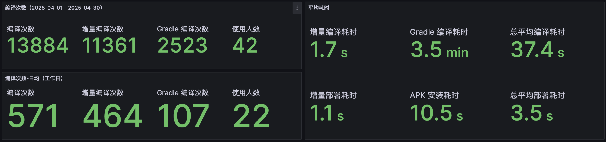

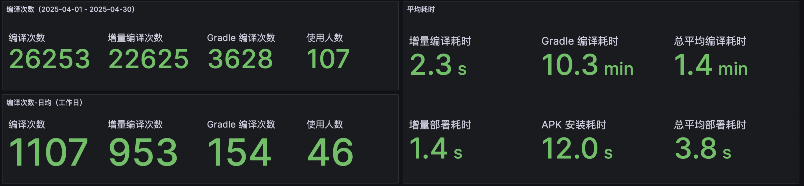

Jugg 使用简单，只需要安装到 Android Studio，点击运行即开始使用，且无需修改工程任何文件。  
Jugg 支持云编译，仅需配置服务器账号密码 IP，5 分钟内完成，所有工程可复用。  

# 1. 关于 Jugg 2.0

Jugg 在 2024 年 10 月发布了 2.0 版本，~~为了避免在 3.0 版本发布时还没写 2.0 的文章~~，2.0 版本根据大家的建议和反馈 带来了更多的优化和特性。接下来给大家介绍一下 Jugg 2.0 做了哪些改进，以及背后实现的原理。


# 2. Jugg 2.0 新增特性

## 2.1. 支持 Android 11 以下的设备

**Jugg 2.0 将支持的版本扩大到 Android 8 及以上（原 Android 11 及以上）。**

1.0 不支持低版本的原因是，Jugg 使用的部署功能是基于官方 Apply Changes 实现的（支持热重载），而 Android 11 以下的 Apply Changes 支持是不完整的，不支持资源增量部署，且不支持增加方法/变量。

Jugg 2.0 版本参考 Q 音 Lightning 的实现方案，增加了经典的热修复部署能力。即：Gradle 构建时替换 Application 为自定义 Application，然后在 Application 创建时执行以下逻辑：

1. 反射设置增量 Dex；
2. 替换 ResourceManager / AssetManager；
3. 启动原来的 Application（如有）。

> 核心实现：DexPatchLoader.kt


新增的热修复实现不依赖 Apply Changes 的加载实现，所以也不再需要 Android 11 才能支持。缺点是不支持热重载，但还是比降级好多了。该功能针对 Android 11 以下设备默认启用，自动识别。

### 疑问：一个 IDE 插件 是怎么实现无侵入修改 APK 的 Application 的？

这个问题也是 Jugg 1.0 的痛点。用 Gradle 做这个事情比较简单，先 `implementation` 自己实现 Application 依赖库，然后在 `processDebugManifest.doLast` 中换掉 XML 中声明的 Application 就搞定了。但 IDE 独立于 Gradle 环境，没法直接修改。

而且我希望用户安装完插件后就可以直接在所有工程就可以使用，不需要给每个工程的 gradle 配置都先配置一次（Code review 随机触发剧情：你这个收益是什么？有数据吗？稳定吗？影响原来编译流程吗？编译失败的时候注释掉可以吗？你还要合入吗？）

在某一个平凡的夜晚，我偶然发现，gradle 有一个参数 `-I` 支持外挂脚本，e.g. `./gradlew :app:assembleDebug -I init.gradle.kts`。在脚本中写和直接在工程写差不多，比如也可以 hook `rootProject.gradle.projectsEvaluated`。接下来事情就简单了。

大家可能注意到，这个 gradle 外挂脚本我用的是 Kotlin Script。这样的话，我就不用真的去写一个脚本，而是可以用一堆 Kotlin 文件拼装而成。无需维护两套实现，我起名叫代码同源。

最后 Jugg 生成出来的脚本有 2200 行 [readProjectInfo.gradle.kts](https://gist.github.com/sickworm/ddf442c8ca379477fb267a202fc5de0c)，里面除了包含替换 Application，还有很多信息读取的功能。信息读取功能也是为读取到 IDE 未提供的一些数据而实现的，如注解器参数，compose 版本和依赖库路径等。这为后面支持注解器编译如 ARrouter，Databinding，Compose 做好了铺垫。


### 另一个好处：经典热修复有更好的兼容性

热修复是国内非常成熟的方案，所有厂商都会注重其可用性的检查。Apply Changes 虽然是谷歌官方方案，但其影响力有限，且不运行于线上，很容易被厂商忽略。

一些和 Apply Changes 有兼容性问题的机型，也可以强制打开兼容模式来兼容。如：
1. Android 11 的 Oppo/一加设备，部署资源后启动 App，会小概率出现 AssetsManager 的 native crash；
2. 华子鸿蒙系统，部署资源后启动 App，会小概率出现屏幕卡住一段时间；
3. 部分中低端机使用 Apply Changes 方案部署大工程资源，运行时有卡顿感。

强制开启方法：点击 “More options” 的 “Force use compat deploy for {你的设备}”

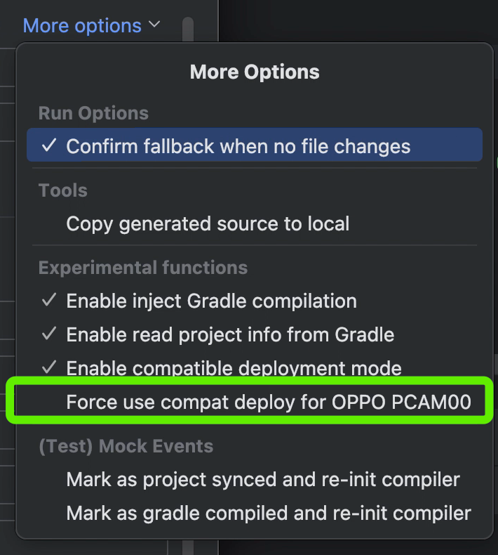


## 2.2. 支持 AndroidManifest.xml 增量编译

Jugg 2.0 支持了 AndroidManifest.xml 的增量编译。无需额外操作，修改后点击运行即可。

但其实 AndroidManifest.xml 本身是不支持增量部署的，系统只认 APK 里的 AndroidManifest.xml。Jugg 是通过把重新编译后的 AndroidManifest.xml 更新到 APK，然后重签名，重装 APK，恢复历史部署，来实现这个功能。

简要流程如下：（整体耗时10-20s）

1. diff AndroidManifest.xml 差异；
2. 将变化/新增的节点 merge 到最终的 AndroidManifest.xml；
3. 用 aapt2 编译新的 AndroidManifest.xml；
4. 把新的 AndroidManifest.xml 更新到 APK 并重签名；
5. 重装 APK，并重新部署历史增量部署文件。

这里有几个细节点值得拎出来单独说一下：

### 实现 AndroidManifest 增量 merge

官方 AGP 有 AndroidManifest 的合并实现，叫 ManifestMerger2，调用起来大概是这个样子：

```java
ManifestMerger2.newMerger(mainManifest, logger, mergeType)
    .setPlaceHolderValues(placeHolders)
    .addFlavorAndBuildTypeManifests(*manifestOverlays.toTypedArray())
    .addManifestProviders(dependencies)
    .addNavigationJsons(navigationJsons)
    .withFeatures(*optionalFeatures.toTypedArray())
    .setMergeReportFile(reportFile)
    .setFeatureName(featureName)
    .addDependencyFeatureNames(dependencyFeatureNames)
    .setNamespace(namespace)
```

但 Jugg 没用官方方案，而是自己实现了一套增量 diff + merge XML 节点的方案。这里当时也纠结了很久（轮子好造不好维护），最终决定不用官方方案，核心理由是 **可控**。主要有以下几点考虑：

1. 官方方案需要收集所有模块/依赖库/build variant 的 AndroidManifest 信息，如果不小心漏收集/错收集一个，结果可能就是声明缺失，引发运行时 crash 等异常。自研方案保守，只增加和更新 XML 节点，忽略删除节点（也会导致一些意料之外的结果，但 ~~我大清自有国情在此，~~ 代码和资源的增量编译也是忽略删除操作的）；
2. 官方方案还需要传递非常多其他数据，如何正确收集，并考虑 AGP 版本差异是个麻烦点；
3. 出现预期不一致的编译结果时，又是苦哈哈的源码阅读时间，一看可能就是一天。自己实现的知根知底，调试起来快很多。

当然，自研方案最大缺点就是，**你可能永远无法完全正确实现 AndroidManifest 的合并。** 如何判断一个节点是更新还是新增？（节点 unique key 是什么，不同类型节点是不一样的）如何正确实现 ```tools:remove```？合并后节点声明顺序对实际调用有什么影响？

对此 Jugg 2.0 是扒拉了几个大工程的源码，自动化测试并兼容了工程里出现的一些组合情况。并且在后续公测中逐渐完善了一些 case，目前是 bug free 状态，常见的场景如新增 Activity 场景没问题。

> 核心实现：AndroidManifestMerger.kt


### 使用什么 API 更新 APK 中的 AndroidManifest.xml

如何更新一个 Zip 文件，第一反应当然是 ZipFile + ZipEntry API 了。但这个方案本质是完整遍历一遍原文件的 ZipEntry ，然后写入到新的 Zip 文件，最终重新生成并替换。实际测试中，200+MB 的 APK，需要接近 60s 的耗时。太慢了，不合格！


在工匠精神的坚持下，幸运的 Jugg 在长白山深处找到了珍贵的天然 API：```nio.FileSystem```：

```kotlin
FileSystems.newFileSystem(zipDisk, zipProperties).use { zipFileSystem ->
            insertFiles.forEach { (path, content) ->
                val pathInZipFile: Path = zipFileSystem.getPath(path)
                if (pathInZipFile.exists()) {
                    Files.delete(pathInZipFile)
                }
                if (pathInZipFile.parent != null && !pathInZipFile.parent.exists()) {
                    Files.createDirectories(pathInZipFile.parent)
                }
                Files.copy(content.inputStream(), pathInZipFile)
            }
        }
```

FileSystem 的优点是它把一个 Zip 文件当做是一个文件系统，可以以随机访问的方式直接找到对应的 ZipEntry，进行增删改操作。测试下来 `nio.FileSystem` 增量更新耗时仅 1-2s。

但，APK 要求 Zip 是无压缩的，也就是 ```zipProperties``` 必须为 `compressionMethod=STORED`。而这个属性只有 JVM 14 以上才支持。（确认方式：查看每个版本的 [JDK API](https://docs.oracle.com/en/java/javase/14/docs/api/jdk.zipfs/module-summary.html) 文档）

所以这里需要再做一个 JVM 版本的判断。

> Jugg 的宿主是 IDE，2024 年之后发布的 IDE 后都是 JVM 14 以上。
> 
> 核心实现：ApkFileModifier.kt


最终整个方案如图：
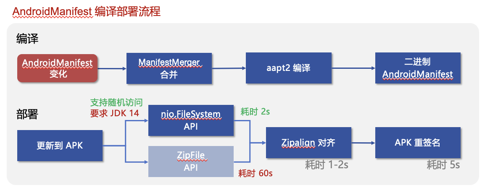


## 2.3. 支持 so 增量编译

这里做的比较简单，流程和 AndroidManifest.xml 的部署流程一样，更新进 APK 重新打包安装。不过 so 文件是支持增量部署的，只是我这边复用流程比较方便，就不单独再写一个新功能了。

## 2.4. 支持依赖库增量编译

Jugg 2.0 支持了依赖库的增量编译。该诉求源于独立库维护开发的同学，在频繁更新依赖库的场景下，希望可以不降级，支持增量编译，提高调试效率。

### 演示视频

[演示视频](https://www.bilibili.com/video/BV1W3411C7PU)


### 使用方式

1. 当检测到 build 文件修改时，Jugg 会弹出确认窗，暂时改动内容。
   
   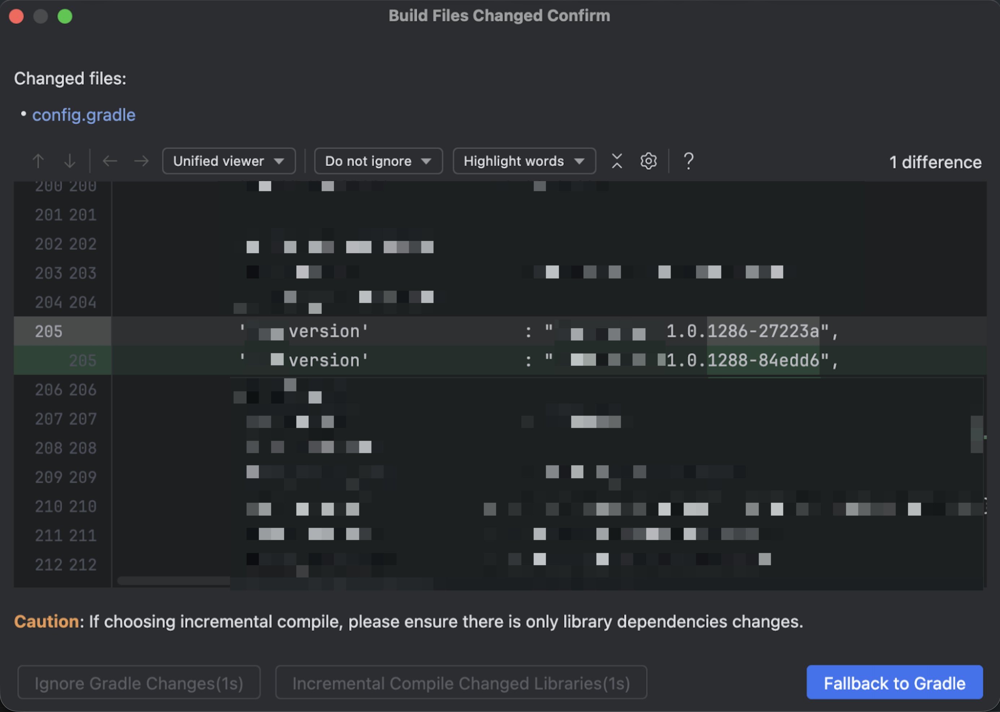

2. 此时用户可以选择：
   1. Fallback to Gradle：降级为 Gradle 编译
   2. Find out changed Libraries：找出依赖库变化
   3. Ignore build changes：忽略 build 文件变更
   4. 右上角关闭弹窗：取消

3. 如果选择“找出依赖库变化”，Jugg 会执行一段 gradle 命令，找出变化的依赖库。找到后用户需要再次确认是否符合期望。

   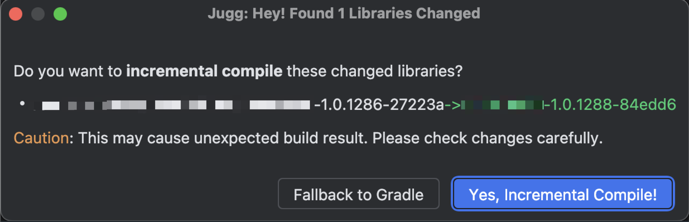

4. 二次确认后，Jugg 会编译变化的依赖库，完成增量编译。（总流程耗时 40-80s，主要耗时在第二步 gradle 执行上）


### 你可能想问：

#### Q：为什么需要用户选择，而不是自动执行？

A：穷举 gradle 构建信息的所有变化是个不明智的做法，可能会陷入无尽的维护深渊中。所以我选择用产品思维解决这个问题：展示文件 diff，让用户自己确认是否只有依赖库的变更，以及是否要使用这个功能。


#### Q：我不想用行不行？
A：当然可以，直接点击 Fallback to Gradle 即可。同时为了避免大家误点，导致意料之外的结果，除了 Fallback，其他按钮增加了倒计时确认，倒计时完成后才可以点击。


#### Q：什么时候我应该选择依赖库编译，什么时候应该选择忽略、降级？
A：以下情况适合选择依赖库增量编译：

1. **只修改了依赖库；**
2. **除了修改了依赖库，其他修改都对 APK 没有影响。**

#### 什么是“对 APK 没有影响” ？

举一些例子：

1. 给某模块增加**已有的**模块依赖。此时仅编译依赖关系变了，但产物（APK）本身无影响；
2. 给某模块增加**已有的** maven 依赖，理由同上；
3. 不会影响 debug 构建的改动，如格式化，空行，日志，或增加一些编译检查流程，修改了release APK 才会用到的一些参数；
4. 你是老司机，你非常自信，**日夜的相伴令你和 Jugg 已经融为一体**。你觉得这些修改对你的开发没有影响。而且当出现异常问题时，你可以很快地分辨出是因为没有降级导致的，并果断重新降级。

#### 什么时候可以选择忽略？

就是你认为这些 build 的改动，对你当前开发没有影响的时候了。

比如，你在开发某个功能，其他同事也提交到这个分支，并且改动了 maven 库。但他的改动只是加个 try catch，或者是接口没有变化的改动，而你也不关心这个改动。此时就可以点击忽略，继续你的开发。

忽略后，Jugg 会直接恢复到增量编译状态，**当作 build 文件改动从未出现过**。

这本质也是提供用户一个选择，避免暴力降级。用户依然可以随时选择主动降级。

#### Q：Jugg 是如何实现依赖库编译的？
A：实现依赖库增量编译，本质是拿到全量的依赖库信息，然后再拿到最新的依赖库信息，然后 diff 出变化的依赖库进行编译。

一开始我是用 IDE sync 来实现依赖库变更检测的。但 IDE sync 和 Gradle编译是独立且异步的，时序管理起来非常复杂，无法保证一一对应，搞了很久体验不佳，最后放弃了这个方案。

后改用 gradle 实现，此时又发现云编译场景下，本地 diff 性能和耗时都不太乐观，于是又支持了云编译 diff。最终整体方案如下：

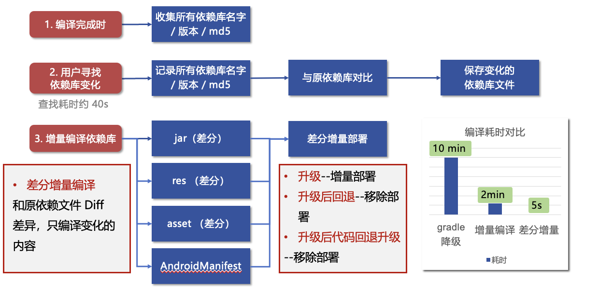

> 方案已考虑依赖库升级，降级，新增，代码回退等场景。
> 
> 核心实现：DependencyDiffResult.kt


## 2.5. 不参与编译 APK 的模块修改不再触发增量编译

老版本会一视同仁地检测所有源码的改动并编译。此时如果工程的一些模块是非 App 依赖的模块，比如一些构建、工具、注解解析类的模块，编译这些文件则可能出现编译失败。

Jugg 2.0 会过滤这些最终不会打包到 APK 的模块，避免误编译的情况。


## 2.6.（云编译）自动同步 BuildConfig / APT 等生成代码

使用云服务器编译时，如果本地没编译过或者修改了注解/BuildConfig，生成代码如 BuildConfig 会报红：
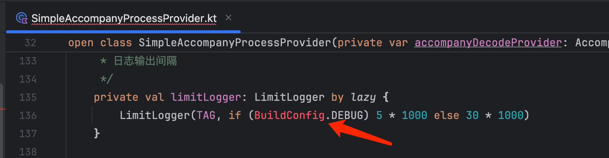

因为 IDE 找不到对应的生成代码。

现在 Jugg 2.0 在云编译完成后，会自动同步一次生成代码。（首次需要右键 reload 一下 build 目录，或者重新开关工程/等待一段时间）


## 2.7. 支持直接降级

在某些情况下，你明确希望直接降级，使用 Gradle 完成此次编译。
此时可以点击此按钮，二次确认后降级。


# 3. 重点 bug 修复

## 3.1. 修复 Git pull/checkout 时可能漏检测部分文件变化

Jugg 在工程打开期间是通过 IDE文件变更回调来检测文件变化的，只有工程重新打开时才会使用 git 找出所有变化的文件，这样可以减少增量编译耗时，也不强依赖 git 是否存在。
但我在持续使用的过程中发现，用户执行 git pull/checkout 等大量文件变更的场景时，IDE回调偶尔会丢失一些文件变更，如果文件变化很多，丢失几乎是必然的。

但因为此时往往伴随着 build.gradle 的修改，触发了降级，所以问题有时候就掩盖过去了。

而在支持依赖库增量编译后，可以遇见丢失文件的 bug 会严重影响依赖库编译这个功能。

所以在 Jugg 2.0 做了一个优化：文件变化时，Jugg 会适时检测 git HEAD 是否发生变化，如有则触发一次 git 查找，确保所有变化的文件都获取到。


## 3.2. 修复偶现编译失败，找不到依赖库类引用 “Declaration not found”

每一两个月都会有一个同学反馈：编译失败，原因是找不到部分引用。

通过反馈日志发现，IDE sync 完成后，Jugg 拿到的依赖列表，有很小的概率会丢失 jce/pb 协议库依赖，重新 sync 后则恢复。我猜测导致这个现象的原因是：协议库很大，而且解析可能是异步的，所以出现这样的概率拿不到的情况。

在 Jugg 2.0 中，Jugg 实现了通过 gradle 读取工程信息的能力（以前是纯靠 IDE 的数据）。核心是生成一个 gradle 脚本，在构建时通过 -I 参数传入：`./gradlew :app:assembleDebug -I readProjectInfo.gradle.kts`。

现在 Jugg 依赖库数据将从 IDE sync 变为 IDE sync + gradle 命令两个数据源的合并数据，避免了 IDE 偶尔丢失依赖的情况。

## 3.3. 修复鸿蒙 4.2 代码修改不生效的问题

华子鸿蒙 4.2 系统代码增量部署失效了！

Jugg 使用的是 IDE 的 Apply Changes 部署通道，所以我很快也发现 Apply Changes（App重启后）也是失效的。甚至 APK 安装也存在不生效的情况（命中增量更新 APK 时）。

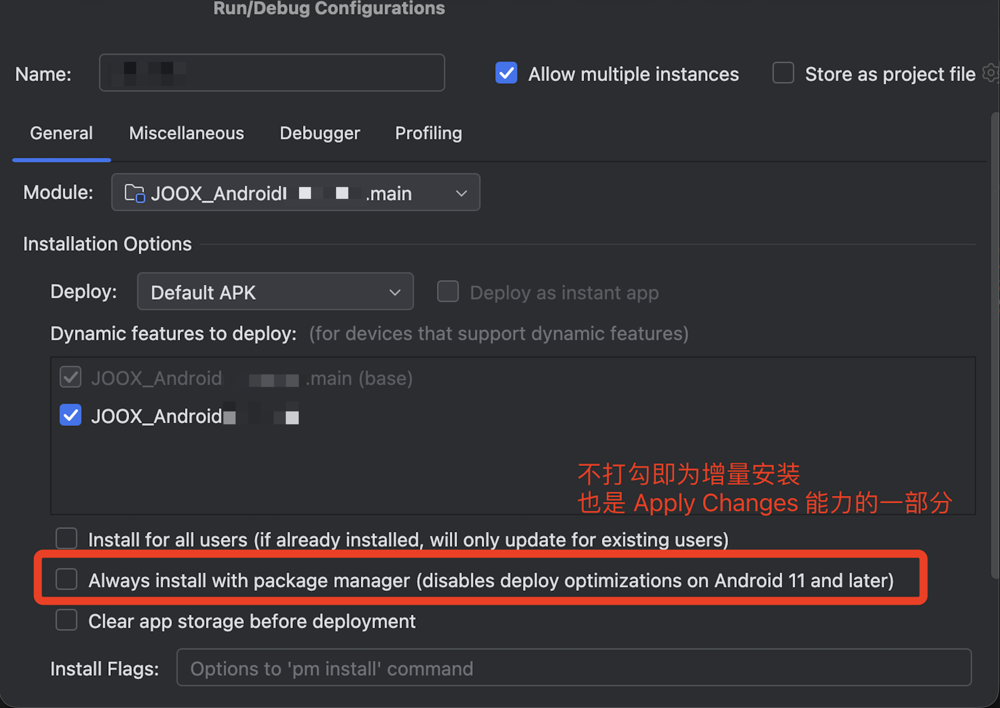

#### 解决方案

Jugg 2.0 突破了底层代码，实现了自己的 [jvmti agent](https://docs.oracle.com/javase/8/docs/platform/jvmti/jvmti.html) 来解决问题。

而这个问题的原因和解决办法要从 Apply Changes 原理说起。Apply Changes 加载流程:
1. ActivityThread 启动
2. Apply Changes 的 JVMTI agent 启动，修改 Dex 搜索逻辑
3. ClassLoader 初始化，加载 apk DEX 和增量部署 Dex
4. Application 创建，App 启动（资源加载原理类似，不展开）

鸿蒙 4.2 部署不生效的的原因是，华子把 ClassLoader 初始化的时机提前了，变成了 1 3 2 4，代码部署自然就不生效了。

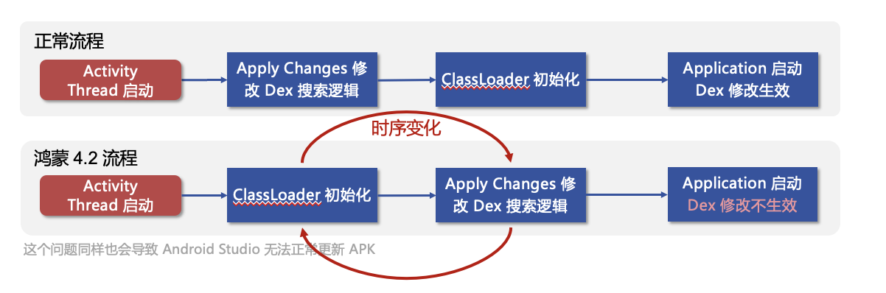

我是怎么发现的呢？因为我在 Application.attachBaseContext时查看 DEX 列表是不含增量 dex 的，但只要触发重新创建一次 DEX 列表就正常了。


但事情没那么简单，重新创建的 DEX 列表会命中 OAT 优化，导致代码过了一会还是不生效。感兴趣可看：[Android N混合编译与对热补丁影响解析
](https://mp.weixin.qq.com/s?__biz=MzAwNDY1ODY2OQ==&mid=2649286341&idx=1&sn=054d595af6e824cbe4edd79427fc2706&scene=0)

所以最后做戏做全套，把整套热修复方案搬过来了。

## 3.4. 修复小米澎湃 OS 无法部署问题

前后共有三位同学的设备复现了此问题。

这往往是突然出现的，而且只影响一个包。出现时往往是正在高频使用 JVMTI 功能。出现后 logcat 会打印：

```
Start com.example.myapplication.dev.free with art compatible
JVMTI Version 0x30010200 requested but the runtime is not debuggable! Only limited, best effort kArtTiVersion (0x70010200) environments are available.
```

提示很明显，JVMTI 被系统关闭了。我把系统的 framework.jar 和 libart.so 都 dump 出来反编译了一遍。但看起来关键代码看起来是动态注入的，没有成功找到核心判断逻辑。

因为 Android Studio Profiler 也是用了 JVMTI，我发现此时也是无法正常工作的。

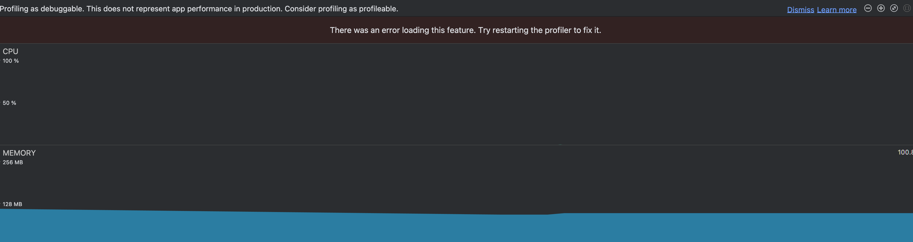

而且我发现此时卸载重装，重启手机都不会恢复。但以下几个方式可能会使 JVMTI 通道恢复：

1. 修改包名；
2. 手机恢复出厂设置；
3. 等待一段时间，可能 1-3 个月。（也可能是因为我升级了系统后重置了）

#### 解决方案
依然是绕过 JVMTI，通过经典热修复部署来兼容。当 Jugg 自动检测到 JVMTI 不可用时，自动启用。

## 3.5. 修复 compileSdkVersion 不匹配导致编译失败

这是一个代码 bug，Jugg 2.0 修复了部分工程可能错误使用了更高的 compileSdkVersion，导致部分场景编译失败。

场景举例：  
工程 compileSdkVersion 声明为 32，但 Jugg 错误使用了 34。  
而 `Animator.AnimatorListener` 在 API 34 新增了标记 @NonNull，对应的 Kotlin 代码声明为 `override fun onAnimationRepeat(animation: Animator?)` ，这在 32 是 OK 的，但 34 则会编译失败。

# 4. What's next in Jugg 3.0

目前 3.0 已规划如下功能，其中部分已完成：

1. 支持 Kotlin Compose（已上线）
2. 支持插件自动更新（已上线）
3. 支持工程编译定制，自定义编译任务（已上线）
4. ViewBinding/DataBinding（进度 80%）
5. 支持注解（进度 30%）
7. 支持 Kotlin 常量扩散编译
6. 一键导出增量编译 APK
8. 支持构建缓存共享

# 最后

感谢你看到这里，接入使用请点此：Jugg 使用手册
<!-- original-article-end -->
