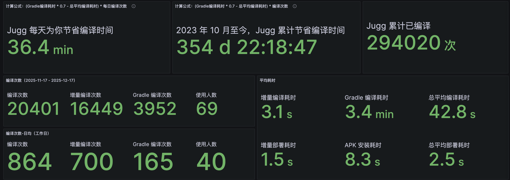
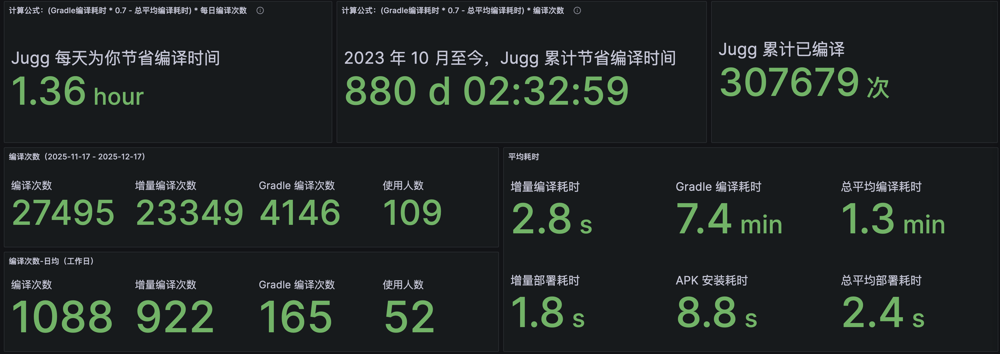
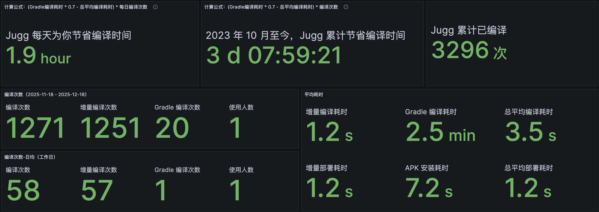
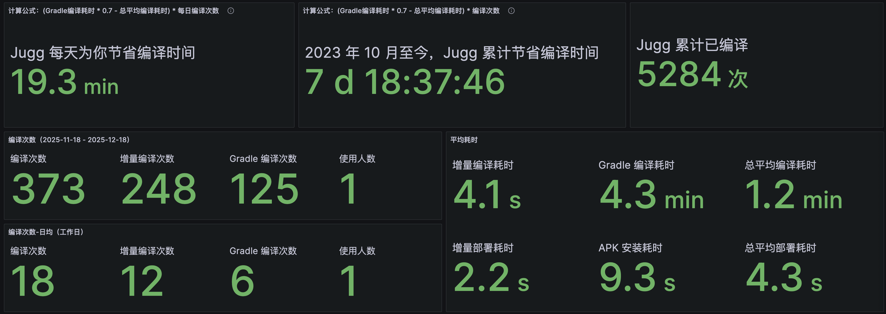
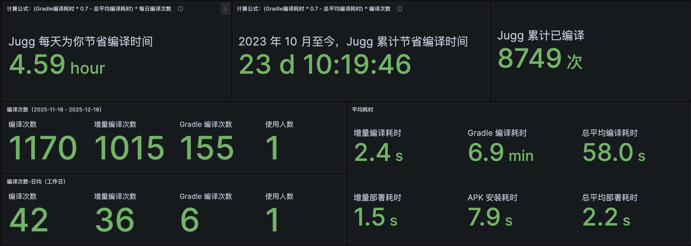
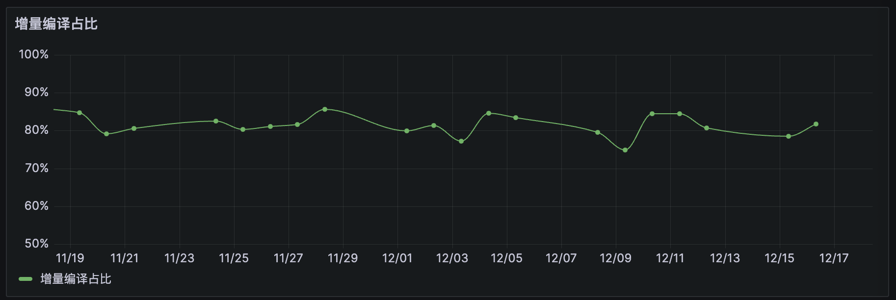
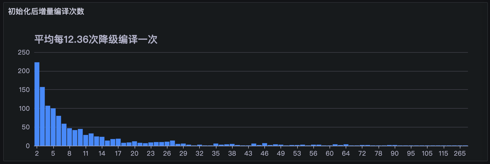
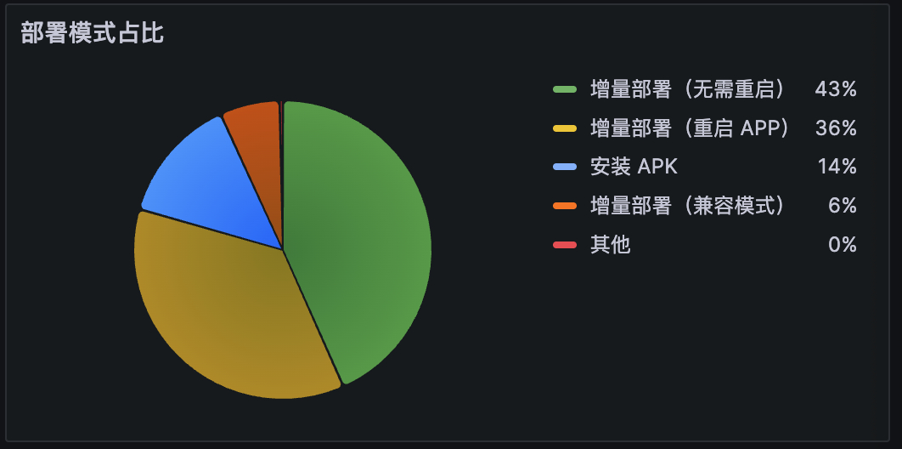

> [!NOTE]
> 本文为历史技术分享，正文保持原文内容。文中的数据、界面、链接和能力状态反映发布时情况；最新产品行为以 Wiki 其他页面为准。

<!-- original-article-start -->

> Android 极速编译插件 Jugg 介绍：
> 
> Jugg 是一款通用，安装即用，无侵入的 Android 增量编译 IDE 插件，于 2023 年 10 月发布。Jugg 在 Gradle 编译产物的基础上，实现了一条独立的旁路编译流程，平均增量编译耗时仅 2.3s。
> 
> Jugg 目前已投入到 全民 K歌，QQ 音乐，JOOX，WeSing，酷狗音乐，酷狗直播，QQ 浏览器，央视频等工程的日常开发。目前每月使用人数 180+ 人，月编译次数 4.7W 次，累计编译次数达 60W 次。
> 
> Jugg 使用简单，只需要安装插件到 Android Studio，点击运行即开始使用，且无需修改工程任何文件。  
> 
> Jugg 支持远程编译，仅需配置服务器账号密码 IP，5 分钟内完成，所有工程可复用。


# Jugg 节省了安卓开发多少编译时间？- 计算篇

在 Jugg 漫长的维护日子中，需要定期和老板报告一下进展，提供一些当前的使用情况数据。对我来说，最喜欢数据的是 **平均增量编译耗时**，改完代码只需 2-3 秒就可以看到结果，对开发体验是颠覆性的改变。除此之外，**接入工程数量**，**使用人数** 是大家都比较关心的指标，因为这代表着这个工具是否真的通用，是不是闭门造车的 ppt 项目。

而最意外的指标，是老板每次都会问：**可以节省多少编译时间？**

第一次问的时候，我有点郁闷，因为这很难有一个精确的数字。不过简单的数字可以直接用一个公式计算出来：

```
节省的编译时间 = 增量编译次数 *（Gradle 编译耗时 - Jugg 增量编译耗时）
```

这个公式确实可以计算出节省时间，但没有考虑引入 Jugg 增量编译这件事本身对计算参数的影响：

1. 接入 Jugg 增量编译后，源码改动由 Jugg 承接，一般直到 build 文件变化才会降级到 Gradle 编译。当降级时，文件变更是比引入增量编译前更多的更复杂的，因此 **Jugg 统计到的 Gradle 编译耗时会比接入 Jugg 前更长。**

2. 编译变快了，编译次数理应也会增长。以前编译耗时比较长的时候，修改完成后需要等待较长的编译时间进行验证，所以会相对进行更长时间的思考，携带更多的改动。接入 Jugg 后，加一行日志也可以编译一次，改一个动画参数也可以编译一次，即时观察验证，**编译次数变多。**

生性多疑的我因为担心被质疑数据，所以没有直接给这个公式算出来的节省时间。但是，不出所料又要但是了，我想起我们项目（WeSing，全民 K 歌国际版）之前还接入了大腾讯的 Gradle 的编译耗时上报平台，所以 1 和 2 的变化我能通过这个平台得到。

我查询到结果是：**项目 Gradle 平均编译耗时从 60 秒左右增长到 90 秒左右，大约是 0.7 倍的关系。** 而编译次数倒没有明显变化，都是一天 20 次左右。可能是大家还没用习惯，和 Jugg 还在磨合期？（后面还会提到相关数据）

所以，最终给到老板节省时间的计算公式是：

```
节省的编译时间 = 增量编译次数 * （Gradle 编译耗时 * 0.7 - Jugg 增量编译耗时）
```

对于我们项目，每人每天可节省编译时间：25 *（90 * 0.7 - 2.1s）= **25 分钟**。

是的，0.7 是一个经验值，基于我所在的工程项目得出。在后面 Jugg 接入到体量更大的 K 歌和酷狗工程中时，Gradle 编译耗时达到 5-10 分钟甚至更多，对于这些巨无霸项目 0.7 这个值可能会变成 0.5，甚至 0.3？

但因为缺失其他项目接入前的数据，所以这里无法求证了。但至少 0.7 这个值代表的含义是明确的，也是我对计算结果的免责声明。（没有直接给 x1 的数据已经很正直了🐶）


> 其实除了编译耗时，还有一个大家平时不太会关注到的：部署耗时。在 Gradle 编译场景，完成编译后，需要先传输 APK 到设备，然后 APP 重启，最后手动点击回到之前开发的页面。整个流程算下来大工程一般都需要 10s 以上。
>
> 而 Jugg 部署是 push 增量产物到 APK 的内部目录，1s 内完成；如果是不修改类结构的变更/资源变更，**Jugg 还支持像 Flutter 那样不重启生效，也就是热重载**（见：之前文章 xxx）。整个流程最快只需要 1-2s。

# Jugg 节省了安卓开发多少编译时间？- 数据篇

对于这个数据，再被问了几次后，后面我也有了更多的体会：这个指标是 **最直接体现 Jugg 价值的数据**。而且，这不仅是用于面向汇报的数据，各位 Jugg 的使用者应该也会对这个数据感兴趣：**Jugg 究竟为我节省了多少时间？** 

所以我把它加进了上报看板：

### 大盘看板

内网看板：

外网看板：

可以看到，**大腾讯的同学平均每天可以节省 36 分钟，酷狗的同学甚至可以节省 1.36 小时**，都比最初计算 WeSing 的 25 分钟要多。因为 Jugg 增量编译不随项目体积增长而增长，所以 Gradle 编译耗时越长，收益越大。

**平均每天编译次数都还是 20 次出头，没有出现我想象中的变多。** 这或许意味着无论项目大小，编译快慢，大家每天需要的编译次数是接近的？


两个看板合计：**累计编译次数 60W+ 次，累计为所有开发者节省 1200 天的编译时间。**

> 当然这里再叠个甲，0.7 这个系数大家可以根据自己的体感酌情脑改一下。对于超大工程，系数取 0.5 甚至 0.3 我觉得都是可能的，不过也不至于会差 5 倍（0.2）或者更多。反正还是遵循 `编译次数 * 每次编译节省时间` 来计算。

### 个人数据

除了大盘，我们还可以看个人数据。**看板已经实现过滤工程和开发者的功能：**

我们来看看这个月编译次数最多的同学：



月 MVP 是 c_____yu 同学，近 30 天编译了 1271 次，每日平均编译 58 次（工作日），预计每日节省 1.9 小时。

然后我们看下 Jugg 的 001 号用户，坐我右边的 c_____iu 同学的使用情况：



作为一个习惯囤十几个文件改动再提交的严谨开发，c_____liu 同学每天平均编译次数是 18 次，预计每日平均节省 19 分钟。不过他从 2023 年 10 月就开始使用了，Jugg 也为他节省了 7 天多的编译时间。

然后非常有趣的是，另外也有一位id 还很接近：c_____liu：


c_____liu 同学也是一名熟练的 Jugg 编译使用者，月编译次数 1168 次，平均每天预计节省时间达 4.5 个小时。可以发现，当工程本身编译耗时较长，且编译次数较多的时候，节省时间会多很多倍。

当然这也会有点失真。因为正常使用 Gradle 编译的话，不太会形成一天编译几十次的习惯，也就是上一节我提到的 **接入 Jugg 对编译次数的增长。** 我还记得有一天我开发了一整天的动画控件，不断的调试参数，一天下来编译了 170 多次。

如果是使用 Gradle 编译，我对动画参数就不会那么较真，因为验证一次的成本会高几十倍。我也不会调试 100 多版参数，而是调到差不多就结束了，时间和精力不允许。

总的来说，每个人的节省时间会和自己的编译习惯有很大的关系。如果你习惯了一边写一边调试，那么 Jugg 增量编译可以帮助你节省更多的等待时间。

# 其他有意思的数据

Jugg 在 2023 年第一版发布的时候就已经埋好上报了，就是为了~~答辩~~  ~~更好的观察用户数据~~ 纯粹想知道究竟数据会呈现哪些有意思的表现。那么我们一起来看看这些数据会对我们说什么样有趣的故事吧。

> 数据取自近 30 天数据。

### 增量编译占比



增量编译占比在 80%-85% 左右，这会有点反直觉，也容易被挑战：Jugg 不是号称支持多少场景吗，增量编译怎么才 80% 出头？

确实正常编译来说，只改动 java \/ kotlin \/ res \/ assets \/ so \/ manifest，走增量编译是没问题的。Jugg 2.0 后，还支持有条件的 build.gradle 的修改走增量编译（xxx）。

但 80-85% 这个值是一个真实的表现，大概是受两个原因影响：

1. Gradle 编译失败时，使用者需要持续的进行 Gradle 编译，直到编译成功；
2. 使用者处于非连续开发的状态，比如切换分支修 bug，此时比较容易触发 Gradle 编译降级。

如果我把连续编译 Gradle 和只增量编译一次的使用记录剔除后，数据是这样的：



增量编译占比会到 92% 左右。从数据看到，有个同学甚至 **连续增量编译了 285 次都没有降级**，实在是太带派了。


#### 热重载占比：

> 这里定义热修复（Hot Fix）是需要重启的部署，热重载是（Hot Reload）不需要重启的部署



可以看到，热重载和热修复比例大概是 1.2:1，热重载稍微多一点，占比并不算很高。热重载修改 res 和 assets 都支持热重载，修改代码则需要满足类结构不变才可以触发。此外，首次编译一个文件时，因为编译工具链的版本和参数和 Gradle 不完全一致，也比较容易触发热修复。这一块应该还有优化空间，但暂时还没投入。

针对一些设备的兼容性问题，还有 6% 的同学主动选择了打开兼容模式，使用传统的热修复方式进行部署。（xxx）

# 写在最后

感谢各位 Jugg 用户一直以来的支持和反馈，也诚邀新同学接入极速编译插件 Jugg！Android 极速编译插件 Jugg 使用手册
<!-- original-article-end -->
