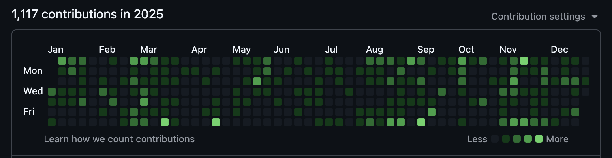
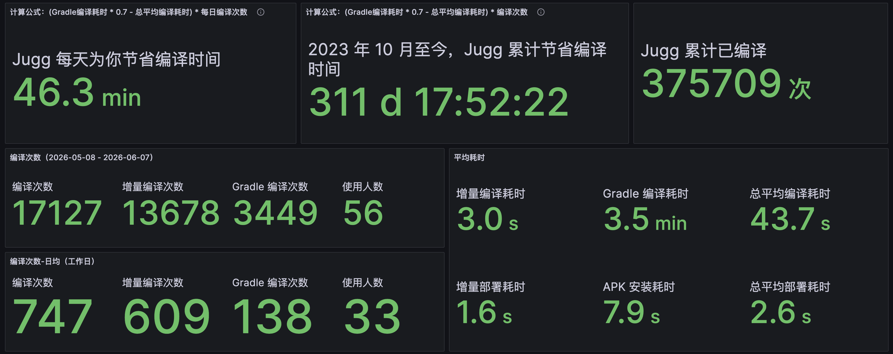
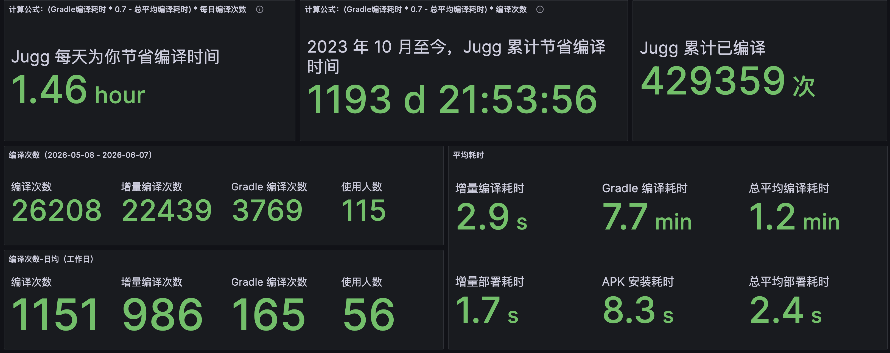
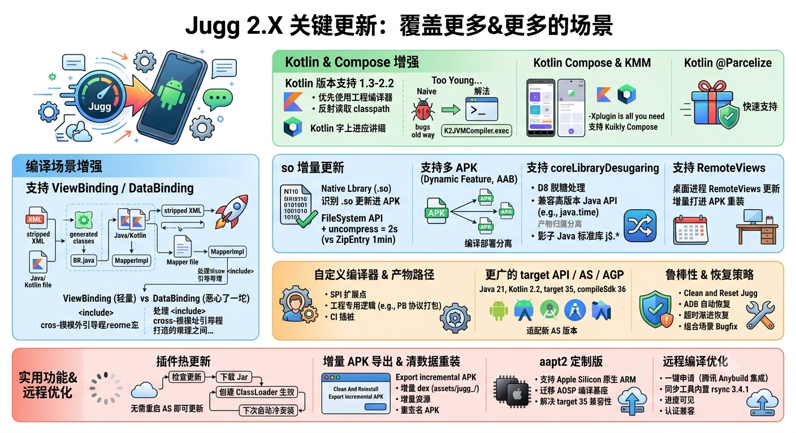
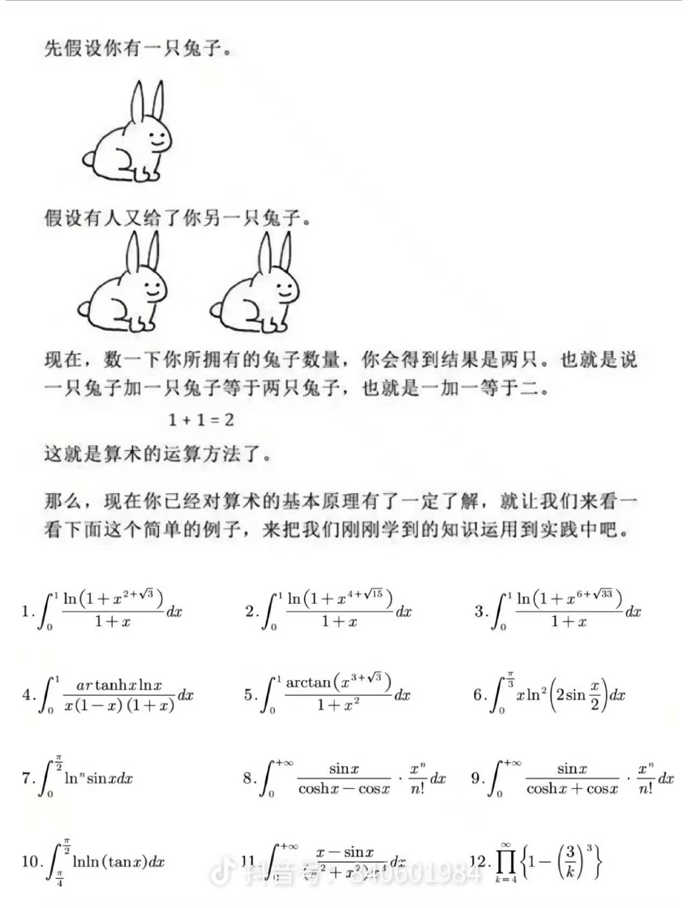
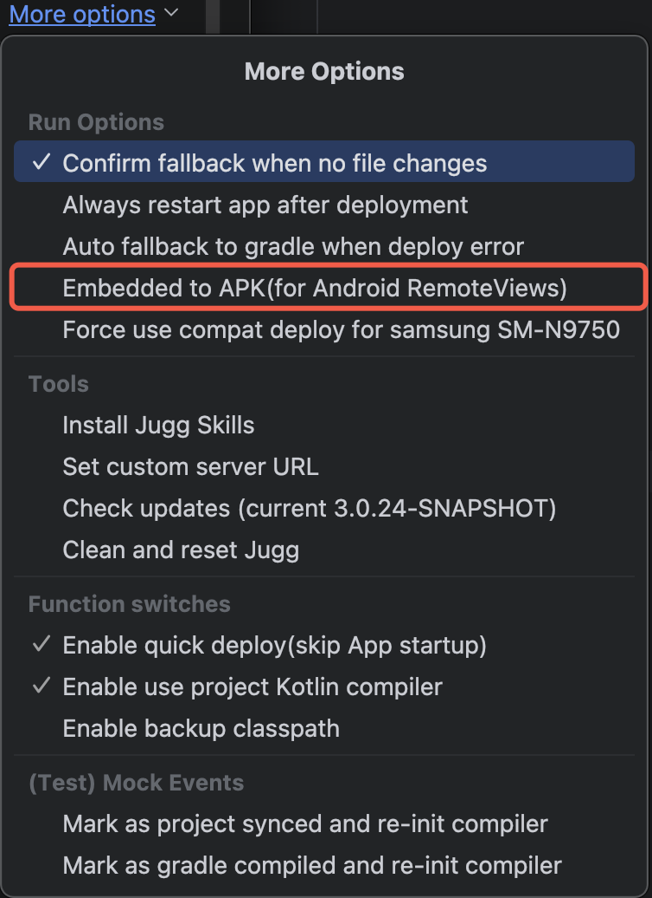
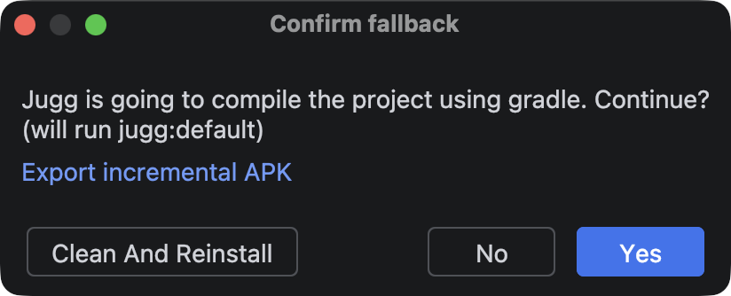
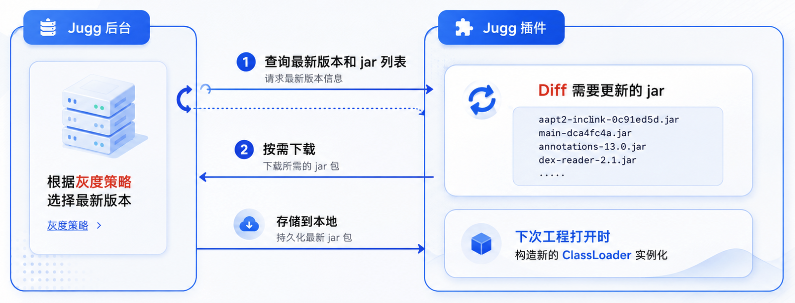
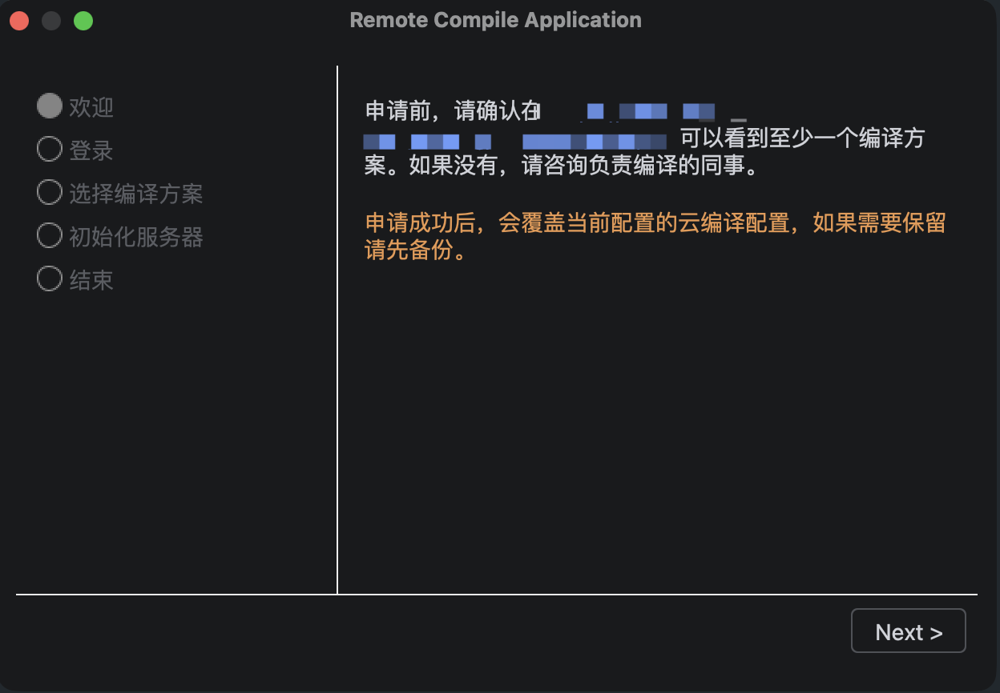

> [!NOTE]
> 本文为历史技术分享，正文保持原文内容。文中的数据、界面、链接和能力状态反映发布时情况；最新产品行为以 Wiki 其他页面为准。

<!-- original-article-start -->
距离上一篇分析 Jugg 更新进展的文章 Android 极速编译插件Jugg 2.0 - 更好的稳定性，更多的增量编译 已经过去一年多了，这一年多里 Jugg 依然在马不停蹄地更新，在 2025 年 Jugg 迭代了不少新功能，收到并解决了 100+ 个用户反馈和建议，新增了 1100+ 个 commit。

<!-- image-link: 2025 Commit History -->

  在这巨量的迭代背后，藏着哪些 bugfix，优化，和你可能用得上的新特性？它们是如何实现的，以及背后又有哪些契机？本篇文章简要和大家分享一下。内容包括：**Kotlin 2.0, Compose，so 增量更新，Kuikly，自定义编译器，一键申请远程编译，增量 APK 导出，CI 集成** 等。

# 0. Jugg 是什么？

Jugg 是**大规模工程的 Android 秒级增量构建方案**，以 Android Studio 插件形式提供：安装即用、无侵入，不需要修改工程的任何文件。Jugg 在 Gradle 构建产物的基础上实现了独立的旁路增量编译与热部署链路，平均编译耗时 < 3 秒。

Jugg 于 2023 年 10 月发布，已投入全民 K 歌、QQ 音乐、JOOX、WeSing、酷狗音乐、酷狗直播、QQ 浏览器、央视频等工程的日常开发：月活跃用户 **170+**，月编译 **4W+** 次，累计编译 **80W+** 次，累计节省编译等待 **36,000+** 小时，相当于约 20 人年的研发工时。

Jugg 保持宽泛的版本兼容。支持 Android Studio 2021 至今全部版本；AGP 3.4-9.1；Kotlin 1.3 - 2.2；target API 21 - 36；Android 8-16。以上所有接入工程使用同一套通用实现，不含任何业务定制逻辑——**你的工程无需适配即可使用**。

<!-- image-link: 腾讯看板（30 天） -->

<!-- image-link: TME 看板（30 天）-->

# 1. Jugg 2.X 关键更新 - 覆盖更多&更多的场景

## 1.1 Kotlin 增强

### Kotlin 版本支持 1.3-2.2

Jugg 初期设计是内置了一个 Kotlin 1.9 编译器，编译器本身可以设置 Kotlin language version，支持 1.3-2.0 的语法。当时想法也很简单，觉得 Kotlin 语法也比较稳定，大部分场景语法兼容就没什么问题。

#### Too young too simple, sometimes naive

但实际上，不同版本的 Kotlin 编译器会存在：
1. .kotlin_module 格式兼容性问题；
2. 工程使用的 compose 版本和 Kotlin 编译器兼容性问题；
3. KMM 模块和正常 android 模块使用不同的依赖包等问题。

#### 解法：优先使用工程的 Kotlin 编译器

解决方案是优先使用工程的 Kotlin 编译器依赖。简单来说：

1. **Gradle runtime 获取 task**：在 Gradle 环境获取 `compileDebugKotlin` 的 task 对象；
2. **版本适配反射读取**：如果 < Kotlin 2.0，反射读 `pluginClasspath` 字段；如果 >= Kotlin 2.0，反射读 `defaultCompilerClasspath$kotlin_gradle_plugin_common` 字段

然后就会读到：
* **核心编译库**：`org.jetbrains.kotlin:kotlin-compiler-embeddable`
* **依赖库**：`org.jetbrains.kotlin:kotlin-reflect`，`org.jetbrains.kotlin:kotlin-stdlib`，`org.jetbrains:annotations` 等几个依赖库。

ClassLoader 加上 Kotlin 编译器库后，**直接在 JVM 环境调用 `K2JVMCompiler.exec` 就可以编译 Kotlin 源码了**。是不是很简单？

<!-- image-link: 来试试吧 -->

> [!NOTE]
> Jugg 目前用到的 Kotlin 编译参数可以看：KotlinCompilerInvoker.kt
>
> Kotlin 编译库路径读取逻辑可以看：GradleProjectInfoReader.kt。最终文件会打包解压到工程里的  `build/jugg/config/readProjectInfo.gradle.kts`。读取到的数据也可以在工程的 `build/jugg/database/project_infos.db/gradle_project_infos.json` 看到。 

### Kotlin Compose

Jugg 2.2 开始支持 Kotlin Compose，后续又支持了 KMM Compose（Kuikly Compose）。

Kotlin Compose 支持的诉求来自元宝的一个同学，因为元宝的工程有用 Compose 和 Databinding。说来比较神奇的是，Compose 在很多大工程确实也一直没有铺开用，我们团队维护的 JOOX 也是在今年才逐渐在一些新的场景尝试性的开始使用 compose（也遇到不多不少的问题），而 Google 都已经开始宣布 [Compose first](https://android-developers.googleblog.com/2026/05/android-ui-development-is-compose-first.html) 了。

#### RIO 最高的功能：-Xplugin is all you need

支持 Compose 算是 RIO 最高的一个功能了。Compose 编译是通过 Kotlin 编译器的 `plugin` 体系实现的，Gradle 读取到 `androidx.compose.compiler:compiler` 依赖后，通过 Kotlin 编译器的 `-Xplugin` 把 jar 包路径放进去，就支持 Compose 编译了。

后面酷狗的同学也提到有在 Kuikly 里用 Compose API 的诉求。KMM 的 Compose 包名上会有点区别，很快也支持上了。

### Kotlin @Parcelize

一个冷知识：`@Parcelize` 其实不是注解器实现的，也是 Kotlin 通过 `-Xplugin` 实现的。所以 `@Parcelize` 支持起来也很快。

#### 但通用注解器的支持：三年未跨过的坎

说到注解器，Jugg 对 APT / KAPT / KSP 的支持，从 1.X 开始就被提及，我也一直以为这只是一个实现成本的问题。但直到在 3.0 版本，在 AI 的助力下，都没有实现通用的注解器能力。**目前只是对特定注解做了支持**，如 @Moshi，Databinding 和 Kuikly 的 @Page。

无法实现通用注解器的核心原因是：注解器的实现很多是不支持增量的，甚至还有写着支持增量但实际是全量的（ARouter 说的就是你）。此外还会拖慢不需要注解处理的编译场景。目前还**找不到几乎无损的解决方案**。

## 1.2 编译场景增强

### 支持 ViewBinding / DataBinding

Jugg 2.5 支持了 ViewBinding 和 DataBinding。如果让我选一个最后悔的事情，就是支持 DataBinding。实在是太恶心了，怪不得安卓官方火速废弃了。

#### 判若云泥的实现

ViewBinding 和 DataBinding 的实现复杂度相差很大。具体来说：

* **ViewBinding（轻量纯粹）**：ViewBinding 其实很简单，它本质就是一个 XML 转 Java 的模板代码生成器。直接调用 `DataBindingBuilder.GradleFileWriter.generateAll` 就可以完成 XML to Java 文件的转换。
* **DataBinding（一坨）**：如果 XML 用了 Databinding，首先也是先调用了 ViewBinding 步骤。但这个步骤之后生成的是 abstract class，还要走注解处理器才能完成所有产物生成。

#### DataBinding 的中间产物洪流

DataBinding 第二段，会通过注解处理器继续生成：
* **核心产物**：`stripped XML`、`layout info`、`trigger source`、`XXXBindingImpl.java`、`BR.java`、`DataBinderMapperImpl.java`
* **辅助元数据**：`setter_store.json`、`dependency artifact` 等一堆中间产物。

此外还需要处理 `<include>` 递归引用、library/app 跨模块引用等场景。

#### 为什么恶心：资源编译与源码编译的强耦合

DataBinding 恶心的地方在于，它把资源编译和源码编译绑在了一起。Jugg 实现增量编译的时候，只要 layout、源码、依赖、BR、mapper 注册关系，任何一环没对上，都会编译失败或者增量结果不正确。

Jugg 是参考着 Lightning 的实现做的，方案简单来说就是复用 Gradle 中间产物完成增量更新。为变化的文件生成单独的产物后，需要增量地合并回 mapper、BR、adapter 等全量产物，最后再接回 Jugg 的编译链路。实现过程中还发现 **`<include>` 递归引用**、**library/app 跨模块引用**，**Java/Kotlin 互调**等让人痛苦万分的边界场景，最终是**打了一个又一个的补丁才搞定的**。

> [!NOTE]
> 想起之前和 Lightning 的同学交流，他们说了一句 “花了很大力气做，但没什么人用”，当时的我并未体会到其中的意味。直到我也同样经历了一次。

### native library (*.so) 增量更新

Jugg 2.0 小版本补上了 native library 增量更新。Jugg 会识别 `.so` 文件并把 so 更新进 APK。Zip 文件更新后，重签名、重装。虽然不像资源热重载那样 1 秒内完成，但还是比完整 Gradle 构建快很多。

#### ZipEntry vs FileSystem：1 分钟和 2 秒的差距

这里有个值得一提的点是，如果直接用 ZipEntry API 进行更新，大 APK 要一分钟以上才能完成，速度会很慢，因为 ZipEntry API 每次都会完整重新制作一个 Zip 文件，而不是增量更新。如果用 FileSystem API + uncompress flag 实现一样的操作，只需要 2 秒。这个 API，在古法编程时代我都忘了用什么办法找到的了。

这个功能特别适用于维护了主仓外 native 库，需要频繁更新 so 进行验证的场景。

> [!NOTE]
> 根据之前初步调研，so 似乎也支持像 dex / res 那样通过反射插入 classpath 来实现动态 so 更新。但因为做这个的时候更新到 APK 的实现已经稳定，所以 so 也沿用了这套。

### 支持多 APK：Dynamic Feature / AAB / 多 APK

一般我们日常调试最终只产出一个 APK，增量更新和部署也只需要围绕一个 APK 进行即可。

但后面逐渐支持的工程也开始会使用 Dynamic Feature，比如 K 歌歌房以 multiple APK 方式接入到 Q 音，JOOX 也开始不断增加 Dynamic Feature 模块。

Jugg 2.5 开始支持 Dynamic Feature 模块，2.6 继续完善了多 APK 扩散编译。

#### 核心变化：产物归属从 "一个 APK" 到 "多个 APK"

这里核心变化是：**Jugg 的编译产物和部署数据不再只面向一个 APK，而是会记录每个产物归属到哪些 APK。** 首先数据库要兼容多 apk 数据结构。**编译时**，需要将变化的文件分离成出不同 apk target 分别编译；**部署时**，对应不同 apk target 部署到不同的 app data 目录。

### 支持 coreLibraryDesugaring 脱糖

Jugg 2.5 支持了 `coreLibraryDesugaringEnabled` 配置。这个配置的作用是兼容高版本 Java API，Android 本身运行在设备系统自带的 Java/Android Runtime 上，低版本系统并没有新版本 Java 标准库 API。比如 `java.time`、`java.util.stream`、`java.nio` 的部分 API。

`coreLibraryDesugaringEnabled` 会让 D8/R8 在 dex 阶段做核心库脱糖：识别代码里对部分 Java 标准库新 API 的调用，把这些调用改写到 desugar library 提供的兼容实现上，同时把对应兼容类一起打进 APK。

#### D8 普通脱糖 vs coreLibraryDesugaring：两回事

你可能会问：**为什么 D8 自己的脱糖不够，以及为什么 D8 脱糖不默认 coreLibraryDesugaringEnabled 打开？**

* **D8 普通脱糖**：主要解决的是"语言特性"兼容问题，比如 lambda、method reference、部分 default method 等。它可以把新的字节码形态改写成低版本 Android 能执行的形式。
* **coreLibraryDesugaringEnabled**：解决的是"运行时类库不存在"的问题，不解决字节码形态问题。`coreLibraryDesugaringEnabled` 会把代码里对部分系统 Java API 的调用重定向到这套实现上，这需要额外引入 `desugar_jdk_libs`，还会增加 APK 体积和方法数。因为不是所有工程都会用到这些高版本 Java API，所以 AGP 设计成显式配置。

#### core​Library​Desugaring​ 的 `j$.*`：一套影子 Java 标准库

具体表现上，在配置启用后，D8 会把对新 Java 标准库 API 的直接引用改写成兼容实现引用 -- 改写到 `j$.*` 相关实现。比如 `java.time.LocalDate` 会被改写到类似 `j$.time.LocalDate` 的兼容实现，`java.util.stream.Stream` 会对应到 `j$.util.stream.*`。`j$` 可以理解成 desugar library 提供的一套影子 Java 标准库，用来避免和系统自带的 `java.*` 冲突。

如果不声明又使用高版本 JDK API 会怎样呢？**Android Studio 会警告，但编译不一定失败**，因为代码是按 `compileSdk` 编译的，只要 `compileSdk` 里的 android.jar 能看到这些 API，Java/Kotlin 编译阶段就可能通过。所以，**会发生运行时 crash**。要稳定拦截，通常需要执行 Lint，并让 Lint error 失败构建。

### 支持 Android RemoteViews

RemoteViews 的特殊在于，它是**跨进程的“声明式” UI 更新。**，而 Apply Changes 和热修复这类方案，对资源的修改是针对“应用进程”内的热补丁，而 RemoteViews 的渲染并不在应用进程，而是在桌面进程。Jugg 2.6 支持了把增量修改打进 APK 并重装，可以兼容 RemoteViews 场景。

<!-- image-link: 开关位置 -->

启用后，增量产物不会部署到 `code_cache/` 而是直接打进 APK，重签后安装。因为这个模式耗时较大，且不是长期需要的，所以编译前会弹确认，提示该模式会增加部署耗时。

> [!NOTE]
> 这个能力其实是在酷狗 CI 流水线上运行 Jugg 时候支持的能力，所以很快就支持好了。

## 1.3 工程增强

### 不同工程使用不同自定义编译器

Jugg 是一个通用 IDE 插件，但**真实工程可能有自己的"编译时额外动作"**，如：pb 协议代码生成、模板代码生成、配置转代码、资源预处理、甚至一些只有本工程才知道的产物修补。这些逻辑 Jugg 难以感知，所以用户每次进行相关场景的改动，都需要降级 Gradle。

如果要支持这种工程的专有逻辑，把专有逻辑都写进插件本体，那 Jugg 就会变成一个专用插件：给 A 工程增加协议打包，B 工程生成路由，C 工程要处理一个神秘二进制文件。

#### SPI 扩展点：通用插件 × 专有逻辑的解法

所以 Jugg 2.1 支持了一个 SPI(Service Provider Interface) 扩展点：工程可以实现自己的 `ICompilerCreator` 和 `ICompiler`，支持直接访问 Jugg 的内部状态。**打成 jar 后，放入指定路径或者由 Jugg 后台配置下发。Jugg 编译时会动态加载这些 jar，根据声明的 `CompileOrder` 插入点，编排编译流程。**

目前有两个使用案例：
1. JOOX 工程修改 PB 源码后，会通过自定义编译器触发协议 jar 打包；
2. 酷狗 CI 构建时，通过自定义编译器对增量的 class 文件进行补插桩。

也欢迎有诉求的工程接入适配。

### 支持自定义编译产物路径

这个功能目的和自定义编译器一样，用于**增强工程的特殊适配能力**。

目前案例：JOOX 协议构建场景，构建出来的 jar 在非常规路径。本地编译不影响，通过 Gradle 可以正常解析到这个依赖，但在远程编译场景默认不会拉取下来。通过给 JOOX 工程配置自定义编译产物路径可以兼容远程编译场景。

### 支持更广的 target API / Android Studio / AGP

除了几个大功能，2.X 还补了很多工程环境兼容：

* **语言与 API 升级**：支持 Java 21、Kotlin 2.2、target API 35；支持 `compileSdk = 36`
* **IDE 版本适配**：适配 Meerkat、Narwhal、Otter、Panda 等 Android Studio 新版本；
* **构建命令兼容**：兼容 Gradle 子目录命令，适配酷狗工程 `subDir/gradlew :app:assembleDebug` 格式的编译命令；

## 1.4 一些实用功能

### 增量 APK 导出、一键清数据重装

Jugg 2.6 增加了 `Clean And Reinstall` 清理数据功能，和`Export incremental APK` 导出增量 APK 功能，放在 fallback 按钮  对话框中：

<!-- image-link: 降级对话框 -->

#### `Clean And Reinstall` 清理数据重装
因为 Jugg（Apply Changes）的增量产物是存在 data 目录的 `code_cache` 的，直接点 App 的清理数据会**同时删除 code_cache 目录，导致增量变更丢失**。此时需要重新点一次运行，此时 Jugg 识别到增量部署丢失，会重新部署进去。而这个按钮就是一次性完成这一整套流程，**提高清理数据场景的体验。**

#### `Export incremental APK` 导出增量 APK
这个诉求来自 K 歌的同学，因为编译一次要很久，快速让测试验证的话最好可以本地快速出包。而增量部署产物是直接推到 `code_cache` 的，直接发 APK 给测试是不含增量变更的。

导出增量 APK 就是为了这个场景而设置。实现方案是：
1. **增量 dex**：打入到 `assets/jugg_/class*.dex`。app 启动时 Jugg runtime 会读取并加载（热修复那套）。
2. **增量资源**：直接覆盖 `res/*.dex` 和 `resource.arsc` 文件。
3. **重签名 APK**：拿 gradle 配置的 `signingConfig` 对更新后的 APK 做一次重签名+对齐。

### 插件热更新：一种不需要重启 AS 就可以更新的 ClassLoader 黑魔法

Jugg 2.1 支持了服务器下发插件热更新。IDE 插件有一个不方便的问题，它依赖用户的主动安装更新。所以在维护过程中，经常出现有用户反馈了一个 bug，修复并交付更新后，**在接下来的几个星期内，其他用户还会反馈同样的问题**。

如果系统能实现自动更新，就不需要让每个用户都经历一次，再由我主动告知他们通过更新来解决，真正实现**一人踩坑，全家享福**。

#### 热更新调度链路

<!-- image-link: 调度链路 -->

1. **定时轮询**：初始化后，延迟 2 分钟开始检查，之后每 4 小时通过 `JuggServer.checkHotUpdate()` 拉取更新信息，并用 1 小时最小间隔限制多实例重复请求。
2. **增量下载**：收到更新后，它只下载缺失 jar，逐个校验 md5，把 `hot_update_data.json` 和 load list 写入 hot update 目录。
3. **插件热更新（无需重启打开工程生效）**：loader 使用热更新 jar。在工程打开时，会优先使用新版本的 jar list，创建 ClassLoader 来实现**无需安装的热重新**。这里有很多细节包括 class 加载优先级，重复加载冲突等，就先不展开了，感兴趣的可以看 JuggLoader.kt
4. **插件冷安装（下次启动时生效）**：再把 jar 打成插件 zip，交给 `PluginInstaller.installAfterRestart()` 走正常的插件安装。这是一个兜底，也用于兼容 Android Studio 升级后默认从老版本迁移插件的行为。

### aapt2 定制版支持 Apple Silicon 原生 ARM

Jugg 的资源增量编译使用的是定制版的 `aapt2-inclink`，可以把十几秒的耗时降低到一秒之内。`aapt2-inclink` 一开始是基于 Android 11 的 AOSP 进行编译的，那时候 Mac 平台还没有 ARM 芯片。

然后有一天，有位同学反馈资源编译失败了，排查半天发现是他把 Rosetta 删了，导致 intel 架构的 `aapt2-inclink` 无法运行。

> [!NOTE]
> Mac Rosetta 是苹果公司开发的一款底层翻译软件，它允许搭载 Apple Silicon 芯片的 Mac 电脑流畅运行专为老款 Intel 芯片编写的应用程序。 它在后台自动运行，通过在应用首次启动或运行时将 Intel 指令集动态转换为 Apple 芯片能够理解的指令，确保了软件生态的平稳过渡。

为了支持没有 `Rosetta` 的开发机，需要把 `aapt2-inclink` 的编译环境往高版本迁移。最后花了一些力气，从 Android 11 迁移到了 Android 15 AOSP，支持了双架构二进制产物编译。

**意外之喜**是 target api 35 工程，资源编译是有兼容性问题的，会因为解析不了 API 35 的 `android.jar` 导致编译失败。迁移了 AOSP 编译基座后一起解决了。

## 1.5 远程编译优化

### 远程编译一键申请

Jugg 2.3 支持远程编译服务器申请流程。这里解决的是远程编译接入成本问题。以前新同学要配服务器、同步、账号、路径、rsync，一套下来很容易卡在某个环境问题上，一趟下来熟手也要 10 分钟，不熟悉的话如果遇到点问题 30 分钟以上也是经常的事情。

然后刚好碰到云编译的同学在推广他们的云编译产品，所以 在插件端集成了**一键申请云编译服务器**的功能：

<!-- image-link: 申请流程 UI -->

全程只需要点点点即可完成申请。申请完成后服务器配置参数会直接回填到 Jugg 配置，不再需要再对着文档一行行填了。更多介绍见：云开发机配置

> [!TIP]
> 值得一吹的是，整个申请流程都没有写进插件，插件依然是无业务的。整个业务是通过一个完全抽象的业务流控制的。详见：Protocols.kt - InteractionProcessFlow

### 远程编译细节优化

远程编译里还有几个很小但有用的优化：

* **同步工具**：内置 rsync 3.4.1，消除 macOS 自带 rsync 版本过旧导致同步不完整的问题；
* **进度可见**：展示拉取远程编译产物进度，避免用户看到 IDE 没动静，以为又卡住了；
* **交互体验**：申请远程编译服务器时，如果内容过多，现在也支持滚动；
* **认证兼容**：处理个人机器 `.ssh` key 过多导致认证尝试过多导致失败的问题。

## 1.6 在酷狗 CI 流水线上运行 Jugg：开始不再做 IDE 的俘虏

### CI 构建

Jugg 2.6 支持了 CI 构建，这意味着 Jugg 的能力不再只能通过 IDE 使用，增量 APK 构建开始可以被脚本或流水线接入。不过目前还是 for CI 的解决方案，这么说因为 **CI 构建的产物是 APK，不需要实现 Apply Changes**，只需要导出增量 APK即可。

#### CI 构建两步走

整体方案分两步：

1. **构建基线**：第一步跑 `buildGradleBase`：执行 Gradle 任务，拉取 APK、classpath 和 library backup，初始化 deploy history、APK database、source file database，并把基线产物 和 APK 复制到指定目录，由 CI 进行保存管理。
2. **增量构建**：第二步跑 `buildIncrementalApk`：传入上一个环节的基线，和变更的文件，然后跑增量编译。最后把增量变更写回 APK，复用导出增量 APK 的流程。
    > [!NOTE]
    > 这里有个小设计是，没有自行计算变更的文件，而是让外部传入。我觉得这很重要，因为调用者需要明确知道自己将要编译的文件，而不是一个自动化黑盒。这样在出现预期之外的结果时，才能快速确认问题。

在如今 AI coding 时代，对 Android Studio 的依赖也在减少，部分同学已经开始提出「不需要打开 Android Studio 也可以使用 Jugg」的诉求。这方面也正在规划，每次迭代 Jugg 都**有意识的剥离对 IDE 的实现依赖**。

### 命令行调用

这个也是酷狗同学的诉求，25 年中旬开始酷狗的同学就开始用 AI coding 了，出现了让 agent 调用 Jugg 的诉求。

当时快速实现了一个 RPC 协议，调用后等效点击运行按钮，用法详见RPC 模式。不过这个即将被 3.0 的 CLI skill 替代。

## 1.7 各种鲁棒性提升：恢复策略增强、各种偏僻场景 bugfix

### Clean and Reset Jugg、部署超时渐进恢复、ADB 自动恢复

2.X 还强化了一部分重试能力，解决用户日常比较容易容易卡住的地方：

* **清理增量缓存 — Clean and Reset Jugg**：在 More Options 里，点击确认后会删除当前工程的 Jugg 缓存目录，再重新打开项目。场景是部分同学在遇到不生效的问题时，会想排除 Jugg 是否是 Jugg 引入。正常直接删除 `build/jugg` 目录也可以，有按钮的话体验更好，不需要先问我如何清理。
* **部署兜底 — 渐进恢复**：典型场景，启动时，adb 卡住时，overlay 数量太多时，有可能出现部署超时（Apply changes 限制了 5 秒）。目前 Jugg 增加了 **kill 掉 ADB **，等 2 秒后重试；**连接类异常短重试**，**回退到 adb cli** 等自动重试策略。

这些拿出来都不复杂，但 Jugg 是每天高频运行的工具，工具出问题时，恢复链路能多兜住一步，就少一次 “Jugg 有问题” 的反馈。

### 组合场景的棍棒：当用户和编译次数多了之后，每一行代码都有可能给你一些 "惊喜"

前面数据有提到 Jugg 已经累计编译 80W 次了，这种体量下，确实是什么问题都有可能遇到。譬如：

* **环境兼容**：macOS 15.4 + 远程编译，部分用户反馈 `findViewById` 返回 null 导致运行时 crash。最后定位到是 rsync 兼容性导致 classpath 备份不完整，拿到的是未同步的 R.jar；
* **认证边界**：`.ssh` 里 key 太多时，填充 key 策略不合理导致远程编译登录失败；
* **编译边界**：nonTransitiveRClass=true + R 超限拆分场景下，`R.styleable` 生成不完整；
* **版本组合**：Kotlin 1.3、Gradle 6.1、Kotlin unstable metadata 等老新版本组合兼容。

这类问题很难靠拍脑袋提前设计出来，基本都是靠海量运行次数逐渐冒出来的。**用的越多越稳定，也算是一种技术壁垒了**。

# 2. Jugg 3.0

其实写这篇文章的原因是 3.0 已经开发完成并内测一段时间了...总不能写了 3.0 再回头写 2.X 的内容。不过我觉得这个时间点也非常好，因为 **3.0 启动的时间点其实和 AI coding 大跃进的时间节点是一起的**，而 2.X 是古法编程时代的产物。开始时我还买了不限额度的中转站，直接就开始了无限子弹的疯狂大编码。

<!-- image-link: 会话记录截图 - 已经有 1100 个会话 -->

而 AI coding 对 Jugg 的影响是，**生产力获得了巨大提升（5-10x）**，特别是主要靠空闲时间迭代的项目来说，并发多工程 AI coding 提效是更显著的。

> [!WARNING]
> 但并发 AI coding 负面作用就是就是脑壳疼，对精神力消耗太大了。

### 为什么 Jugg 比生产项目更能吃到 AI 红利
我自己总结下来发现，相比公司的生产项目，Jugg 工程可以获得大幅效率提升的原因是：
1. Jugg 是一个**单人维护项目**，代码架构完全了解，个人有全局的掌控力。
2. 单人项目对比团队**没有复杂的决策链条和协作损耗**；
3. **代码体量较小**，大几万行，AI 基建搭的快，上下文量级可控；
4. 代码 99% 是逻辑，几乎都**可以写代码测试用例**，不用碰难提效的 UI 部分。

然后结果就是：**半年新增的代码和过去 3 年一样多**。以前一个大功能点可能要 2-3 个月的开发和打磨，现在只需要 1-2 周。提效后甚至还把几年前的"需求债"都还了。有什么想法或者同学提过来的新点子，以前都是先记个 TODO，有空就琢磨一下，等闲下来再开始编码，而且还要分优先级。现在直接开个会话就可以聊个 7788 了。

### Jugg 3.0 新功能
目前 3.0 功能已全部开发完成，正在内测。重点功能如下：

* **Agent 调用能力 Jugg CLI Skill**：skill 支持 agent 调用 Jugg 的已有能力，如编译、部署、重启，重装等操作。此外还增加了设备交互能力，如查看页面堆栈，页面布局、点击/长按/滑动等 UI 交互能力。agent 改完代码后，可以自己跑增量部署、确认预期页面、进行真实交互、再根据日志和页面结果继续改。 有点像 Web 端的 Playwright 框架。
* **支持 Android Test**：支持像原生 Android Test 那样运行单元测试，但走的是 Jugg 增量编译部署。做这个功能是因为，在 AI coding 的加持下，Android Test 成为越来越多人重新开始尝试的场景，也有同学提到这方面的诉求。
* **常量扩散编译**：解决了修改常量后不会自动触发跨文件编译的历史难题。常量无法自动跨文件生效，是因为 `const val` / `static final` 被内联后， Jugg 无法通过字节码分析影响范围，导致其他文件内联的常量没有更新。解决方案是实现了一个高效的工程源码语法分析框架 `ConstRefEngine`。
* **release APK 增量编译**：现在 Jugg 也支持混淆的 APK 的增量编译/部署。
* **Kuikly @Page 支持**：以前增加一个 Kuikly 页面需要降级，现在 Jugg 3.0 实现了定向的注解器支持。基于自维护的注解器框架，不需要启动的时候没有额外的耗时。
* **部署体验优化**：解绑了对 Apply changes 的强依赖，解决部分场景部署需要重启 1-2 次，和启动 crash 时无法部署的小场景问题。

感兴趣的同学可以点击查看 Jugg 3.0 功能介绍和下载内测包。

# 3. 最后

感谢你看到这里，接入使用请点此：Jugg 使用手册
<!-- original-article-end -->
