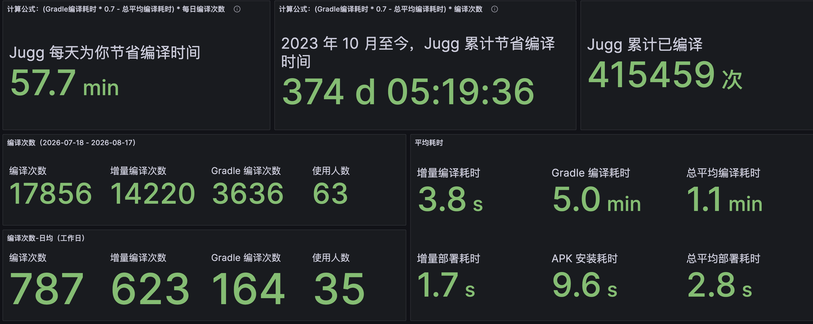
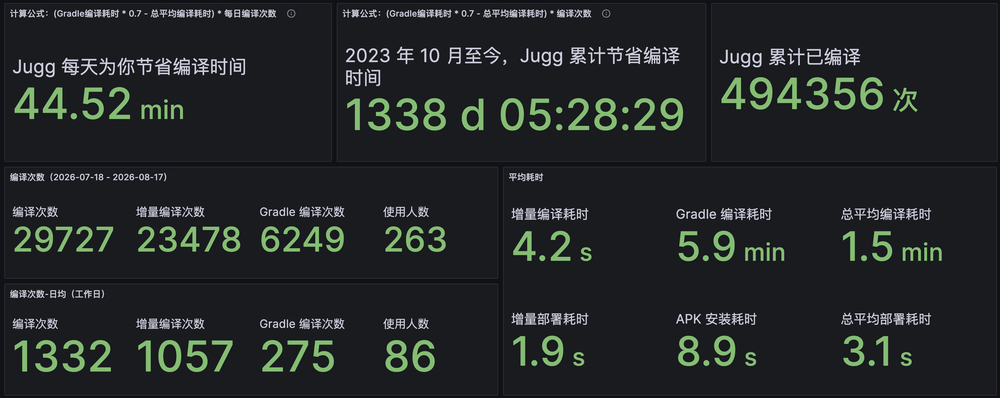
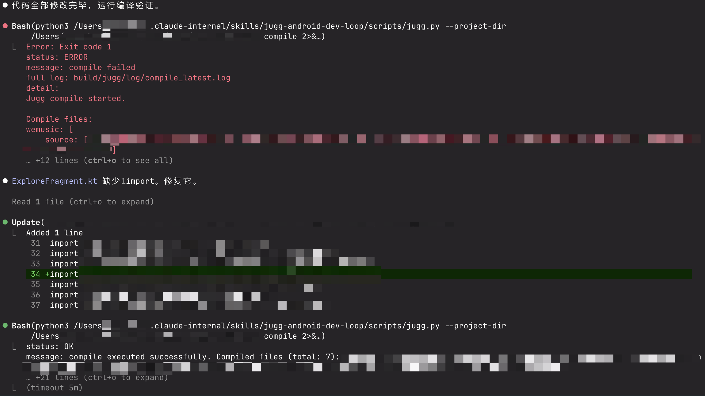
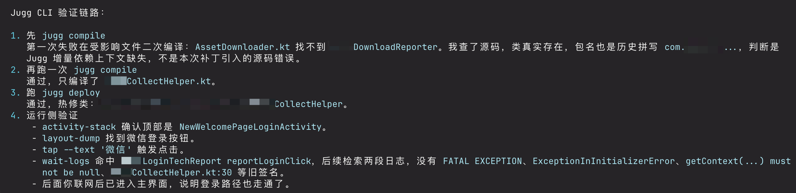
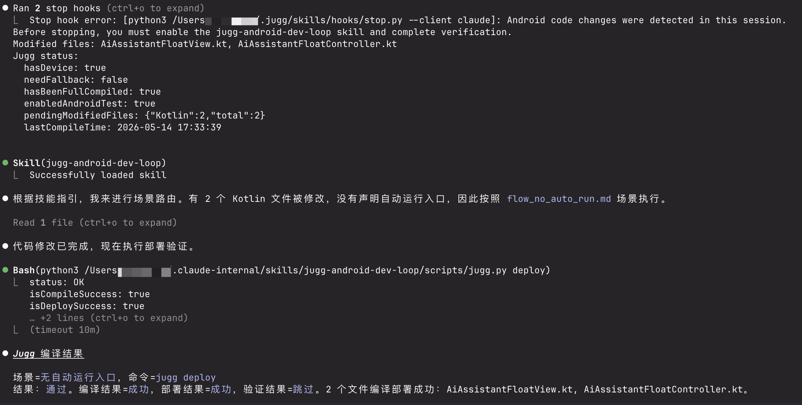
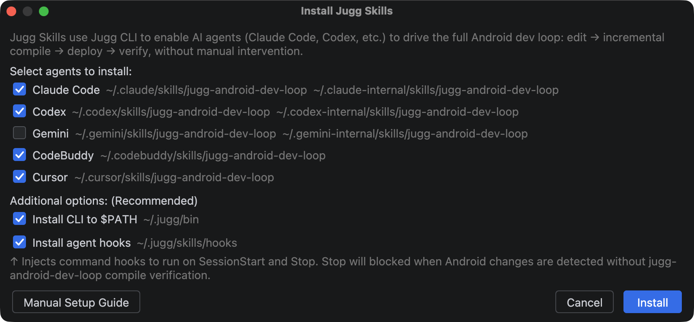
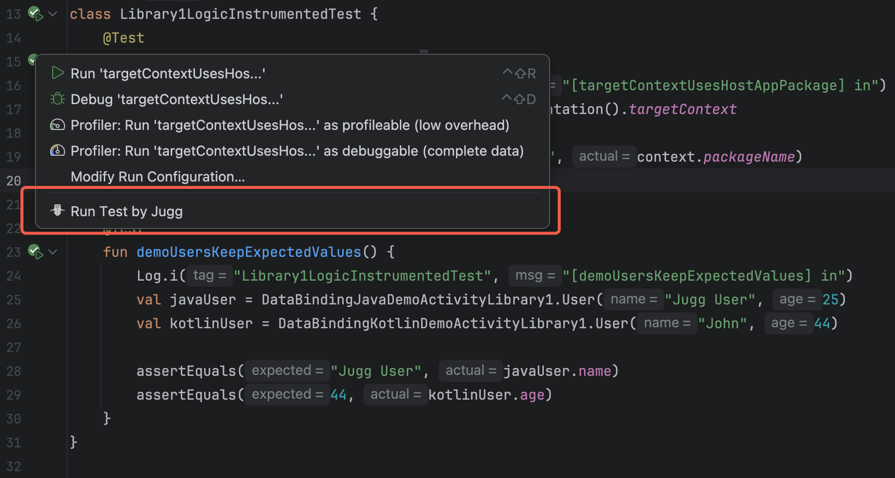
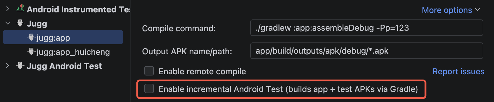

> [!NOTE]
> 本文为历史技术分享，正文保持原文内容。文中的数据、界面、链接和能力状态反映发布时情况；最新产品行为以 Wiki 其他页面为准。

<!-- original-article-start -->

Jugg 3.0 是一个巨大的变更。3.0 的开发刚好是乘着 AI coding 的风，开始大规模进入日常开发的时间点，也使得 Jugg 的迭代速度有了 **10x 的生产力增长**。

迭代速度上，以前一个大功能点可能要 2-3 个月的开发和打磨，现在只需要 1-2 周。提效后甚至还把几年前的"需求债"都还了。以前有什么想法或者同学提过来的新诉求，都是先记个 TODO，有空就琢磨一下，等闲下来再开始编码，而且还要分优先级。现在直接开个会话就可以聊个 7788 了。

而 AI coding 的另一方面，是 **用户自己写代码变少了，编译验证的需求也变少了**，并逐渐迁移到了 Agent 侧，也就是 `plan-code-verify` 中的 `verify` 这一部分。此时一个很自然的诉求也冒出来了：**Agent 改完代码后，能不能自己调用 Jugg 编译？** 又或者说，再畅想一下，让 Agent 直接完成单元测试编写和验收，甚至是 e2e 验证？

过去 Jugg 的入口主要在 Android Studio。无论增量编译有多快，最终还是需要人点击 Run。有些时候 Agent 会写出无法编译通过的代码，这时候 `Human in the loop` 又需要 Human 介入一下，降低了整体验证效率。

所以 Jugg 3.0 最重要的更新，是增加了 **Jugg CLI Skill，把编译、部署、运行测试和一部分设备交互能力提供给 Agent**。除此之外，3.0 还补上了 Android Test、Debug、常量扩散、Release APK、Kuikly 注解支持 `@Page` 和新的部署通道。

不过 `plan-code-verify` 中的 plan 和 code 已经进步得很快，但 verify 依然是最难的一段。就算给了 Agent 一揽子工具，但如何构造操作路径，如何判断需求应该如何验证，页面是否真的符合预期、哪些日志足以证明修改正确，如何高效的编写 Android Test，目前都还没有标准答案。

Jugg 目前也只是把能力暴露出来，最佳实践还需要时间去验证。也欢迎大家用这些命令组合自己的验证流程，看看 verify 能走到哪一步。

# 0. Jugg 是什么？

Jugg 是**大规模工程的 Android 秒级增量构建方案**，以 Android Studio 插件形式提供：安装即用、无侵入，不需要修改工程的任何文件。Jugg 在 Gradle 构建产物的基础上实现了独立的旁路增量编译与热部署链路，平均编译耗时 < 3 秒。

Jugg 于 2023 年 10 月发布，已投入全民 K 歌、QQ 音乐、JOOX、WeSing、酷狗音乐、酷狗直播、QQ 浏览器、央视频等工程的日常开发：月活跃用户 **300+**，月编译 **4W+** 次，累计编译 **80W+** 次，累计节省编译等待 **36,000+** 小时，相当于约 20 人年的研发工时。

Jugg 保持宽泛的版本兼容。支持 Android Studio 2021 至今全部版本；AGP 3.4-9.1；Kotlin 1.3 - 2.2；target API 21 - 36；Android 8-16。以上所有接入工程使用同一套通用实现，不含任何业务定制逻辑——**你的工程无需适配即可使用**。





更多信息：[演示视频](https://www.bilibili.com/video/BV1W3411C7PU/?spm_id_from=333.999.0.0)

# 1. Jugg CLI Skill：让 Agent 可以调用秒级增量编译

## 1.1 从 Run 按钮到 CLI

Jugg 3.0 提供了 `jugg` CLI。**CLI 通过 Android Studio 插件 runtime 暴露端口调用**，效果和在 Android Studio 内触发对应功能一致，

而且 3.0 还新增加了设备交互能力。目前一共有 16 个命令，大致分为几类：

- **编译部署**：`compile`、`deploy`、`gradle-build`、`clean-reinstall`、`instrument`。
- **状态观测**：`status`、`version`、`devices`、`ssh-info`。
- **App 运行态**：`restart`、`wait-logs`、`activity-stack`。
- **页面交互**：`layout-dump`、`view-locate`、`view-inspect`、`tap`。

其中最常用的是：

- `jugg compile`：编译验证，不部署。
- `jugg deploy`：编译并部署到设备。
- `jugg gradle-build`：回退 Gradle 全量构建。
- `jugg status`：查看当前修改文件、编译状态和是否需要降级。

Agent 修改代码后，直接调用 `jugg compile` 做一次编译检查。编译失败时，Jugg 会返回 token 消耗很小的错误信息，Agent 修完后继续重试。

<!-- image-link: 示例：Agent 在编译失败后修复并重试 -->


## 1.2 Jugg verify 工具集 -- 直接用 ADB 不好操作的的设备交互能力

除了编译部署，CLI 还提供了一些设备交互命令。

当然普通 ADB 可以按坐标点击，但如果让 Agent「点击微信登录按钮」，它需要：**先解析界面，判断按钮在哪，再换算成坐标点击。** 工具调用次数不说，正确率也会有影响。

而 Jugg 本身就会往 App 注入一个 runtime，正好利用起来。3.0 增加了 **运行时 layout dump** 能力，并实现了 ```click "微信登录"``` 这样的快捷能力，**比截图和解析布局文件要高效很多。**

类似的命令还有：
- `activity-stack`：确认当前顶部 Activity。
- `layout-dump`：导出当前页面的 UI 层级。
- `view-locate`：按文本、resource ID 等条件查找元素位置。
- `view-inspect`：通过反射读取 View getter 属性。
- `tap`：点击、长按或滑动。
- `wait-logs`：阻塞等待指定日志，收集期间的关键日志，如果 crash 或超时也会中断。

<!-- image-link: Agent 使用交互能力示例 -->


> [!TIP]
> 布局解析能力由 k 同学的 dragonfly sdk 提供，支持 View / Compose / Kuikly 布局解析。

> [!NOTE]
> 目前 Skill 不会默认暴露和使用 verify 工具，只有用户主动要求做 UI 验证的时候才会读取调用。原因是让 Agent 裸用这些工具，**是可以走完流程，但没有成熟的 verify harness，成功率，token 消耗，问题检出率都并不理想，效率不一定比人直接写小作文高。**
> 
> 但 AI 自动化是趋势和未来，什么时候开始探索都不算早，欢迎大家使用 Jugg verify 工具进行实践。我自己也在不断琢磨，比如：维护一套 verify benchmark，以及专门给 verify 做一个 harness agent loop，来解决这些问题。


## 1.3 Skill：告诉 Agent 怎么使用 CLI

只有命令还不够。如果直接把 `jugg compile` 扔给 Agent，它不知道什么时候该用 `compile`，什么时候该用 `deploy`，失败后又应该重试还是回退 Gradle。

所以 3.0 同时提供了 `jugg-android-dev-loop` Skill，主要描述：

1. CLI 命令列表，告诉 agent 有什么能力和如何使用；
2. 内置三个场景，编译/部署（默认），UI verify，Android Test；
3. 遇到各种问题时应该如何排查。

> [!NOTE]
> 为什么默认只编译，不自动部署？
> 
> 最开始的时候我确实把默认行为设置为 `deploy`，想着 **让 Agent 改完代码自动部署，人直接验收**，非常方便。
> 
> 但实际用下来很快发现，实际上 **Agent 在干活的时候，其他 Agent 或者人一般不会闲着，也会操作/部署一下设备**。我可能正在设备上看另一个功能，突然 App 被重启或者页面状态被重置，互相打架。
> 
> 当然，你依然可以在自己的 AGENTS.md 或者 prompt 中让 agent 自动调用 `deploy`。

## 1.4 Hooks：Jugg CLI Skill 为什么需要 Hooks 提醒

Agent Skill 通常是在会话开始时根据用户意图加载的。但「编译验证」有点特殊，**它的意图一般在会话结束时才出现**。

例如用户只说「修一下播放页面 crash」。会话开始时，Agent 识别到意图是排查和修改代码，不会主动加载 Android 编译 Skill。**等代码改完，Agent 大概率直接汇报完成。** 测试下来，如果不安装 Hooks，也不额外写 prompt，Agent 几乎不会自己想起调用 Jugg。

解决这个问题还有一种办法：把 Skill description 写得非常宽，让所有 Android 开发任务都提前加载。但这样会导致不需要编译的会话也加载 Skill，还会占用 Agent 的注意力，而且依然不能保证最后真的执行。

最后发现 Hooks 效果非常好：

- 会话修改了 Android 源码，但没有执行 Jugg 编译验证时，Hooks 在结束前阻断一次。
- Agent 直接调用 Gradle 命令时，Hooks 阻断一次，提醒加载 Jugg Skill 代替。
- Hooks 返回的阻断信息会附带本轮修改文件和 Jugg 状态，方便 Agent 继续处理。

<!--image-link: 示例：在会话结束前 Hooks 触发编译验证-->


Agent 被拦一次后，后续就会自觉调用了。Hooks 解决的是 **「让 Agent 在最需要知道的时候提醒他」**，而不用强行让每个任务都强制在会话开始时加载。

而且 Jugg 的 Hooks 机制做了不少细节，只有 **Agent 在当前轮会话修改了源码文件，且未进行编译** 时，才会触发 hooks。且 hooks 只会 block 一次，block 信息也留有 Agent 自己判断的余地，没有写死「必须加载」。

> [!NOTE]
> 整个 hooks 体系会用到 「开始会话」「结束会话」「命令调用」「文件编辑」4 个 hooks。hooks 兼容了 5 款 Coding Agents，每款 Agents hooks 都有些不一样，花了不少功夫适配。

## 1.5 一键安装

Jugg 插件支持一键安装 Skill/CLI/Hooks，并已充分验证 Claude Code，Codex，Gemini，Cursor，CodeBuddy IDE。

安装方式：在 Android Studio 中双击 `Shift`，搜索 `Install Jugg Skills` 即可打开安装弹窗。也可以从 Jugg 面板进入 `More Options -> Tools -> Install Jugg Skills`。



默认勾选的是推荐选项，会检测选择所有已安装的 Agents 并勾选（支持变体），同时安装 CLI 和 Hooks。

CLI 有三种输出模式：

- `--console=rich`：【默认】给人看的，带 **转菊花** 和终端交互。
- `--console=plain`：给 Agent 看的，输出紧凑。
- `--console=json`：给脚本的，解析结构化字段。

> [!WARNING]
> Skill 默认会调用 --console=plain。注意：如果要 DIY，不要让 Agent 直接用 CLI 的 rich 模式。spinner 不断刷新后，上下文里会多出一大坨基本没用的输出。


## 1.6 为什么不做 Jugg MCP？

**是的，Jugg 有一个 MCP，但不建议使用** 。Jugg CLI 其实提供的是 MCP 1:1 完全对等的封装调用，能力一样。Jugg MCP 的配置在 “手动配置” 文档里有介绍。

而不建议配置 Jugg MCP 原因是：

* **调用不规范**：MCP 在知识上依赖 Jugg skill，但 MCP 调用时 agent 不一定加载 Jugg skill；CLI 直接和 skill 封装到一起，是一体的。
* **Token 浪费**：MCP 调用无法使用命令组合/管道的方式，使用起来更加笨重，调用次数更多。且 MCP 有调用超时，某些耗时场景 agent 不得不进行轮询，造成 Token 浪费。CLI 内置轮询无此问题。
* **Context 污染**：MCP 占 context 上下文更多，比 cli 重。
* **工具重复**：agent 又有 cli 又有 mcp的时候，会随便选一个用。


# 2. Android Test 增量编译

Jugg 3.0 支持了 Android Test 增量编译。

做这个功能的原因是，在 AI coding 的加持下，androidTest 又开始被一些同学捡起来了。测试代码现在可以让 Agent 帮忙写，但如果每次运行都要重新构建 App APK 和 Test APK，写得快，跑得还是很慢。

Android Test 增量编译使用方式和 Android Studio 自带测试基本一致。在 `src/androidTest` 的测试类或方法旁点击 gutter，选择 `Run Test by Jugg`。



点击后也会像原生 Android Test 一样，创建一个临时 RunConfiguration：


## 2.1 第一次还是要跑 Gradle

第一次运行时，右下角会提示先在 Jugg App RunConfiguration 中打开 `Enable incremental Android Test`。



打开后首次需要降级 Gradle，因为要额外构建 Test APK。建立过基线后，后续 `src/androidTest` 源码变化就可以走 Jugg 增量编译。

## 2.2 Library Test APK：又一套机制

第一次点击 Library 模块里的测试，也会触发一次 Gradle Test APK 构建。

原因是 **Application Test APK 和 Library Test APK 是分开的，运行包和实现方式也不同。** Jugg 会根据测试源码定位所属模块，只构建当前缺失的 Library Test APK，再把它加入本轮安装和部署。

后续 Gradle 降级时，Jugg 会读取最近 30 天的构建记录，最多一起构建最近使用过的 3 个 Test 模块，减少降级频率。

> [!NOTE]
> Android Test 这部分实现时最麻烦的是多 APK 归属。测试源码到底应该进入 App APK 的 overlay，还是进入独立 Library Test APK，都需要准确判断。还好之前支持 aab 时已经改造适配 multiple APK 场景，这块支持起来也相对比较快。

# 3. Debug 按钮：不用再和启动速度赛跑

Jugg 之前不支持 Debug 按钮。因为古法时代找了半天没找到怎么支持。


所以，以前用 Jugg 要调试启动的逻辑，有两个常用操作：

1. App 启动后赶紧点击 `Attach debugger to Android process`；
2. 去开发者选项打开 `Wait for debugger`，调试完再关掉。

3.0 在 AI 的伟力下，终于适配了 Debug 按钮。

# 4. 编译场景增强

### 4.1. 支持Release APK 增量编译（R8 混淆 / AabResGuard）
实验性功能。

识别到当前混淆打开时，会进行增量混淆处理，并把增量产物塞进 APK 部署（ 因为release 包不支持 JVMTI）。
目前已在 JOOX 几个超大类文件上验证可用。

> 这个功能其实花了很长时间做。**光修 bug 就修了几百刀 token。**
> 
> 最开始以为只要把编译出来的 dex 按照 mapping 重新混淆即可，但忘了 R8 会疯狂删除类和方法，修改参数，可见性，导致适配需要疯狂打补丁。
> 
> 如果后面有机会再展开。

### 4.2. 支持Kuikly @Page
针对性实现了 Kuikly 注解器支持。当检测到当前页面是 Kuikly 页面，且 @Page 未注册到列表中时，会触发新页面注册并增量编译。
因为注解器本身实现机制的原因，无法做成通用实现，只能一个个针对性实现。

### 4.3. 支持常量扩散编译
这是一个迟到了 2 年半的需求。现在修改 Java/Kotlin 常量时，会根据 **新搭建的语法树 AST 解析能力，识别出受影响的其他文件，触发重新编译**。

初次打开工程需要初始化，会启动一个后台线程低消耗慢慢完成工程初始化，首次大工程大约 15-30分钟。后续则只分析变更的文件，耗时基本可忽略。初始化期间其他功能不受影响，仅影响常量变化识别。

### 4.4. Windows / Linux 支持 target api 35 资源增量编译
aapt2 jugg 定制版从 Android 11 AOSP迁移到 Android 15 AOSP 进行编译，修复 target api 35 不支持问题。
Mac 支持的比较早。Windows / Linux 因为文件系统格式限制，又单独存了一套 AOSP 用来编译 aapt2。而且为了省空间把 repo 删过一次，导致需要重新拉代码。
虚拟机同步又慢，同步过程还会内存不足直接卡死。最后是装了个 Mac 上的支持 ext4 的限免软件把文件拷到了 SSD 完成了 AOSP 的拉取。

### 4.5. 支持 Gradle 9.2.1
Gradle 9 移除了一些 API，找到代餐实现进行替换。

# 5. 体验优化

### 5.1. 修复降级后初始化，IDE 偶现卡死一小段时间
做了两件事：1. 把 APK 解析摘到了独立进程；2. 移除了 System.gc() 调用

2 是主因 🤡。

### 5.2.修复 Windows 上 clean project 报错
原因是JDK 自带的日志文件系统带文件锁，导致 windows 上 clean project 时无法删除 build/jugg/log/xxx.log 文件。
解决方案：让 AI 重写了一套无锁日志实现。

### 5.3.WebView 部分机型 crash 修复
原因是 Apply Changes 实现会无差别 hook 所有的资源包，导致部署资源之后，部分 WebView 版本的资源包被 hook 会出现读取异常，导致 WebView<init> crash。
解决方案是给 Apply Changes 擦屁股：非本 apk 的资源包不要 hook。

### 5.4.gradlew clean && assembleDebug兼容
远程编译场景，如果有clean 构建的需求，不想上机器主动clean。
此时写 ./gradlew clean :app:assembleDebug，会报错找不到一个 jar 文件。（其实clean 成功了，只是需要去掉 clean 再编译一次）
原因是这里存了个依赖：build/jugg/config/jugg-runtime.jar。clean 的时候会被删掉导致编译时候报错了。
现在改为放到 .gradle/jugg，避开 clean 的影响

### 5.5.DataBinding 兼容性提升
ViewBinding 比较简单，这里是优化了 DataBinding。 3.0 处理了 DataBinding 和 Kotlin 版本冲突导致编译失败，Java/Kotlin 混编，增加新变量等编译失败的场景。
有 bug 也不想碰了，非常恶心

### 5.6. 交互优化
还有一些使用体验上的微调：
* 切换工程编译时可以识别出来，会直接部署，不再会提示“No file changes”弹窗
* 修复了同时打开多个工程时，如果工程kotlin版本不一样可能会编译报错 -- 编译器实例复用导致，已拆分

# 6. 最后又来了，Jugg 4.0

4.0 已经开发完毕，实现了脱离 Android Studio 的独立运行能力。

其实 2.X 版本已经实现了在 CI 流水线上构建增量 APK 的能力，但是是个“丐版”，内存常驻/配置管理/热重载等功能是缺失的。4.0 做了一次基础能力整体下沉，完整的把核心能力下沉到了逻辑层，插件层只保留 IDE 相关的一层薄实现。欢迎各位私聊试用体验。
<!-- original-article-end -->
