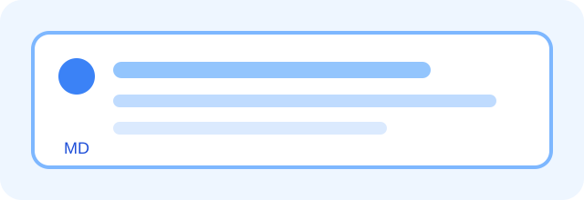

# Wiki 元素 Demo

> 最后核对：2026-06-14  
> 可见性：仅 dev 可见，production build 会排除本页。

本页是开发环境专用的 Markdown 元素样板间，用于验证 Wiki 渲染、间距、搜索行为与后续样式调整。

[[toc]]

## 1. 文本

普通段落支持 **加粗**、*斜体*、***加粗斜体***、~~删除线~~，以及 `JuggManager`、`docs/wiki/.vitepress/config.mts` 这类行内代码。

行尾保留两个空格可以换行。  
这一句会出现在下一行。

## 2. 标题

### 2.1 三级标题

#### 2.1.1 四级标题

标题会生成页面锚点与右侧大纲。

## 3. 列表

无序列表：

- 编译
- 部署
- Debug
  - 嵌套条目
  - 嵌套条目

有序列表：

1. 读取页面 frontmatter。
2. 渲染 Markdown 正文。
3. production 环境隐藏 dev-only 页面。

任务列表：

- [x] 新增 demo 页面
- [x] 增加 dev-only frontmatter
- [ ] 在 dev server 中检查视觉效果

## 4. 链接

- 站内链接：[使用指南概览](/zh/guide/)
- 相对链接：[日志排查](../troubleshooting/logs.md)
- 外部链接：[VitePress](https://vitepress.dev/)
- 锚点链接：[跳转到提示块](#_9-提示块)

## 5. 表格

| 元素 | Markdown 写法 | 必须支持 |
|---|---|---|
| 标题 | `# 标题` | 是 |
| 提示块 | `> [!NOTE]` | 是 |
| 任务列表 | `- [ ] Task` | 是 |
| 图片 | `` | 可选 |

## 6. 代码

行内代码适合展示 `JuggRunningTask` 这类符号。

```kotlin
class WikiElementRenderer {
    fun render(page: WikiPage) {
        println(page.title)
    }
}
```

```bash
npm run wiki:dev
npm run wiki:build
```

```text
load markdown
  -> parse frontmatter
  -> render body
  -> exclude dev-only pages in production
```

## 7. 引用

> 这是普通引用块。它没有使用提示块标记，因此不会被当作 alert 渲染。

## 8. 图片



## 9. 提示块

> [!NOTE]
> Note 用于普通背景说明。

> [!TIP]
> Tip 用于推荐做法或最佳实践。

> [!IMPORTANT]
> Important 用于强调不能忽略的重要信息。

> [!WARNING]
> Warning 用于提示继续操作前需要关注的风险。

> [!CAUTION]
> Caution 用于严重风险或破坏性操作。

> [!WARNING]
> **自定义提示标题**
>
> 如果后续 Wiki renderer 需要，可以把第一段加粗文本识别为自定义标题。

## 10. 分割线

分割线之前的内容。

---

分割线之后的内容。

## 11. 原生 HTML

<kbd>Shift</kbd> + <kbd>F10</kbd>

<details>
<summary>折叠详情</summary>

这一段用于验证原生 HTML details 渲染效果。

</details>

## 12. 工程 Wiki 语义块

### 核心源码索引

| 类或文件 | 路径 | 作用 |
|---|---|---|
| VitePress config | `docs/wiki/.vitepress/config.mts` | 负责 nav、sidebar、search 与 dev-only route 排除。 |
| Demo page | `docs/wiki/zh/dev/elements-demo.md` | 展示所有支持的页面元素。 |

### 调用链

```text
wiki dev mode
  -> include /zh/dev/ pages in routing
  -> show Dev navigation entry
  -> render Wiki 元素 Demo

wiki production build
  -> exclude /zh/dev/ pages from routing
  -> omit Dev navigation entry
  -> omit dev pages from local search index
```

### 隐形约束

- Dev-only 页面必须使用 `visibility: dev` frontmatter。
- Dev-only 页面必须放在 `dev/` 或 `zh/dev/` 下，方便 production build 按路径排除。
- Production build 不能通过目录、搜索或直接路由暴露 dev 页面。

### 排查入口

| 现象 | 优先入口 |
|---|---|
| Production nav 里出现 Demo 页 | 检查 `docs/wiki/.vitepress/config.mts` 的 `isWikiDev`。 |
| Production 下可以直接访问 Demo 页 | 检查 `docs/wiki/.vitepress/config.mts` 的 `srcExclude`。 |
| 提示块样式异常 | 检查 VitePress Markdown alert 支持与主题样式。 |

## 13. Frontmatter 示例

```yaml
---
title: Wiki 元素 Demo
visibility: dev
status: draft
---
```
